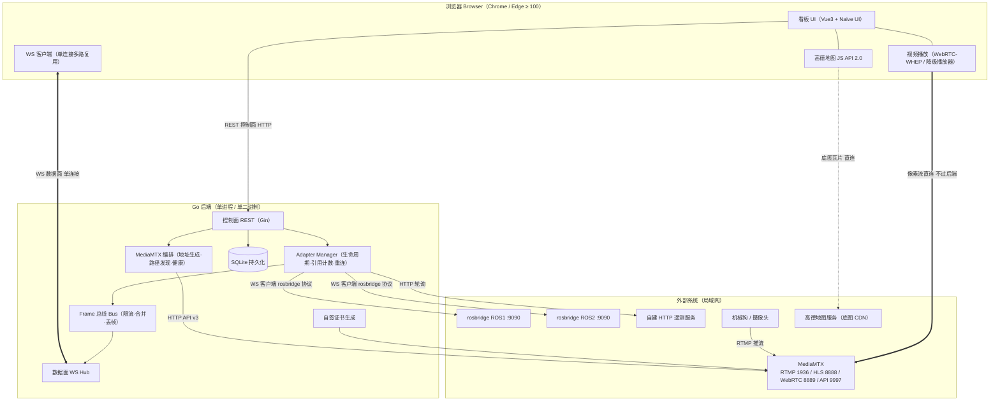
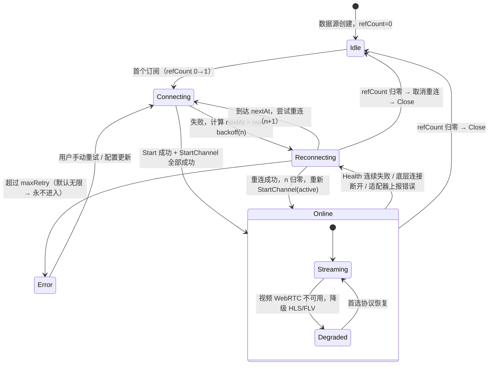
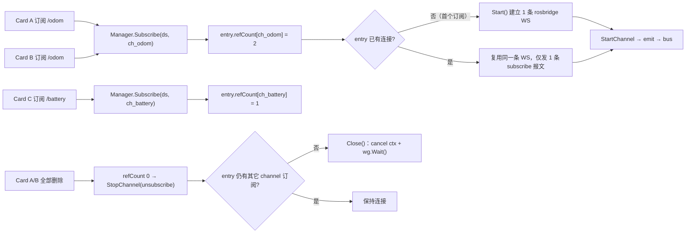
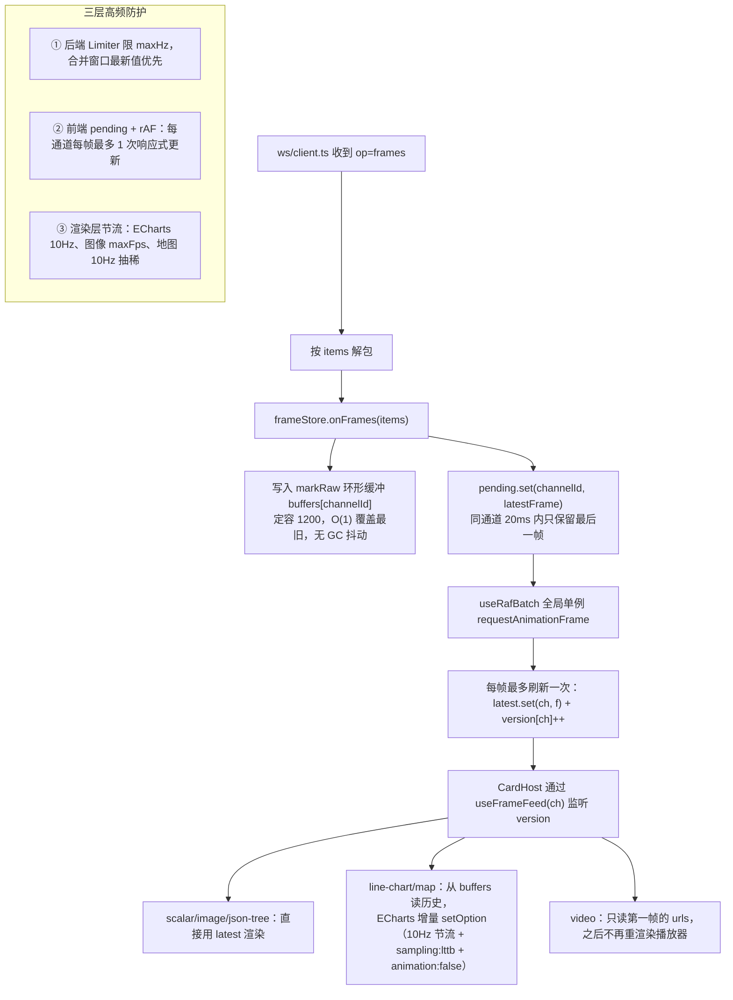
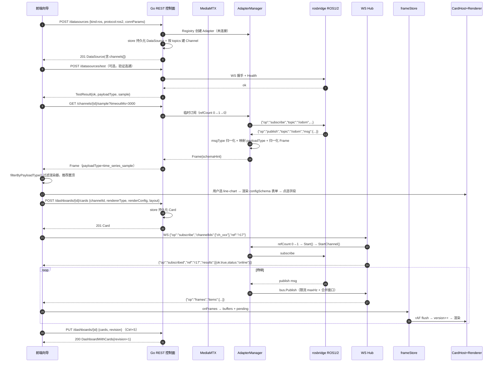
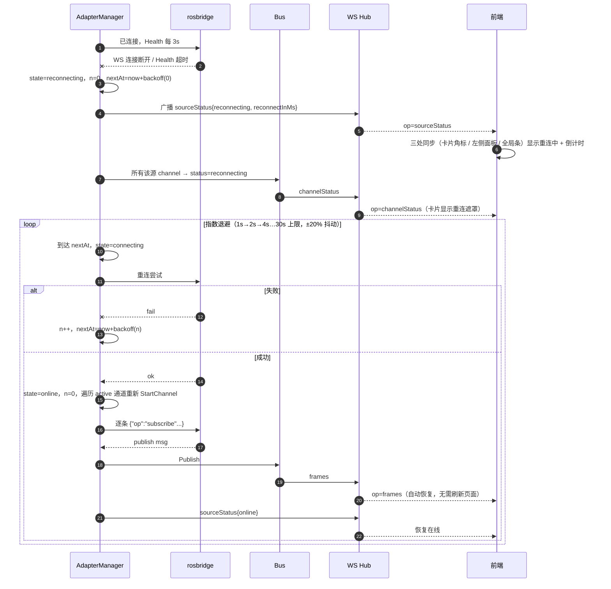
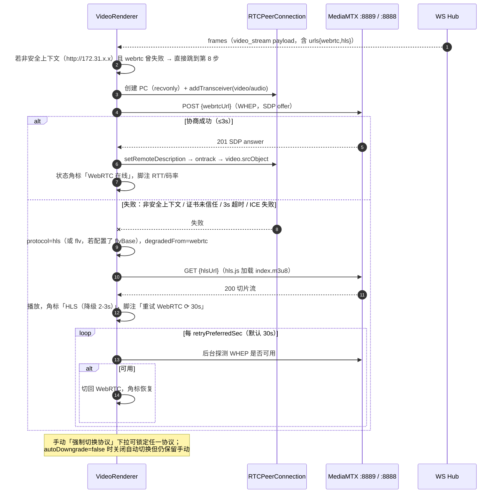

# MonitorAll 监控看板平台 — 系统架构设计

| 项 | 内容 |
| --- | --- |
| 版本 | v1.0 |
| 日期 | 2026-09-21 |
| 作者 | 高见远（架构师） |
| 上游输入 | `docs/PRD.md` v1.0（许清楚）+ 交付总监对 Q1–Q6 的拍板结论 |
| 交付范围 | PRD 全部 **P0 条目（39 条）** + **BE-04（通道级限流丢帧，提前至 P0）** |
| 关联文档 | `docs/PRD.md`、`docs/TASKS.md` |

> **本文档定位**：工程师（寇豆码）直接照此写代码。所有跨模块契约（Frame、WS 协议、REST、Adapter 接口、RendererManifest）均已写成可复制的代码块，不允许口头约定。
> **优先级标记**：`[MVP]` = 本次必须实现；`[EXT]` = 为 P1/P2 预留的扩展点，本次**只需留接口/占位**，不实现。

---

## 目录

| 章 | 内容 |
| --- | --- |
| 1 | 架构总览 |
| 2 | 技术选型最终确认表 |
| 3 | 目录结构（`server/` + `web/`） |
| 4 | 核心数据模型（Go struct + TS interface） |
| 5 | **统一 Frame 契约**（全局最关键） |
| 6 | WebSocket 协议（数据面） |
| 7 | REST API 设计（控制面） |
| 8 | 适配器 Adapter 设计 |
| 9 | 渲染器注册表机制 |
| 10 | 前端状态流转 |
| 11 | 关键时序图（3 张） |
| 12 | 非功能设计 |
| 13 | 🚩 地图合规红线（独立小节） |
| 14 | 配置与部署 |
| 15 | 待明确事项 |

---

## 1. 架构总览

### 1.1 部署拓扑



**三条路径必须严格区分**：

| 路径 | 承载内容 | 协议 | 是否过 Go 后端 |
| --- | --- | --- | --- |
| **控制面** | 数据源/通道/看板/卡片 CRUD、测试连接、样例帧、MediaMTX 路径查询 | REST / JSON over HTTP | ✅ 过 |
| **数据面（非视频）** | 归一化 Frame、通道状态事件、数据源状态事件、心跳 | WebSocket（单连接多路复用） | ✅ 过 |
| **数据面（视频）** | RTMP → WebRTC/HLS 的像素流 | WHEP(HTTPS) / HLS | ❌ **不过**，浏览器直连 MediaMTX |
| **底图** | 高德瓦片 | HTTPS | ❌ 直连 |

> 视频像素不过后端是硬性架构约束：后端只做**地址编排**（生成播放 URL）与**状态查询**（MediaMTX path 是否 ready）。任何"把视频流代理进 Go"的实现都视为违约。

### 1.2 进程内分层

```
┌──────────────────────────────────────────────────────────────┐
│ api/     REST 控制面（Gin）   ws/ 数据面 Hub（gorilla）        │
├──────────────────────────────────────────────────────────────┤
│ bus/     Frame 总线：channelBroker + 限流/合并/丢帧 + 环形缓冲 │
├──────────────────────────────────────────────────────────────┤
│ adapter/ Adapter Manager（引用计数 / 指数退避重连 / 健康检查） │
│          ├ video/  ├ ros/(ros1|ros2)  ├ http/                 │
├──────────────────────────────────────────────────────────────┤
│ media/   MediaMTX 客户端 + 播放地址编排   crypto/ 敏感字段加密 │
├──────────────────────────────────────────────────────────────┤
│ store/   SQLite（无 ORM）   config/ yaml   apperr/ 错误码      │
└──────────────────────────────────────────────────────────────┘
```

---

## 2. 技术选型最终确认表

> 说明：PM 在 PRD §7 给出了建议，下列是架构师的最终判断。**与 PRD 不一致处以本表为准，并已在"理由/判断"列标注。**

### 2.1 后端（Go）

| 项 | **最终选型** | 版本 | 备选 | 架构师理由 |
| --- | --- | --- | --- | --- |
| HTTP 框架 | **Gin** | `github.com/gin-gonic/gin v1.10.x` | ① `net/http` + Go1.22 ServeMux ② `go-chi/chi` | 需要 REST CRUD（BE-06）+ 路径参数 + 中间件链 + JSON 绑定/校验 + 统一错误渲染。用标准库要自己写 ~400 行 binder/validator/error-middleware；chi 更轻但生态与 binding 弱。Gin 的性能（httprouter）对本项目完全够用，风险是"多一个依赖"，可接受（MIT、事实标准）。**不使用 Gin 的模板/静态以外的重特性。** |
| WebSocket | **gorilla/websocket** | `v1.5.3` | `coder/websocket`（原 nhooyr） | Hub 广播 + 单写者 goroutine + ping/pong 控制帧 + `SetWriteDeadline` 背压，gorilla 的 API 最成熟、资料最多。nhooyr 更现代（context 驱动）但需要自己封装控制帧与并发写保护。本项目 WS 是**核心数据面**，选最稳的。 |
| SQLite 驱动 | **modernc.org/sqlite** | `v1.3x` | `mattn/go-sqlite3`(CGO) | 必须 `CGO_ENABLED=0` 才能单二进制多平台交叉编译（OP/BE-08）。modernc 是纯 Go 翻译版，性能对本项目（6 张表、百行级写入）无感知差异。**代价：二进制体积 +15MB 左右，可接受。** |
| ORM | **不用 ORM** | — | GORM / sqlc | 只有 6 张表，且核心字段（`connParams`/`renderConfig`/`meta`）都是 JSON blob，ORM 帮不上忙反而增加迁移心智。用 `database/sql` + 手写 SQL + 显式迁移脚本，代码量与 GORM 相当但可控性更强、排障更直接。 |
| 配置 | **gopkg.in/yaml.v3 + 自研 struct** | `v3.0.1` | spf13/viper | Viper 引入 ~30 个间接依赖，且 env 优先级魔法在局域网部署场景下是负担。本项目只有一个 `config.yaml` + 少量 `MONITORALL_*` 环境变量覆盖，自研 `Load()` 约 120 行、行为完全可预测。 |
| 日志 | **标准库 `log/slog`** | Go 1.21+ | `go.uber.org/zap` | 结构化 + 分级 + JSON/Text handler 全部零依赖满足（BE-10）。zap 性能优势在 >10万行/s 才有意义，本项目日志量 <1000 行/s。**用 `slog.With("module","ros")` 这类 group 承载模块名。** 滚动文件用 `lumberjack` 或自研 30 行（见 §12.2）。 |
| JSONPath 提取 | **tidwall/gjson** | `v1.18.x` | 自研路径解析 | HTTP 数据源需要 `jsonPath` 提取字段（DS-07）。gjson 零依赖、语法稳定、支持 `data.items.0.voltage` 与 `#` 过滤，比自研可靠得多。 |
| ID 生成 | **自研前缀 + base36 随机** | — | google/uuid | 需要 `ds_`/`ch_`/`cd_`/`db_` 前缀（调试、日志、UI 都要肉眼可辨类型），UUID 不满足。用 `crypto/rand` 取 10 字节转 base36（16 字符），碰撞概率可忽略。 |
| 敏感加密 | **crypto/aes + crypto/hmac (标准库)** | — | age / vault | AES-256-GCM 加密落盘，密钥来自 `data/secret.key`（首次启动生成，0600）。局域网单机场景无需 KMS。 |
| 证书 | **crypto/x509 + crypto/rsa (标准库)** | — | mkcert / certmagic | 自签证书必须**进程内生成**（离线局域网不能依赖 ACME）。见 §12.3。 |

### 2.2 前端（Vue 3）

| 项 | **最终选型** | 版本 | 备选 | 架构师理由 |
| --- | --- | --- | --- | --- |
| 框架 | Vue 3 + Vite + TypeScript | `vue ^3.5` / `vite ^6` | — | 用户硬约束。 |
| UI 库 | **Naive UI** | `^2.45` | Element Plus | 同意 PM 判断，补充一条硬要求：**所有业务组件不得直接 `import type` 自 naive-ui**，统一从 `src/components/base/` 适配层或 `src/types` 取类型，保留替换可能。 |
| 状态管理 | Pinia | `^3.0` | — | Vue3 官方。 |
| 网格布局 | **grid-layout-plus** | **锁 `^1.1.1`** | v2 beta | 同意锁 v1。补充：**不要把 grid item 的 `i` 直接当业务 ID**，用 `i = card.id`，并用 `:key="card.id"` 保证 Vue diff 稳定。 |
| 图表 | **ECharts** | **锁 `^5.6.0`（不用 v6）** | Chart.js | ECharts 6 改了默认调色板与部分 option 语义（如 `universalTransition`、主题变量），MVP 不冒兼容性风险。一个库覆盖 Gauge / Line / Histogram / Radar，减少体积与心智。用 `echarts/core` 按需引入（只注册 GaugeChart/LineChart/GridComponent/TooltipComponent/LegendComponent）。 |
| 视频 - 首选 | **原生 WebRTC WHEP**（自研 ~150 行，不引第三方库） | — | — | WHEP 就是一次 `fetch(POST)` + `RTCPeerConnection`，引库反而受限。 |
| 视频 - 降级 | 🚩 **见 §2.3 阻塞风险**：默认 **hls.js**，可选 **mpegts.js** | `hls.js ^1.6` / `mpegts.js ^1.8` | — | **MediaMTX 原生不支持 HTTP-FLV**，mpegts.js 无处可喂。详见 §2.3。 |
| 地图 | 高德 JS API 2.0 + `@amap/amap-jsapi-loader` | `^1.0.1` | — | 合规硬约束。 |
| 坐标转换 | **gcoord（前端离线转换）** | `^1.0.7` | 高德 `AMap.convertFrom` | 同意 PM：官方接口有配额 + 依赖外网。转换落点**拍板在前端**，见 §13。 |
| 工具 | `vue-router ^4.5`（两个路由：看板 / 信任指引） | | | |

### 2.3 🚩 P0 阻塞级风险：MediaMTX 不原生支持 HTTP-FLV

| 事实 | MediaMTX（bluenviron/mediamtx）**没有** HTTP-FLV 输出能力。官方 issue #1460「HTTP FLV Server for play video in flv.js」被作者以"LL-HLS 延迟已相当、兼容性更好"为由拒绝实现。官方文档协议列表为 RTSP / RTMP / HLS / WebRTC / SRT。**PRD §4.2.1 与 DS-02 中"MediaMTX 同时产出 HTTP-FLV 地址"在当前 MediaMTX 上无法原生实现。** |
| --- | --- |

**架构处理（本次即按此实现，如总监要改请在 §15-D1 拍板）**：

1. 把"降级播放"抽象为 `VideoBackend` 接口（`src/utils/video/backends.ts`），三种实现按需启用：

| 后端 id | 依赖 | URL 形态 | 延迟 | MVP 默认 |
| --- | --- | --- | --- | --- |
| `webrtc` | 无（原生） | `http(s)://{mtxHost}:8889/{path}/whep` | ≤500ms | ✅ **首选** |
| `hls` | `hls.js` | `http(s)://{mtxHost}:8888/{path}/index.m3u8` | 2–5s | ✅ **降级默认** |
| `flv` | `mpegts.js` | `http(s)://{flvHost}/{path}.flv`（**需外部 FLV 网关**） | 1–2s | ⬜ 仅当 `mediamtx.flvBase` 已配置时启用 |

2. Docker Compose 中 MediaMTX 配置 `hlsVariant: mpegts`（MPEG-TS 切片，hls.js 兼容性最好）、`hlsSegmentDuration: 1s`、`hlsPartDuration: 200ms`。
3. 配置项 `mediamtx.flvBase`（默认空）。非空时降级优先走 `flv`（mpegts.js），否则走 `hls`。这样既保留了用户在已有 SRS / ZLMediaKit / nginx-http-flv 环境下的 FLV 路径，也保证默认部署**一定有可用降级**。
4. ST-03（WebRTC → 降级自动切换 ≤3s）与"不允许出现无法播放"的验收标准**不受影响**，只是降级目标从 FLV 变为 HLS（延迟量级同为 1–3s，仍满足 PRD §6.1）。

---

## 3. 目录结构

> 设计约束：前后端源文件合计 **约 95 个**，避免碎片化。每个文件职责写在注释里。

### 3.1 `server/`（Go）

```
server/
├── go.mod                          # module github.com/monitorall/monitorall
├── go.sum
├── Makefile                        # build / run / cert / embed-web / docker
├── config.example.yaml
├── cmd/
│   └── monitorall/
│       └── main.go                 # 入口：解析 flag、加载配置、初始化、启动 server、打印 LAN 地址
└── internal/
    ├── config/
    │   └── config.go               # Config 结构体全量定义 + Load() + 默认值填充 + 环境变量覆盖
    ├── apperr/
    │   └── apperr.go               # 错误码常量表、AppError 类型、Wrap/New、HTTP 状态映射
    ├── logx/
    │   └── log.go                  # slog 初始化（level/format）、With 模块日志构造器
    ├── model/
    │   ├── ids.go                  # NewDataSourceID/NewChannelID/NewCardID/NewDashboardID
    │   ├── common.go               # PayloadType / Status / CRS / DataSourceKind / Protocol 枚举
    │   ├── source.go               # DataSource、Channel、视频/ROS/HTTP 三类 ConnParams、RetryPolicy
    │   ├── frame.go                # Frame、FieldHint、SchemaHint
    │   ├── payload.go              # 各 payloadType 的 Go struct（VideoPayload/ScalarPayload/...）
    │   └── board.go                # Dashboard、Card、Layout、DisplayOptions
    ├── crypto/
    │   └── secret.go               # AES-256-GCM 加解密、密钥文件管理、IsMasked/MaskSecrets/Unmask
    ├── store/
    │   ├── store.go                # Store 接口（6 类实体的 CRUD）+ 事务封装
    │   ├── sqlite.go               # database/sql 实现，JSON 列序列化、行→struct 映射
    │   └── schema.go               # 建表 DDL + schemaVersion 迁移链（Migrate 步骤数组）
    ├── media/
    │   ├── cert.go                 # 自签 CA/Server 证书生成（含 LAN IP SAN）、加载、信息摘要
    │   ├── url.go                  # RTMP URL 解析 → path；播放地址编排（webrtc/hls/flv 三路）
    │   └── mediamtx.go             # MediaMTX HTTP API v3 客户端：paths/list、paths/add、健康探测
    ├── adapter/
    │   ├── adapter.go              # Adapter 接口 + Registry（kind → Factory）+ ChannelSpec/Health
    │   └── manager.go              # 生命周期、引用计数、指数退避重连、状态广播、goroutine 治理
    ├── adapter/video/
    │   └── video.go                # 视频适配器：注册 path 到 MediaMTX、轮询状态、产出 video_stream Frame
    ├── adapter/ros/
    │   ├── client.go               # rosbridge WebSocket 统一客户端（连接/重连/发送/接收/心跳）
    │   ├── diff.go                 # ROS1/ROS2 差异分支：msgType 归一化、subscribe 报文、rosapi 调用
    │   ├── mapping.go              # ROS msgType → payloadType 映射表与推荐渲染器
    │   └── adapter.go              # ROS 适配器：订阅/退订、msg→Frame 归一化（含 image/base64）
    ├── adapter/http/
    │   └── adapter.go              # HTTP 轮询适配器：定时器、gjson 提取、payloadType 推断
    ├── bus/
    │   ├── bus.go                  # Bus + channelBroker（订阅集合、环形缓冲、seq 分配、状态广播）
    │   └── limiter.go              # 通道级限流器：令牌桶 + 合并窗口 + 最新值优先丢帧 + 背压计数
    ├── ws/
    │   ├── protocol.go             # 前后端 WS 消息结构体（ClientMsg / ServerMsg 全部 op）
    │   ├── conn.go                 # 单连接：读泵、写泵、批量发送、背压丢批、心跳、关闭清理
    │   └── hub.go                  # 连接池、订阅登记（conn ↔ channel）、广播入口、取消订阅
    ├── api/
    │   ├── router.go               # Gin 路由注册 + 静态资源（embed web dist）+ SPA fallback
    │   ├── resp.go                 # OK/Error 统一响应封装、错误码 → HTTP status
    │   ├── mw.go                   # 请求日志、panic recover、可选 CORS、请求 ID
    │   ├── source.go               # 数据源 + 通道 REST handler
    │   ├── board.go                # 看板 + 卡片 REST handler
    │   ├── mediamtx.go             # MediaMTX 路径查询 REST handler
    │   └── system.go               # runtime/lan/cert/healthz/readyz
    └── server/
        └── server.go               # HTTP + HTTPS 双监听、优雅关闭、LAN 地址打印、embed FS
```

**Go 文件数：37**

### 3.2 `web/`（Vue 3）

```
web/
├── index.html
├── package.json
├── vite.config.ts                  # 代理 /api,/ws 到 Go；@ 别名；build.outDir=../server/internal/web/dist
├── tsconfig.json / tsconfig.node.json / env.d.ts
└── src/
    ├── main.ts                     # createApp + Pinia + Router + NaiveProvider
    ├── App.vue
    ├── router/index.ts             # /dashboard/:id  ·  /trust
    ├── types/
    │   ├── index.ts                # 全部业务类型：DataSource/Channel/Frame/Card/Dashboard/Payload/Renderer
    │   └── ws.ts                   # WS 消息联合类型（ClientMessage / ServerMessage）
    ├── api/
    │   ├── client.ts               # fetch 封装：统一响应解包、错误码 → AppError、脱敏字段处理
    │   └── endpoints.ts            # 各模块 REST 调用函数（datasource/channel/dashboard/card/system）
    ├── ws/
    │   └── client.ts               # WS 连接管理：重连、心跳、订阅表、消息分发回调
    ├── stores/
    │   ├── datasource.ts           # 数据源 + 通道列表、状态、CRUD action
    │   ├── dashboard.ts            # 当前看板、卡片列表、布局、编辑模式、脏标记、保存
    │   ├── frame.ts                # 环形缓冲（非响应式 Map）、最新帧（响应式）、rAF 批量刷新
    │   └── ui.ts                   # 主题、抽屉选中态、全局连接状态、错误日志、提示
    ├── renderers/
    │   ├── manifests.ts            # 7 个 P0 RendererManifest 定义（含 configSchema）
    │   └── index.ts                # 注册表：Map<type,Manifest>、registerRenderer、查询/过滤 API
    ├── components/
    │   ├── base/
    │   │   ├── NaiveProvider.vue   # n-config-provider + 暗色主题 + themeOverrides
    │   │   ├── EChart.vue          # ECharts 实例托管：init/resize/dispose/setOption 节流
    │   │   └── EmptyState.vue      # 空态/错误态占位（图标+文案+可选操作）
    │   ├── layout/
    │   │   ├── TopBar.vue          # 看板切换、编辑模式、新建卡片、保存、连接状态、主题
    │   │   ├── SourcePanel.vue     # 左侧数据源树 + 状态点 + 新建入口 + 拖拽源
    │   │   ├── DashboardCanvas.vue # grid-layout-plus 容器：布局变更、吸附、模式控制
    │   │   ├── CardFrame.vue       # 卡片外壳：头/脚/角标/编辑态装饰/重连遮罩
    │   │   ├── StatusBadge.vue     # 四态角标（在线/离线/重连中/错误 + hover lastError）
    │   │   └── ConnectionBanner.vue# 顶部全局连接横幅（WS 断连/恢复）
    │   ├── cards/
    │   │   ├── CardHost.vue        # 单卡片宿主：订阅管理、状态推导、三态切换、渲染器分发
    │   │   ├── CardErrorBoundary.vue# onErrorCaptured 错误边界 + 重试按钮
    │   │   └── CardSkeleton.vue    # 加载骨架屏
    │   ├── config/
    │   │   ├── CardConfigDrawer.vue# 卡片属性抽屉（三步向导的 Step3 容器）
    │   │   ├── DataSourceWizard.vue# 数据源向导 Step1/Step2（类型 + 连接参数 + 测试连接）
    │   │   ├── ChannelSelect.vue   # 通道选择器（可新建 ROS topic）
    │   │   ├── RendererSelectList.vue # 按 payloadType 过滤 + 推荐置顶 + 不兼容置灰 tooltip
    │   │   ├── SchemaForm.vue      # 由 configSchema 动态生成表单（Naive UI 控件映射）
    │   │   └── FieldPicker.vue     # JSONPath 字段点选器（树形展开 + 实时预览）
    │   └── renderers/
    │       ├── JsonTreeRenderer.vue    # RD-01 原始数据 JSON 树
    │       ├── TableRenderer.vue       # RD-02 表格
    │       ├── GaugeRenderer.vue       # RD-03 仪表
    │       ├── LineChartRenderer.vue   # RD-04 XY 折线图
    │       ├── ImageRenderer.vue       # RD-05 图像
    │       ├── MapRenderer.vue         # RD-06 地图（GCJ-02）
    │       └── VideoRenderer.vue       # RD-07 视频播放器
    ├── composables/
    │   ├── useFrameFeed.ts         # 组件订阅 frameStore 某通道（返回 latest/version/buffer）
    │   ├── useRafBatch.ts          # rAF 批量刷新调度器（全局单例）
    │   ├── useCardStatus.ts        # 卡片状态推导（数据源状态 + 通道状态 + 首帧超时）
    │   ├── useDashboardSave.ts     # 脏标记、Ctrl+S、beforeunload、保存/冲突处理
    │   └── useHotkeys.ts           # Ctrl+S / Esc 等快捷键
    ├── utils/
    │   ├── geo.ts                  # 🚩 gcoord 坐标转换唯一落点 + CRS 声明校验
    │   ├── ringbuffer.ts           # 环形缓冲（定容、O(1) 写、区间遍历）
    │   ├── jsonpath.ts             # JSONPath 求值 + 字段树枚举（供 FieldPicker）
    │   ├── format.ts               # 数值/时间/单位格式化、小数位、百分比
    │   ├── constants.ts            # 🚨 全前端唯一常量源（GRID_COLS/ROW_HEIGHT/MARGIN/1200/超时/重连参数/状态色）
    │   ├── csv.ts                  # CSV 导出
    │   ├── amapLoader.ts           # 高德 JS API 单例加载器（含 key 缺失降级）
    │   └── video.ts                # VideoBackend 抽象：webrtc / hls / flv 三实现 + 降级编排
    ├── views/
    │   ├── DashboardView.vue       # 主视图：TopBar + SourcePanel + Canvas + Drawer
    │   └── TrustGuideView.vue      # /trust 自签证书信任指引页
    └── styles/
        ├── theme.ts                # Naive UI darkTheme + themeOverrides（CSS 变量来源）
        ├── variables.css           # 全局 CSS 变量（间距/圆角/状态色/字号）
        └── global.css              # reset + 滚动条 + 布局工具类
```

**前端文件数：62（含 6 个配置文件）｜合计 ≈ 99**

---

## 4. 核心数据模型

### 4.0 全局序列化约定（🚨 所有文件必须遵守）

| 约定 | 规则 |
| --- | --- |
| JSON 字段命名 | **统一 camelCase**。Go struct 必写 json tag；TS interface 同名。 |
| 时间字段 | **统一毫秒 int64**（`publishedTs`/`ingestedTs`/`createdAt`/`updatedAt`/`lastFrameAt`）。禁止 RFC3339 字符串、禁止秒级。 |
| ID 前缀 | `ds_` 数据源、`ch_` 通道、`cd_` 卡片、`db_` 看板。格式 `<前缀><16位base36随机>`，例：`ds_7f3kq9x2ap1m0z4t`。 |
| 枚举 | 字符串枚举，小写 + 连字符（`video_stream`、`http-poll`、`reconnecting`）。Go 用 `type X string` + 常量。 |
| 可选字段 | Go：`omitempty`；TS：`?:`。**不得用 `null` 表达"未设置"**，用缺省值。 |
| 数字 | 浮点一律 `float64`；TS 为 `number`。整数计数用 `int`/`number`。 |
| 版本 | 所有持久化实体含 `schemaVersion`（当前 **1**）；Dashboard 另含 `revision`（乐观锁）。 |
| 敏感字段 | 见 §12.4：落盘加密，API 出参一律 `***`。 |

### 4.1 枚举（`model/common.go` / `types/index.ts`）

```go
// server/internal/model/common.go
package model

type PayloadType string
const (
	PayloadVideoStream PayloadType = "video_stream"
	PayloadImage       PayloadType = "image"
	PayloadScalar      PayloadType = "scalar"
	PayloadTimeSeries  PayloadType = "time_series_sample"
	PayloadGeoPose     PayloadType = "geo_pose"
	PayloadTable       PayloadType = "table"
	PayloadJSON        PayloadType = "json"
	PayloadLogLine     PayloadType = "log_line"      // [EXT] P1
	PayloadStateEnum   PayloadType = "state_enum"    // [EXT] P1
	PayloadHistogram   PayloadType = "histogram_bins"// [EXT] P1
	PayloadPointCloud  PayloadType = "point_cloud"   // [EXT] P2
)

type Status string
const (
	StatusIdle         Status = "idle"         // 新建未连接 / 无订阅
	StatusConnecting   Status = "connecting"
	StatusOnline       Status = "online"
	StatusReconnecting Status = "reconnecting"
	StatusError        Status = "error"
	StatusDegraded     Status = "degraded"     // 仅视频：WebRTC 不可用已降级
	StatusOffline      Status = "offline"
)

type DataSourceKind string
const (
	KindVideo DataSourceKind = "video"
	KindROS   DataSourceKind = "ros"
	KindHTTP  DataSourceKind = "http"
)

type Protocol string
const (
	ProtoRTMP     Protocol = "rtmp"
	ProtoRTSP     Protocol = "rtsp"      // [EXT]
	ProtoROS1     Protocol = "ros1"
	ProtoROS2     Protocol = "ros2"
	ProtoHTTPPoll Protocol = "http-poll"
)

type CRS string
const (
	CRSWGS84 CRS = "WGS-84"
	CRSGCJ02 CRS = "GCJ-02"
	CRSBD09  CRS = "BD-09"
)
```

```ts
// web/src/types/index.ts
export type PayloadType =
  | 'video_stream' | 'image' | 'scalar' | 'time_series_sample'
  | 'geo_pose' | 'table' | 'json'
  | 'log_line' | 'state_enum' | 'histogram_bins' | 'point_cloud'   // [EXT]

export type Status =
  | 'idle' | 'connecting' | 'online' | 'reconnecting' | 'error' | 'degraded' | 'offline'

export type DataSourceKind = 'video' | 'ros' | 'http'
export type Protocol = 'rtmp' | 'rtsp' | 'ros1' | 'ros2' | 'http-poll'
export type CRS = 'WGS-84' | 'GCJ-02' | 'BD-09'
```

### 4.2 DataSource + Channel（`model/source.go`）

```go
// server/internal/model/source.go
package model

type RetryPolicy struct {
	BaseMs   int     `json:"baseMs"`   // 默认 1000
	MaxMs    int     `json:"maxMs"`    // 默认 30000
	Jitter   float64 `json:"jitter"`   // 默认 0.2
	MaxRetry int     `json:"maxRetry"` // -1 = 无限，默认 -1
}

type DataSource struct {
	ID          string         `json:"id"`
	Name        string         `json:"name"`
	Kind        DataSourceKind `json:"kind"`
	Protocol    Protocol       `json:"protocol"`
	ConnParams  map[string]any `json:"connParams"`  // 敏感键已脱敏为 "***"
	SecretKeys  []string       `json:"secretKeys"`  // 声明哪些 connParams 键是敏感字段
	RetryPolicy *RetryPolicy   `json:"retryPolicy,omitempty"`
	Status      Status         `json:"status"`
	LastError   string         `json:"lastError,omitempty"`
	LastOKAt    int64          `json:"lastOkAt,omitempty"`
	Enabled     bool           `json:"enabled"`
	CreatedAt   int64          `json:"createdAt"`
	UpdatedAt   int64          `json:"updatedAt"`
	SchemaVersion int          `json:"schemaVersion"`
}

// ——— 三类连接参数（按 kind 解析 ConnParams） ———

type VideoConnParams struct {
	RtmpURL           string `json:"rtmpUrl"`                     // rtmp://172.31.68.227:1936/live/lite3
	MediaMTXPath      string `json:"mediaMtxPath,omitempty"`      // 自动解析：live/lite3
	PreferredProtocol string `json:"preferredProtocol,omitempty"` // webrtc | hls | flv，默认 webrtc
	Audio             bool   `json:"audio"`
}

type ROSConnParams struct {
	Version    string            `json:"version"`              // ros1 | ros2
	BridgeURL  string            `json:"bridgeUrl"`            // ws://172.31.68.227:9090
	NodeName   string            `json:"nodeName,omitempty"`
	MasterURI  string            `json:"masterUri,omitempty"`  // ROS1 可选 http://host:11311
	DomainID   int               `json:"domainId,omitempty"`   // ROS2 可选
	Topics     []string          `json:"topics,omitempty"`     // 手工填写的 topic 列表（P0 无话题浏览器）
	TopicTypes map[string]string `json:"topicTypes,omitempty"` // topic → msgType（可空，运行时推断）
}

type HTTPConnParams struct {
	URL         string            `json:"url"`
	Method      string            `json:"method"`            // GET | POST
	IntervalMs  int               `json:"intervalMs"`        // 默认 1000，下限 100
	Headers     map[string]string `json:"headers,omitempty"` // 敏感：Authorization
	Body        string            `json:"body,omitempty"`
	JSONPath    string            `json:"jsonPath,omitempty"`
	TimeoutMs   int               `json:"timeoutMs"`         // 默认 3000
	InsecureTLS bool              `json:"insecureTls"`
}

type Channel struct {
	ID           string      `json:"id"`
	DataSourceID string      `json:"dataSourceId"`
	Name         string      `json:"name"`        // live/lite3 | /odom | /api/stat
	PayloadType  PayloadType `json:"payloadType"`
	Meta         map[string]any `json:"meta,omitempty"` // rosMsgType / videoCodec / httpMethod ...
	RateLimitHz  float64     `json:"rateLimitHz"` // 0 = 用全局默认；BE-04
	Status       Status      `json:"status"`
	LastError    string      `json:"lastError,omitempty"`
	LastFrameAt  int64       `json:"lastFrameAt,omitempty"`
	LastSeq      uint64      `json:"lastSeq"`
	LatencyMs    int64       `json:"latencyMs,omitempty"` // ingestedTs - publishedTs 滑动均值
	CreatedAt    int64       `json:"createdAt"`
}

// 运行时视图（不落盘，仅 API/WS 返回）
type ChannelRuntime struct {
	Channel
	RefCount   int     `json:"refCount"`   // 订阅引用计数
	FrameRateHz float64 `json:"frameRateHz"`
	Dropped    uint64  `json:"dropped"`    // 累计丢帧数
}
```

```ts
// web/src/types/index.ts
export interface RetryPolicy { baseMs: number; maxMs: number; jitter: number; maxRetry: number }

export interface DataSource {
  id: string; name: string; kind: DataSourceKind; protocol: Protocol
  connParams: Record<string, unknown>
  secretKeys: string[]
  retryPolicy?: RetryPolicy
  status: Status; lastError?: string; lastOkAt?: number
  enabled: boolean; createdAt: number; updatedAt: number; schemaVersion: number
}

export interface Channel {
  id: string; dataSourceId: string; name: string; payloadType: PayloadType
  meta?: Record<string, unknown>
  rateLimitHz: number; status: Status; lastError?: string
  lastFrameAt?: number; lastSeq: number; latencyMs?: number; createdAt: number
}
export interface ChannelRuntime extends Channel {
  refCount: number; frameRateHz: number; dropped: number
}
export interface VideoConnParams { rtmpUrl: string; mediaMtxPath?: string; preferredProtocol?: 'webrtc'|'hls'|'flv'; audio: boolean }
export interface ROSConnParams { version: 'ros1'|'ros2'; bridgeUrl: string; nodeName?: string; masterUri?: string; domainId?: number; topics?: string[]; topicTypes?: Record<string,string> }
export interface HTTPConnParams { url: string; method: 'GET'|'POST'; intervalMs: number; headers?: Record<string,string>; body?: string; jsonPath?: string; timeoutMs: number; insecureTls: boolean }
```

### 4.3 Card + Dashboard（`model/board.go`）

```go
// server/internal/model/board.go
package model

type Layout struct {
	X    int `json:"x"`
	Y    int `json:"y"`
	W    int `json:"w"`
	H    int `json:"h"`
	MinW int `json:"minW"` // 默认 2
	MinH int `json:"minH"` // 默认 2
}

type DisplayOptions struct {
	ShowFooter   bool     `json:"showFooter"`   // 默认 true
	Decimals     int      `json:"decimals"`    // 默认 2
	FooterFields []string `json:"footerFields"`// 默认 ["lastUpdate","rate","latency","source"]
}

type Card struct {
	ID            string         `json:"id"`
	DashboardID   string         `json:"dashboardId"`
	ChannelID     string         `json:"channelId"`
	RendererType  string         `json:"rendererType"`
	Title         string         `json:"title"`
	Unit          string         `json:"unit,omitempty"`
	RenderConfig  map[string]any `json:"renderConfig"`  // 由 RendererManifest.configSchema 驱动
	DisplayOptions DisplayOptions `json:"displayOptions"`
	Layout        Layout         `json:"layout"`
	CreatedAt     int64          `json:"createdAt"`
	UpdatedAt     int64          `json:"updatedAt"`
}

type Dashboard struct {
	ID            string         `json:"id"`
	Name          string         `json:"name"`
	Revision      int64          `json:"revision"`      // 乐观锁，每次保存 +1
	SchemaVersion int            `json:"schemaVersion"` // 1
	GridCols      int            `json:"gridCols"`      // 默认 12
	RowHeight     int            `json:"rowHeight"`     // 默认 30（px，配合 margin 12）
	Margin        [2]int         `json:"margin"`        // [12,12]
	GlobalConfig  map[string]any `json:"globalConfig"`  // theme / defaultRefreshRate / amapStyle ...
	CreatedAt     int64          `json:"createdAt"`
	UpdatedAt     int64          `json:"updatedAt"`
}

type DashboardWithCards struct {
	Dashboard
	Cards []Card `json:"cards"`
}
```

```ts
export interface Layout { x: number; y: number; w: number; h: number; minW: number; minH: number }
export interface DisplayOptions { showFooter: boolean; decimals: number; footerFields: string[] }
export interface Card {
  id: string; dashboardId: string; channelId: string; rendererType: string
  title: string; unit?: string
  renderConfig: Record<string, unknown>
  displayOptions: DisplayOptions
  layout: Layout
  createdAt: number; updatedAt: number
}
export interface Dashboard {
  id: string; name: string; revision: number; schemaVersion: number
  gridCols: number; rowHeight: number; margin: [number, number]
  globalConfig: Record<string, unknown>
  createdAt: number; updatedAt: number
}
export interface DashboardWithCards extends Dashboard { cards: Card[] }
```

### 4.4 SQLite 表结构（`store/schema.go`）

| 表 | 关键列 |
| --- | --- |
| `meta` | `key TEXT PK, value TEXT` — 存 `schema_version` |
| `data_sources` | `id TEXT PK, name, kind, protocol, conn_params TEXT(JSON), secret_keys TEXT(JSON), retry_policy TEXT(JSON), status, last_error, last_ok_at INTEGER, enabled INTEGER, created_at, updated_at, schema_version` |
| `channels` | `id TEXT PK, data_source_id, name, payload_type, meta TEXT(JSON), rate_limit_hz REAL, created_at`；`UNIQUE(data_source_id, name)` |
| `dashboards` | `id TEXT PK, name, revision INTEGER, schema_version, grid_cols, row_height, margin TEXT(JSON), global_config TEXT(JSON), created_at, updated_at` |
| `cards` | `id TEXT PK, dashboard_id, channel_id, renderer_type, title, unit, render_config TEXT(JSON), display_options TEXT(JSON), layout TEXT(JSON), created_at, updated_at`；索引 `idx_cards_dashboard` |
| `secret_meta` | `id TEXT PK, nonce BLOB, ciphertext BLOB` — 数据源敏感字段密文（按 `ds_id:key` 为主键） |

> **运行态不落盘**：`status`、`lastError`、`lastFrameAt`、`refCount`、`seq` 等只在内存 + WS 中流通；重启后统一为 `idle`，由 AdapterManager 自动恢复订阅。

---

## 5. 统一 Frame 契约（全局最关键）

> **三句话**：① 所有数据源进入总线前必须归一化成 `Frame`；② 前端**禁止**针对数据源类型写分支逻辑；③ `payload` 的具体结构由 `payloadType` 决定，下表即法律。

### 5.1 Frame 外壳

```go
// server/internal/model/frame.go
package model

type FieldHint struct {
	Type string `json:"type"`           // number | string | boolean | object | array
	Unit string `json:"unit,omitempty"`
	Path string `json:"path"`           // JSONPath，如 "twist.linear.x"
}

type Frame struct {
	ChannelID   string               `json:"channelId"`
	Seq         uint64               `json:"seq"`         // 通道内单调递增，用于丢帧检测
	PublishedTs int64                `json:"publishedTs"` // 数据产生时刻（ms）；无法获取时 = ingestedTs
	IngestedTs  int64                `json:"ingestedTs"`  // 后端接收时刻（ms）
	PayloadType PayloadType          `json:"payloadType"`
	Payload     json.RawMessage      `json:"payload"`
	SchemaHint  map[string]FieldHint `json:"schemaHint,omitempty"` // path → hint，驱动字段映射 UI
	SizeBytes   int                  `json:"sizeBytes"`
}

// 内存态扩展（不序列化到 WS）
type FrameExt struct {
	Frame
	DroppedSinceLast uint64 `json:"-"`
}
```

```ts
// web/src/types/index.ts
export interface FieldHint { type: 'number'|'string'|'boolean'|'object'|'array'; unit?: string; path: string }

export interface Frame<T = unknown> {
  channelId: string
  seq: number
  publishedTs: number
  ingestedTs: number
  payloadType: PayloadType
  payload: T
  schemaHint?: Record<string, FieldHint>
  sizeBytes: number
}
```

### 5.2 payloadType 枚举表与对应 payload 结构

| payloadType | 来源 | payload Go 类型 | 默认推荐渲染器 | MVP |
| --- | --- | --- | --- | --- |
| `video_stream` | 视频适配器（MediaMTX 编排） | `VideoPayload` | `video` | ✅ |
| `image` | ROS `sensor_msgs/Image`/`CompressedImage`、HTTP 图片 | `ImagePayload` | `image` | ✅ |
| `scalar` | ROS std_msgs、BatteryState、HTTP 单值 | `ScalarPayload` | `gauge` | ✅ |
| `time_series_sample` | ROS Odometry/Imu、HTTP JSON 对象 | `TimeSeriesPayload` | `line-chart` | ✅ |
| `geo_pose` | ROS NavSatFix、Odometry 里程推算 | `GeoPosePayload` | `map` | ✅ |
| `table` | HTTP 返回数组 | `TablePayload` | `table` | ✅ |
| `json` | 兜底（HTTP 原始响应、未知 ROS msg） | `JSONPayload` | `json-tree` | ✅ |
| `log_line` | `/rosout` | `LogPayload` | `log-stream` | [EXT] P1 |
| `state_enum` | 状态话题 | `StateEnumPayload` | `status-badge` | [EXT] P1 |
| `histogram_bins` | LaserScan / 统计接口 | `HistogramPayload` | `histogram` | [EXT] P1 |
| `point_cloud` | PointCloud2 | — | `pointcloud` | [EXT] P2 |

### 5.3 各 payload 具体结构（工程师照此实现）

```go
// server/internal/model/payload.go
package model

// ① video_stream —— 注意：这里只有"地址与状态"，不含像素
type VideoPayload struct {
	Protocol      string            `json:"protocol"`      // webrtc | hls | flv
	State         string            `json:"state"`         // ready | not_ready | degraded
	DegradedFrom  string            `json:"degradedFrom,omitempty"` // 从 webrtc 降级时 = "webrtc"
	DegradedReason string           `json:"degradedReason,omitempty"`
	URLs          map[string]string `json:"urls"`          // {"webrtc":"...","hls":"...","flv":"..."} 只含有值的
	SourceURL     string            `json:"sourceUrl"`     // rtmp://172.31.68.227:1936/live/lite3
	Path          string            `json:"path"`          // live/lite3
	Ready         bool              `json:"ready"`
	Readers       int               `json:"readers"`
	BytesPerSec   int64             `json:"bytesPerSec,omitempty"`
	RetryInSec    int               `json:"retryInSec,omitempty"` // 降级后重试首选协议的倒计时
}

// ② image
type ImagePayload struct {
	Mime     string `json:"mime"`               // image/jpeg | image/png
	Encoding string `json:"encoding"`           // base64 | url
	Data     string `json:"data"`               // base64 串 或 可访问 URL
	Width    int    `json:"width,omitempty"`
	Height   int    `json:"height,omitempty"`
	StampMs  int64  `json:"stampMs,omitempty"`  // 图像采集时刻（来自 msg header.stamp）
}

// ③ scalar
type ScalarPayload struct {
	Value    float64 `json:"value"`
	Unit     string  `json:"unit,omitempty"`
	Min      float64 `json:"min,omitempty"`      // 已知量程，未知则省略
	Max      float64 `json:"max,omitempty"`
	Label    string  `json:"label,omitempty"`    // 字段语义名，如 "voltage"
	RawPath  string  `json:"rawPath,omitempty"`  // 从 json 挑字段时的 JSONPath
}

// ④ time_series_sample
type TimeSeriesPayload struct {
	T      int64              `json:"t"`       // 采样时刻 ms（优先用 msg header.stamp）
	Fields map[string]float64 `json:"fields"`  // 扁平化后的 数值字段 → 值（非数值字段丢弃）
	Units  map[string]string  `json:"units,omitempty"`
}

// ⑤ geo_pose —— 🚩 crs 字段是合规关键，必须由后端盖章
type GeoPosePayload struct {
	Lat        float64 `json:"lat"`
	Lon        float64 `json:"lon"`
	Alt        float64 `json:"alt,omitempty"`
	YawDeg     float64 `json:"yawDeg,omitempty"`   // 朝向，正北为 0，顺时针
	Speed      float64 `json:"speed,omitempty"`    // m/s
	CRS        CRS     `json:"crs"`                // 源坐标系，默认 WGS-84
	Accuracy   float64 `json:"accuracy,omitempty"` // m
	T          int64   `json:"t"`
	Label      string  `json:"label,omitempty"`
}

// ⑥ table
type TableColumn struct {
	Key   string `json:"key"`
	Title string `json:"title"`
	Type  string `json:"type"` // number|string|boolean
}
type TablePayload struct {
	Columns   []TableColumn `json:"columns"`
	Rows      [][]any       `json:"rows"`
	Total     int           `json:"total"`
	Truncated bool          `json:"truncated"`
}

// ⑦ json（兜底）
type JSONPayload struct {
	Root any `json:"root"`
}
```

```ts
// web/src/types/index.ts
export interface VideoPayload {
  protocol: 'webrtc'|'hls'|'flv'; state: 'ready'|'not_ready'|'degraded'
  degradedFrom?: string; degradedReason?: string
  urls: Partial<Record<'webrtc'|'hls'|'flv', string>>
  sourceUrl: string; path: string; ready: boolean; readers: number
  bytesPerSec?: number; retryInSec?: number
}
export interface ImagePayload { mime: string; encoding: 'base64'|'url'; data: string; width?: number; height?: number; stampMs?: number }
export interface ScalarPayload { value: number; unit?: string; min?: number; max?: number; label?: string; rawPath?: string }
export interface TimeSeriesPayload { t: number; fields: Record<string, number>; units?: Record<string, string> }
export interface GeoPosePayload { lat: number; lon: number; alt?: number; yawDeg?: number; speed?: number; crs: CRS; accuracy?: number; t: number; label?: string }
export interface TablePayload { columns: { key: string; title: string; type: string }[]; rows: unknown[][]; total: number; truncated: boolean }
export interface JSONPayload { root: unknown }

export type PayloadOf<T extends PayloadType> =
  T extends 'video_stream' ? VideoPayload :
  T extends 'image' ? ImagePayload :
  T extends 'scalar' ? ScalarPayload :
  T extends 'time_series_sample' ? TimeSeriesPayload :
  T extends 'geo_pose' ? GeoPosePayload :
  T extends 'table' ? TablePayload :
  T extends 'json' ? JSONPayload : unknown

export type FrameOf<T extends PayloadType> = Frame<PayloadOf<T>>
```

### 5.4 payload 归一化规则（各适配器必须遵守）

| 规则 | 说明 |
| --- | --- |
| R1 | `time_series_sample.fields` 的 key 是**扁平化的点分路径**，如 `twist.linear.x`、`angular.z`；非数值字段（string/bool/嵌套对象）**不进 fields**，但要在 `schemaHint` 里声明其 type，供字段选择器展示为不可选。 |
| R2 | `geo_pose.crs` 由**数据源配置的 `crs` 字段**决定（默认 `WGS-84`），适配器不得擅自改写坐标值。转换在前端做（§13）。 |
| R3 | `image` 的 base64 不加 `data:` 前缀，`mime` 单独给；前端拼接 `data:${mime};base64,${data}`。 |
| R4 | HTTP 响应若 `jsonPath` 提取结果是数组 → `table`；是对象且全为数值标量 → `time_series_sample`；是单个数值 → `scalar`；其余 → `json`。 |
| R5 | ROS msg 映射见 §8.5；未知类型 → `json`，并用反射生成 `schemaHint`。 |
| R6 | `publishedTs`：ROS 优先取 `header.stamp`（纳秒→毫秒），无 header 则用 rosbridge 接收时刻；HTTP 用响应到达时刻；视频用 MediaMTX 轮询时刻。 |
| R7 | `sizeBytes` = `len(payload)`，用于带宽统计与 ST-07 内存保护。 |

---

## 6. WebSocket 协议（数据面）

### 6.1 连接与生命周期

```
ws(s)://{host}:{port}/api/v1/ws?protocol=1
```

| 环节 | 约定 |
| --- | --- |
| 握手 | 客户端连接后**必须**在 5s 内发 `hello`，否则服务端关闭（1008）。服务端回 `welcome`。 |
| 心跳 | **服务端主动**每 `heartbeatIntervalMs`(15000) 发 `ping`（携带 `t`）；客户端 3s 内回 `pong`。服务端连续 3 次未收到 `pong` → 关闭连接。客户端 45s 未收到任何消息 → 主动重连。 |
| 订阅 | 客户端发 `subscribe` 携带 `channelIds[]`；服务端对每个 channel 执行引用计数 +1，并回 `subscribed`（含当前 status 与最近一帧，若有）。 |
| 取消 | `unsubscribe` → 引用计数 -1；归零时适配器停止该通道、释放底层连接（见 §8.4）。 |
| 重连 | 客户端指数退避（1s→30s，±20%）。重连成功后**重放**本地订阅表（发一条 `subscribe` 携带全部 channelIds）。 |
| 协议版本 | `protocol` 字段；不匹配时服务端发 `error.code=WS_PROTOCOL_MISMATCH` 并关闭。当前 = **1**。 |
| 批量 | 服务端把 ≤`frameBatchMs`(20ms) 窗口内、最多 `frameBatchMax`(64) 条 Frame 打包成一条 `frames` 消息。**单条推送也用 `frames`（items 长度 1）**，保持只有一个 frame 消息类型。 |

### 6.2 客户端 → 服务端

```ts
// web/src/types/ws.ts
export type ClientMessage =
  | { op: 'hello'; protocol: number; clientId?: string }
  | { op: 'subscribe'; channelIds: string[]; ref: string }
  | { op: 'unsubscribe'; channelIds: string[]; ref: string }
  | { op: 'pong'; t: number }
  | { op: 'setRate'; channelId: string; hz: number; ref: string }   // [EXT] P1，MVP 可不实现
```

```jsonc
// hello
{ "op": "hello", "protocol": 1, "clientId": "web-7f3kq9x2" }

// subscribe（ref 用于配对 ack，客户端自增）
{ "op": "subscribe", "channelIds": ["ch_9a1b2c3d4e5f6g7h", "ch_1z2y3x4w5v6u7t8s"], "ref": "r17" }

// unsubscribe
{ "op": "unsubscribe", "channelIds": ["ch_1z2y3x4w5v6u7t8s"], "ref": "r18" }

// pong
{ "op": "pong", "t": 1758000000123 }
```

### 6.3 服务端 → 客户端

```ts
export type ServerMessage =
  | { op: 'welcome'; connId: string; protocol: number; serverTimeMs: number; heartbeatIntervalMs: number; pingIntervalMs?: number }
  | { op: 'subscribed'; ref: string; results: { channelId: string; ok: boolean; status: Status; error?: string }[] }
  | { op: 'unsubscribed'; ref: string; channelIds: string[] }
  | { op: 'frames'; items: Frame[]; ts: number }             // ts = 服务端发送时刻
  | { op: 'channelStatus'; channelId: string; status: Status; lastError?: string; lastFrameAt?: number; latencyMs?: number }
  | { op: 'sourceStatus'; dataSourceId: string; status: Status; lastError?: string; reconnectInMs?: number; nextRetryAt?: number }
  | { op: 'backpressure'; channelId: string; dropped: number; windowMs: number }
  | { op: 'ping'; t: number }
  | { op: 'error'; code: string; message: string; ref?: string }
```

```jsonc
// welcome
{ "op":"welcome", "connId":"c_0a1b", "protocol":1, "serverTimeMs":1758000000000, "heartbeatIntervalMs":15000 }

// subscribed
{ "op":"subscribed", "ref":"r17",
  "results":[ { "channelId":"ch_9a1b2c3d4e5f6g7h", "ok":true, "status":"online", "latencyMs":42 } ] }

// frames（批量，注意 items 元素就是 §5.1 的 Frame）
{ "op":"frames", "ts":1758000000123,
  "items":[
    { "channelId":"ch_9a1b2c3d4e5f6g7h", "seq":10241, "publishedTs":1758000000090,
      "ingestedTs":1758000000096, "payloadType":"scalar",
      "payload":{ "value":24.63, "unit":"V", "min":0, "max":30, "label":"voltage" },
      "schemaHint":{ "voltage":{ "type":"number","unit":"V","path":"voltage" } },
      "sizeBytes":78 }
  ] }

// channelStatus
{ "op":"channelStatus", "channelId":"ch_9a1b2c3d4e5f6g7h", "status":"reconnecting",
  "lastError":"rosbridge connection closed", "lastFrameAt":1758000000096, "latencyMs":42 }

// sourceStatus（含重连倒计时，驱动 UI 的"重连中（3s）"）
{ "op":"sourceStatus", "dataSourceId":"ds_7f3kq9x2ap1m0z4t", "status":"reconnecting",
  "lastError":"dial tcp 172.31.68.227:9090: connect: connection refused",
  "reconnectInMs":4000, "nextRetryAt":1758000004123 }

// backpressure（服务端因该连接积压而丢批，节流至 1 条/秒/通道）
{ "op":"backpressure", "channelId":"ch_5image00000001", "dropped":37, "windowMs":1000 }

// ping / pong / error
{ "op":"ping", "t":1758000000123 }
{ "op":"error", "code":"CHANNEL_NOT_FOUND", "message":"channel ch_xxx not found", "ref":"r19" }
```

### 6.4 多路复用 / 引用计数 / 背压如何在协议上落地

| 机制 | 落地位置 |
| --- | --- |
| **channelId 多路复用** | 一条 WS 连接上，`frames.items[].channelId` 决定分发目标；前端 `frameStore` 按 channelId 路由（§10）。 |
| **引用计数** | 以 **WS 连接**为订阅单位：`hub.subscribe(connID, channelID)` → `bus.Subscribe(channelID, connID)`。同一连接重复订阅同一 channel 幂等（Set 语义）。连接关闭 → 该连接持有的**全部**订阅一次性 -1。 |
| **限流（BE-04，P0）** | 每个 channel 有独立 `Limiter`（§8.6）：令牌桶限 `maxHz`；超限帧进入"合并窗口"，**最新值覆盖旧值**（last-write-wins），窗口结束时只发 1 帧。图像/高频场景自动降频，不产生积压。 |
| **丢帧统计** | 通道级 `dropped` 计数；每 `backpressureNotifyMs`(1000) 通过 `backpressure` 消息告知前端（每通道每秒最多 1 条），前端在卡片脚注显示"丢帧 N"。 |
| **连接级背压** | 每个 conn 有容量 `connQueueDepth`(256) 的输出队列（chan）。写泵取出后批量写；队列满 → **丢弃最旧的一批**（保留新鲜度）+ `dropped` 计数 + 触发 `backpressure`。写超时 `writeWaitMs`(3000) → 关闭连接。 |
| **慢客户端隔离** | 单连接丢弃**不影响**其它连接与其它通道的数据（每个 conn 独立队列）。 |

---

## 7. REST API 设计（控制面）

### 7.1 统一响应格式

```jsonc
// 成功
{ "code": 0, "message": "ok", "data": { ... } }
// 失败
{ "code": 40404, "message": "dashboard not found", "data": null, "traceId": "9f2c..." }
```

- `data` 永远存在，失败时为 `null`。
- HTTP status 与 `code` 一致（见错误码表），便于 fetch/网关识别。
- 所有响应带 `X-Request-Id`（中间件生成，同时写入 slog）。

### 7.2 错误码表（`apperr/apperr.go`）

| code | 常量 | HTTP | 含义 | 前端处理 |
| --- | --- | --- | --- | --- |
| 0 | `OK` | 200 | 成功 | — |
| 40000 | `BAD_REQUEST` | 400 | 报文/JSON 解析失败 | 提示 |
| 40001 | `INVALID_PARAM` | 400 | 参数校验失败（含字段级 detail） | 表单红字 |
| 40002 | `INVALID_URL` | 400 | RTMP/WS/HTTP URL 非法 | 输入框红字 + 禁用保存 |
| 40003 | `UNSUPPORTED_TYPE` | 400 | 不支持的 kind/protocol/renderer | 提示 |
| 40004 | `NOT_FOUND` | 404 | 资源不存在 | 提示 |
| 40009 | `REVISION_CONFLICT` | 409 | 看板 revision 不匹配（并发覆盖） | 提示"已被他人修改，请刷新" |
| 40010 | `RENDERER_INCOMPATIBLE` | 400 | 渲染器不接受该 payloadType | 渲染器列表置灰时不应触发 |
| 50001 | `SOURCE_CONNECT_FAILED` | 502 | 数据源连接失败（测试连接） | 显示原因 + 修复建议 |
| 50002 | `ADAPTER_ERROR` | 500 | 适配器内部错误 | 卡片错误态 |
| 50003 | `MEDIAMTX_UNREACHABLE` | 502 | MediaMTX API 不可达 | 视频源状态 error |
| 50004 | `SAMPLE_TIMEOUT` | 504 | 样例帧超时（3s 内无数据） | 提示"未收到数据" |
| 50010 | `STORE_ERROR` | 500 | 持久化失败 | 顶部横幅 |
| 50011 | `SECRET_DECRYPT_FAILED` | 500 | 敏感字段解密失败（密钥丢失） | 提示重新录入凭据 |
| 50301 | `CHANNEL_UNAVAILABLE` | 503 | 通道暂不可用 | 卡片等待态 |
| 50900 | `INTERNAL` | 500 | 未分类内部错误 | 顶部横幅 |

### 7.3 接口表

| 方法 | 路径 | 请求体 | 响应 data | 说明 / 对应需求 |
| --- | --- | --- | --- | --- |
| GET | `/api/v1/datasources` | — | `DataSource[]` | 含运行态 status |
| POST | `/api/v1/datasources` | `CreateDataSourceReq` | `DataSource` | 创建并自动创建默认 Channel（video 1 个、http 1 个、ros 按 topics 逐个） |
| GET | `/api/v1/datasources/:id` | — | `DataSource` | |
| PUT | `/api/v1/datasources/:id` | `UpdateDataSourceReq` | `DataSource` | 改协议/版本 → 断开重建 |
| DELETE | `/api/v1/datasources/:id` | — | `{deleted:true}` | 级联删除其下 Channel 与引用它们的 Card |
| POST | `/api/v1/datasources/test` | `CreateDataSourceReq` | `TestResult` | 不落库，验证连通性 + 返回识别到的 payloadType 与一帧样例 |
| GET | `/api/v1/datasources/:id/channels` | `?discover=1` | `ChannelRuntime[]` | 列出通道；`discover=1` 时尝试从源发现（ROS 走 rosapi，失败降级为返回已持久化通道） |
| POST | `/api/v1/datasources/:id/channels` | `{name, payloadType?, meta?}` | `Channel` | 手工添加通道（ROS 手工填 topic，P0 主路径） |
| GET | `/api/v1/channels/:id` | — | `ChannelRuntime` | |
| GET | `/api/v1/channels/:id/sample` | `?timeoutMs=3000` | `Frame` | 拉取样例帧（卡片向导 Step2 用）；无数据 → 50004 |
| DELETE | `/api/v1/channels/:id` | — | `{deleted:true}` | |
| GET | `/api/v1/dashboards` | — | `Dashboard[]` | 不含 cards |
| POST | `/api/v1/dashboards` | `{name, gridCols?}` | `DashboardWithCards` | 新建空看板 |
| GET | `/api/v1/dashboards/:id` | — | `DashboardWithCards` | |
| PUT | `/api/v1/dashboards/:id` | `{...,revision}` | `DashboardWithCards` | 全量保存（cards 一并替换）；revision 不匹配 → 40009 |
| DELETE | `/api/v1/dashboards/:id` | — | `{deleted:true}` | |
| PUT | `/api/v1/dashboards/:id/layout` | `{revision, layouts:[{id,x,y,w,h}]}` | `Dashboard` | 轻量保存，仅改布局（拖拽后高频调用） |
| GET | `/api/v1/dashboards/:id/cards` | — | `Card[]` | |
| POST | `/api/v1/dashboards/:id/cards` | `CreateCardReq` | `Card` | 建卡（触发订阅引用计数） |
| PUT | `/api/v1/cards/:id` | `UpdateCardReq` | `Card` | 改通道/渲染器 → 先退订旧通道再订阅新通道 |
| DELETE | `/api/v1/cards/:id` | — | `{deleted:true}` | 引用计数 -1 |
| GET | `/api/v1/mediamtx/paths` | `?path=` | `MediaMTXPath[]` | 路径发现与健康（embedded 走 API，external 同理）；失败 → 50003 |
| GET | `/api/v1/system/runtime` | — | `RuntimeConfig` | `{amapKey, wsUrl, lanHosts, protocolVersion, secureContext, videoBackends[]}` |
| GET | `/api/v1/system/lan` | — | `{hosts:[], httpPort, httpsPort, tlsEnabled}` | |
| GET | `/api/v1/system/cert` | — | `application/x-x509-ca-cert` | 下载自签证书（供信任） |
| GET | `/healthz` | — | `{ok:true, goroutines, uptimeSec}` | 非 200 表示异常 |
| GET | `/readyz` | — | `{ready:true}` | store + mediamtx 就绪 |
| GET | `/api/v1/ws` | — | — | WS 端点（同 REST 端口） |

```go
// 关键请求体（server/internal/api/*.go 内定义）
type CreateDataSourceReq struct {
	Name       string         `json:"name" binding:"required"`
	Kind       model.DataSourceKind `json:"kind" binding:"required,oneof=video ros http"`
	Protocol   model.Protocol `json:"protocol" binding:"required"`
	ConnParams map[string]any `json:"connParams" binding:"required"`
}

type TestResult struct {
	OK          bool                 `json:"ok"`
	PayloadType model.PayloadType    `json:"payloadType,omitempty"`
	Sample      *model.Frame         `json:"sample,omitempty"`
	Channels    []string             `json:"channels,omitempty"` // 发现到的通道名
	Error       string               `json:"error,omitempty"`
	Hint        string               `json:"hint,omitempty"`     // 修复建议
	LatencyMs   int64                `json:"latencyMs"`
}

type CreateCardReq struct {
	ChannelID    string         `json:"channelId" binding:"required"`
	RendererType string         `json:"rendererType" binding:"required"`
	Title        string         `json:"title"`
	Unit         string         `json:"unit,omitempty"`
	RenderConfig map[string]any `json:"renderConfig"`
	Layout       model.Layout   `json:"layout"`
}

type RuntimeConfig struct {
	AMapKey       string   `json:"amapKey"`        // 空串 = 未配置，地图渲染器显示配置提示
	WSUrl         string   `json:"wsUrl"`          // 相对或绝对，前端据此连 WS
	ProtocolVersion int    `json:"protocolVersion"`
	SecureContext bool     `json:"secureContext"`  // 后端是否启用 TLS
	VideoBackends []string `json:"videoBackends"`  // ["webrtc","hls"] 或 ["webrtc","flv"]
	LanHosts      []string `json:"lanHosts"`
	ServerTimeMs  int64    `json:"serverTimeMs"`   // 前端据此校正时钟差
}
```

```ts
// web/src/types/index.ts
export interface TestResult {
  ok: boolean; payloadType?: PayloadType; sample?: Frame
  channels?: string[]; error?: string; hint?: string; latencyMs: number
}
export interface RuntimeConfig {
  amapKey: string; wsUrl: string; protocolVersion: number
  secureContext: boolean; videoBackends: ('webrtc'|'hls'|'flv')[]
  lanHosts: string[]; serverTimeMs: number
}
```

---

## 8. 适配器（Adapter）设计

### 8.1 接口定义

```go
// server/internal/adapter/adapter.go
package adapter

type Health struct {
	OK        bool   `json:"ok"`
	LatencyMs int64  `json:"latencyMs"`
	Detail    string `json:"detail,omitempty"`
}

type ChannelSpec struct {
	Name        string            `json:"name"`
	PayloadType model.PayloadType `json:"payloadType"`
	Meta        map[string]any    `json:"meta,omitempty"`
	DefaultHz   float64           `json:"defaultHz,omitempty"` // 建议限流，0=用全局默认
}

// Emit 是适配器向总线投递 Frame 的回调；必须非阻塞（内部自带限流与丢弃）
type Emit func(channelID string, f model.Frame)

// Adapter = 一个 DataSource 实例的"连接管理器"。
// 生命周期：New → Start(由 Manager 在首订阅时调用) → Channels/Subscribe/... → Close
type Adapter interface {
	// Meta
	DataSourceID() string

	// Start 建立底层连接；幂等。失败返回 error，由 Manager 进入退避重连。
	Start(ctx context.Context) error

	// Close 释放底层连接与其派生 goroutine；必须可重复调用，且保证 WaitGroup 归零。
	Close() error

	// Health 轻量探活（供重连判定与状态显示），超时由 ctx 控制。
	Health(ctx context.Context) Health

	// ListChannels 发现该源下可用通道；发现失败应返回已持久化通道 + error（软失败）。
	ListChannels(ctx context.Context) ([]ChannelSpec, error)

	// StartChannel 让适配器开始为某通道产数据（通过 emit 投递）。幂等。
	StartChannel(ctx context.Context, channelID string, spec ChannelSpec, emit Emit) error

	// StopChannel 停止该通道的数据产出；不关闭底层连接。幂等。
	StopChannel(channelID string) error
}

// Factory 由 Registry 按 kind 分派
type Factory func(ds *model.DataSource, log *slog.Logger) (Adapter, error)
```

### 8.2 Manager：生命周期 / 引用计数 / 指数退避重连

```go
// server/internal/adapter/manager.go
package adapter

type entry struct {
	ds       *model.DataSource
	adapter  Adapter
	mu       sync.Mutex
	refCount map[string]int          // channelID → 订阅数（跨 WS 连接累加）
	active   map[string]ChannelSpec  // 已 StartChannel 的通道
	state    model.Status
	lastErr  string
	nextAt   time.Time               // 下次重试时刻

	connCtx    context.Context
	connCancel context.CancelFunc
	wg         sync.WaitGroup        // 所有派生 goroutine 必须登记
	closeOnce  sync.Once
	retryTimer *time.Timer
}

type Manager struct {
	mu      sync.RWMutex
	entries map[string]*entry
	bus     *bus.Bus
	log     *slog.Logger
	cfg     *config.Config
}
```

**状态机与重连（对应 DS/ST-02）**



**退避算法（`backoff(n) = min(base * 2^n, max) * (1 ± jitter)`）**

```go
func (m *Manager) nextDelay(base, max time.Duration, jitter float64, n int) time.Duration {
	d := base * time.Duration(1<<uint(min(n, 20)))   // 防溢出
	if d > max { d = max }
	f := 1.0 + (rand.Float64()*2-1)*jitter           // ±20%
	return time.Duration(float64(d) * f)
}
```

**goroutine 生命周期与泄漏防护（硬性规则）**

| 规则 | 说明 |
| --- | --- |
| G1 | 每个 `entry` 持有 `connCtx`；**所有** `go` 出的 goroutine 第一个参数必须是该 ctx，并在 `defer wg.Done()` 前 `defer` 取消/退出。 |
| G2 | `Close()` = `connCancel()` + `wg.Wait()` + `closeOnce`。`wg.Wait()` 必须有超时保护（10s），超时则记 error 日志并强制返回，避免死锁卡住 API。 |
| G3 | 重连定时器用 `time.Timer` 并 `Stop()` 后复用，禁止每次 `time.Sleep` 起新 goroutine 循环（防 goroutine 累积）。 |
| G4 | 每个 `entry` 只允许**一个**重连 goroutine，用 `retrying bool` 标志位保护。 |
| G5 | `Health` 探活复用同一 goroutine（间隔 `healthIntervalMs`，默认 3000），不要每次新建。 |
| G6 | rosbridge/HTTP 适配器的 `emit` 回调**永不阻塞**：`bus.Publish` 内部必须无阻塞（channel 满即丢弃并计数）。 |
| G7 | 单元测试/冒烟：连续创建+删除 100 个数据源后，`runtime.NumGoroutine()` 回到基线 ±10（`make smoke` 检查 `/healthz.goroutines`）。 |

### 8.3 video 适配器（`adapter/video/video.go`）

| 要点 | 实现 |
| --- | --- |
| RTMP URL 解析 | `rtmp://172.31.68.227:1936/live/lite3` → `{host:172.31.68.227, port:1936, path:"live/lite3"}`。校验：scheme ∈ {rtmp, rtmps}；path 非空；端口缺省 1935。非法 → `INVALID_URL`。 |
| 注册到 MediaMTX | embedded 模式：`POST {apiBase}/v3/config/paths/add/{path}` body `{"source":"rtmp://172.31.68.227:1936/live/lite3","sourceOnDemand":true}`。若该 RTMP 的 host:port 就是本 MediaMTX 的 RTMP 端口，则 `source:"publisher"`。 |
| 状态轮询 | 每 2s `GET {apiBase}/v3/paths/list?path={path}` → `{ready, readers, bytesSent, sourceReady}`。状态映射：`ready=true` → online；`ready=false` 且有源 → reconnecting；API 不可达 → error(50003)。 |
| Frame 产出 | 状态变化或每 2s 产出一帧 `video_stream`，payload 含三路 URL（由 `media/url.go` 编排）。**不产像素。** |
| Channel | 自动创建 1 个：`name = path`，`payloadType = video_stream`，`meta = {rtmpUrl, mediaMtxPath, isLocalPublish}`。 |
| 降级 | 后端只提供三路 URL 与 `state`；**协议选择与降级完全在前端**（§11.3）。后端在 `ready=false` 时置 `state=not_ready`。 |

### 8.4 ROS 适配器（`adapter/ros/`）

**统一 Client（`client.go`）**：一个 DataSource = 一条到 rosbridge 的 WS 连接（`ws://host:9090`）。内部维护 `pendingSubscribe map[topic]chan`，把收到的 `{"op":"publish","topic":...,"msg":...}` 分发给对应通道的归一化器。

**ROS1 / ROS2 差异分支集中在 `diff.go`（🚨 唯一允许写 `if version == "ros1"` 的地方）**

| 差异点 | ROS1（rosbridge_suite 0.11） | ROS2（rosbridge_suite humble/foxy） | 处理方式 |
| --- | --- | --- | --- |
| msgType 字符串 | `nav_msgs/Odometry` | `nav_msgs/msg/Odometry` | `NormalizeMsgType()`：统一去掉 `/msg/`，内部一律用 ROS1 形式做映射表 key |
| subscribe 的 `type` 字段 | **必填**，缺失会返回 status error | **可选**；提供时若与实际不完全匹配会导致订阅静默失败 | ROS2：若已推断出 msgType 则填（归一化后的 ROS2 形式，即保留 `/msg/`）；否则省略 `type`，让 rosbridge 自行推断 |
| subscribe 附加字段 | `throttle_rate`(ms)、`queue_length`、`fragment_size`、`compression` | 同左（ROS2 端 `throttle_rate`/`queue_length` 支持，`compression:"cbor-raw"` 额外可用） | 统一发送 `throttle_rate = 1000/maxHz`、`queue_length = 1`、`compression = "none"`（图像通道用 `"jpeg"` 压缩，若源是 raw Image） |
| publish 报文 | `{"op":"publish","topic","msg"}` | 同左 | 一致，无分支 |
| rosapi 服务参数 | `args` 为**数组** `[]`，`values` 为数组 | `args` 为**对象** `{}`，`values` 为对象 | `callRosAPI()` 按版本构造；**任一失败均软失败**（返回已持久化 topic 列表），不阻塞 P0 |
| rosapi 服务名 | `/rosapi/topics`、`/rosapi/topic_type` | `/rosapi/topics`、`/rosapi/topics_and_types`（版本间不统一） | 依次尝试多个服务名，全部失败则降级为"仅手工填 topic"（P0 本就以此为主路径） |
| 订阅无数据 | 会返回 status error | **静默无数据** | 统一策略：订阅后 `sampleTimeoutMs`(3000) 内无帧 → 标记 channel `status=reconnecting`，`lastError="no data within 3s"`；并在 10s 后重试一次 `Subscribe` |
| 图像数据 | `sensor_msgs/Image.data` = base64 原始字节；`CompressedImage.data` = base64 jpeg | 同左 | `step/encoding/width/height` 将 raw 转 JPEG 需编码 → **MVP 只支持 `CompressedImage` 与 HTTP 图片**；raw `Image` 走 `compression:"jpeg"` 由 rosbridge 侧压缩后传 |

**msgType → payloadType 映射（`mapping.go`）**

| ROS msgType（归一化后） | payloadType | 提取逻辑 | 推荐渲染器 |
| --- | --- | --- | --- |
| `std_msgs/Float32\|Float64\|Int32\|Int64\|Bool` | `scalar` | `value = msg.data` | gauge |
| `sensor_msgs/BatteryState` | `scalar` | `value = voltage`，`unit=V`，`min/max` 取 `design_capacity` 不可得时省略 | gauge |
| `sensor_msgs/Imu` | `time_series_sample` | 展平 `orientation.{x,y,z,w}`、`angular_velocity.{x,y,z}`、`linear_acceleration.{x,y,z}` | line-chart |
| `nav_msgs/Odometry` | `time_series_sample` | 展平 `pose.pose.position.{x,y,z}`、`twist.twist.linear.{x,y,z}`、`twist.twist.angular.{x,y,z}` | line-chart |
| `sensor_msgs/NavSatFix` | `geo_pose` | `lat/lon/alt`；`crs = 数据源配置 crs（默认 WGS-84）` | map |
| `sensor_msgs/Image` / `CompressedImage` | `image` | base64 + mime；`stampMs` 取 `header.stamp` | image |
| `sensor_msgs/LaserScan` | `histogram_bins` [EXT] | — | histogram |
| `rosgraph_msgs/Log` | `log_line` [EXT] | — | log-stream |
| 未知 | `json` | 反射为 map，`schemaHint` 由反射生成 | json-tree |

> `nav_msgs/Odometry` 同时可出 `geo_pose`：仅当数据源勾选 `deriveGeoFromOdom=true`（[EXT] P1）时才额外产出。MVP 只出 `time_series_sample`。

**引用计数与连接复用（BE-03）**



- **跨 WS 连接**：`refCount` 按 `channelID` 累加，与前端 WS 连接数无关（2 个浏览器各 3 张卡订阅同一 topic → refCount=3，底层仍 1 条 rosbridge 连接）。
- **StopChannel** 时向 rosbridge 发 `{"op":"unsubscribe","topic":...}`。

### 8.5 HTTP 轮询适配器（`adapter/http/adapter.go`）

| 要点 | 实现 |
| --- | --- |
| 定时器 | `time.Ticker(intervalMs)`，下限强制 100ms；单次请求超时 `timeoutMs`（默认 3000）。**超时不叠加**：上一请求未完成时跳过本次 tick（防雪崩）。 |
| 提取 | `jsonPath` 为空 → 用整个响应体；非空 → `gjson.GetBytes(body, jsonPath)`。 |
| payloadType 推断 | 见 §5.4-R4。首次推断结果写入 `channel.payloadType` 并广播 `channelStatus`。 |
| schemaHint | 对推断出的对象/数组，遍历一级字段生成 `{path, type}`；数组取首元素。 |
| 失败处理 | 连续 3 次失败 → 数据源 `reconnecting`（沿用同一退避）；单次失败仅记日志，保持 `online`（HTTP 偶发失败不应闪状态）。 |
| Channel | 自动创建 1 个：`name = URL 的 path` 部分（如 `/api/stat`）。 |

### 8.6 总线与限流（`bus/`）

```go
// server/internal/bus/limiter.go
type Limiter struct {
	maxHz      float64
	interval   time.Duration          // 1/maxHz
	lastSent   time.Time
	pending    atomic.Value           // *model.Frame，最新值覆盖
	dropped    atomic.Uint64
}

// Publish 由适配器调用，**永不阻塞**
func (b *Bus) Publish(chID string, f model.Frame) {
	br := b.broker(chID)
	if br == nil { return }
	// 1) 分配 seq；2) 写入后端环形缓冲（样例帧 + 最新帧，容量 ringCapacity）
	// 3) 交给 Limiter：未到 interval → 覆盖 pending + dropped++；到点 → 投递
	// 4) 投递 = 遍历订阅该 channel 的 conn，非阻塞写入其输出队列，满则丢最旧批
}
```

| 参数（config） | 默认 | 说明 |
| --- | --- | --- |
| `bus.defaultMaxHz` | 20 | `time_series_sample` / `scalar` / `json` 默认上限 |
| `bus.imageMaxHz` | 10 | `image` 默认上限 |
| `bus.videoStatusHz` | 0.5 | `video_stream` 状态帧频率 |
| `bus.frameBatchMs` | 20 | 批量窗口 |
| `bus.frameBatchMax` | 64 | 单批上限 |
| `bus.connQueueDepth` | 256 | 每连接输出队列批次容量 |
| `bus.ringCapacity` | 1200 | 后端环形缓冲（样例帧/最新帧），与前端 1200 点对齐 |

---

## 9. 渲染器注册表机制

### 9.1 类型定义

```ts
// web/src/types/index.ts
export type ConfigField =
  | { key: string; label: string; type: 'number'; min?: number; max?: number; step?: number; unit?: string; default: number; help?: string }
  | { key: string; label: string; type: 'slider'; min: number; max: number; step: number; default: number; help?: string }
  | { key: string; label: string; type: 'text'; placeholder?: string; default: string; help?: string }
  | { key: string; label: string; type: 'select'; options: { label: string; value: string }[]; default: string; help?: string }
  | { key: string; label: string; type: 'switch'; default: boolean; help?: string }
  | { key: string; label: string; type: 'color'; default: string }
  // 点选式 JSONPath 字段选择器（CD-09）：从最近一帧的 schemaHint 生成候选树
  | { key: string; label: string; type: 'field-picker'; accept: 'number' | 'any'; payloadTypes: PayloadType[]; default?: string; help?: string }
  // 多选字段：折线图 Y 轴字段、表格列选择
  | { key: string; label: string; type: 'multi-field'; accept: 'number' | 'any'; max?: number; default?: string[] }
  // 阈值区段（视觉着色，RD-14 简化版，本次仅用于弧线配色）
  | { key: string; label: string; type: 'threshold-list'; unit?: string; default: ThresholdBand[] }

export interface ThresholdBand { from: number; to: number; color: string; label?: string }

export interface RendererManifest {
  type: string                 // 'gauge' | 'line-chart' | ...
  displayName: string
  icon: string                 // Naive UI 图标名或内联 svg id
  accepts: PayloadType[]       // 声明能吃的 payloadType
  recommended: PayloadType[]   // 在这些类型上打「推荐」标签并置顶
  configSchema: ConfigField[]
  defaultConfig: Record<string, unknown>
  defaultLayout: { w: number; h: number; minW: number; minH: number }
  capabilities: {
    needsHistory?: boolean     // 需要环形缓冲历史（折线/地图）
    supportsPause?: boolean
    supportsExport?: boolean
    maxPoints?: number         // 环形缓冲容量，默认 1200
    requiresAMap?: boolean     // 需要高德 key
  }
  component: () => Promise<Component>   // 异步组件（为 P2 插件化预留）
}
```

### 9.2 注册表 API（`renderers/index.ts`）

```ts
const registry = new Map<string, RendererManifest>()

export function registerRenderer(m: RendererManifest): void
export function getManifest(type: string): RendererManifest | undefined
export function allRenderers(): RendererManifest[]

/** CD-07：按 payloadType 过滤，返回 { recommended, compatible, incompatible } 三段 */
export function filterByPayloadType(pt: PayloadType | undefined): {
  recommended: RendererManifest[]
  compatible: RendererManifest[]
  incompatible: { manifest: RendererManifest; reason: string }[]
}

/** 合并默认配置：新增字段自动补默认值，未知字段保留（兼容旧数据） */
export function mergeConfig(type: string, saved: Record<string, unknown> | undefined): Record<string, unknown>
```

> **P2 插件化扩展点**：`registerRenderer` 是唯一注册入口，manifest 自带 `component` 懒加载函数。未来只需新增 `manifests.ts` 中的一项 + 一个 `.vue`，不改任何平台代码。

### 9.3 三个完整 Manifest 示例

```ts
// web/src/renderers/manifests.ts（节选）
export const gaugeManifest: RendererManifest = {
  type: 'gauge',
  displayName: '仪表',
  icon: 'speedometer',
  accepts: ['scalar', 'json', 'time_series_sample'],
  recommended: ['scalar'],
  configSchema: [
    { key: 'field', label: '数值字段', type: 'field-picker', accept: 'number',
      payloadTypes: ['scalar', 'json', 'time_series_sample'], default: 'value',
      help: '从最近一帧中点选数值字段' },
    { key: 'min', label: '量程下限', type: 'number', step: 0.1, default: 0 },
    { key: 'max', label: '量程上限', type: 'number', step: 0.1, default: 30 },
    { key: 'decimals', label: '小数位', type: 'slider', min: 0, max: 4, step: 1, default: 2 },
    { key: 'bands', label: '阈值区段', type: 'threshold-list', unit: 'V',
      default: [ { from: 0, to: 21, color: '#e5534b', label: '危险' },
                 { from: 21, to: 23, color: '#f2c037', label: '警戒' },
                 { from: 23, to: 30, color: '#63e2b7', label: '安全' } ] },
    { key: 'showPointer', label: '显示指针', type: 'switch', default: true },
    { key: 'showMinMax', label: '脚注显示 MIN/MAX', type: 'switch', default: true },
  ],
  defaultConfig: { field: 'value', min: 0, max: 30, decimals: 2, showPointer: true, showMinMax: true,
                   bands: [ { from: 0, to: 21, color: '#e5534b', label: '危险' },
                            { from: 21, to: 23, color: '#f2c037', label: '警戒' },
                            { from: 23, to: 30, color: '#63e2b7', label: '安全' } ] },
  defaultLayout: { w: 2, h: 4, minW: 2, minH: 3 },
  capabilities: { supportsPause: false, supportsExport: false },
  component: () => import('../components/renderers/GaugeRenderer.vue'),
}

export const lineChartManifest: RendererManifest = {
  type: 'line-chart',
  displayName: 'XY 折线图',
  icon: 'trending-up',
  accepts: ['time_series_sample', 'scalar', 'json'],
  recommended: ['time_series_sample'],
  configSchema: [
    { key: 'fields', label: 'Y 轴字段（多选）', type: 'multi-field', accept: 'number', max: 8,
      help: '图例即字段开关，可实时勾选' },
    { key: 'windowSec', label: '时间窗口', type: 'select',
      options: [ { label: '30 秒', value: '30' }, { label: '60 秒', value: '60' },
                 { label: '5 分钟', value: '300' }, { label: '30 分钟', value: '1800' } ],
      default: '60' },
    { key: 'yAxisMode', label: 'Y 轴量程', type: 'select',
      options: [ { label: '自动', value: 'auto' }, { label: '固定', value: 'fixed' } ], default: 'auto' },
    { key: 'yMin', label: 'Y 轴下限（固定时）', type: 'number', step: 0.1, default: 0 },
    { key: 'yMax', label: 'Y 轴上限（固定时）', type: 'number', step: 0.1, default: 1 },
    { key: 'maxPoints', label: '缓冲点数上限', type: 'slider', min: 200, max: 5000, step: 100, default: 1200,
      help: '超出后环形缓冲自动淘汰最旧点' },
    { key: 'sampling', label: '降采样', type: 'select',
      options: [ { label: 'LTTB', value: 'lttb' }, { label: '关闭', value: 'none' } ], default: 'lttb' },
    { key: 'showLegend', label: '显示图例', type: 'switch', default: true },
  ],
  defaultConfig: { fields: [], windowSec: '60', yAxisMode: 'auto', yMin: 0, yMax: 1,
                   maxPoints: 1200, sampling: 'lttb', showLegend: true },
  defaultLayout: { w: 4, h: 5, minW: 2, minH: 3 },
  capabilities: { needsHistory: true, supportsPause: true, supportsExport: true, maxPoints: 1200 },
  component: () => import('../components/renderers/LineChartRenderer.vue'),
}

export const mapManifest: RendererManifest = {
  type: 'map',
  displayName: '地图（GCJ-02）',
  icon: 'map',
  accepts: ['geo_pose', 'json'],
  recommended: ['geo_pose'],
  configSchema: [
    { key: 'sourceCRS', label: '输入坐标系（请确认）', type: 'select',
      options: [ { label: 'WGS-84（GPS 原始 / ROS NavSatFix）', value: 'WGS-84' },
                 { label: 'GCJ-02（已转换）', value: 'GCJ-02' },
                 { label: 'BD-09（百度）', value: 'BD-09' } ],
      default: 'WGS-84',
      help: '⚠ 选错会产生 300–600m 偏移。转换在前端离线完成，不调用高德官方接口' },
    { key: 'mapStyle', label: '底图样式', type: 'select',
      options: [ { label: '标准路网', value: 'amap://styles/normal' },
                 { label: '暗色', value: 'amap://styles/dark' },
                 { label: '卫星', value: 'amap://styles/satellite' } ],
      default: 'amap://styles/dark' },
    { key: 'trailLength', label: '轨迹尾迹点数', type: 'slider', min: 0, max: 2000, step: 50, default: 200 },
    { key: 'follow', label: '镜头跟随当前点', type: 'switch', default: true },
    { key: 'showYaw', label: '朝向箭头随 yaw 旋转', type: 'switch', default: true },
    { key: 'zoom', label: '初始缩放级别', type: 'slider', min: 3, max: 20, step: 1, default: 17 },
  ],
  defaultConfig: { sourceCRS: 'WGS-84', mapStyle: 'amap://styles/dark', trailLength: 200,
                   follow: true, showYaw: true, zoom: 17 },
  defaultLayout: { w: 6, h: 6, minW: 3, minH: 4 },
  capabilities: { needsHistory: true, requiresAMap: true, maxPoints: 2000 },
  component: () => import('../components/renderers/MapRenderer.vue'),
}
```

### 9.4 其余 4 个 P0 渲染器（简表，实现时补齐 manifest）

| type | displayName | accepts | recommended | 关键 configSchema 字段 | defaultLayout |
| --- | --- | --- | --- | --- | --- |
| `json-tree` | 原始数据 | `json` + 全部 | `json` | `defaultExpandDepth`(slider 1–6, 默认 3)、`showType`(switch true)、`maxNodes`(slider 500–20000, 默认 5000) | 3×5 |
| `table` | 表格 | `table`,`json`,`time_series_sample` | `table` | `columns`(multi-field any)、`maxRows`(slider 100–5000, 默认 1000)、`sortable`(switch)、`freezeFirst`(switch) | 4×5 |
| `image` | 图像 | `image` | `image` | `fit`(select: contain/cover/stretch, 默认 contain)、`showTimestamp`(switch true)、`maxFps`(slider 1–30, 默认 10) | 4×5 |
| `video` | 视频播放器 | `video_stream` | `video_stream` | `preferredProtocol`(select webrtc/hls/flv, 默认 webrtc)、`autoplay`(true)、`muted`(true)、`showControls`(true)、`autoDowngrade`(switch, 默认 true)、`retryPreferredSec`(slider 10–120, 默认 30) | 4×6 |

> **兼容矩阵原则**：`json` 为兜底类型——`json-tree` 与 `table` 接受 `json`；`gauge`/`line-chart` 也接受 `json`，但需用户通过 `field-picker` 挑数值字段（不置"推荐"）。`video` 只接受 `video_stream`，`image` 只接受 `image`，互斥清晰。

---

## 10. 前端状态流转

### 10.1 Pinia Store 划分

| Store | 职责 | 关键 state |
| --- | --- | --- |
| `datasource.ts` | 数据源 + 通道列表、CRUD、状态订阅 | `sources: DataSource[]`、`channelsBySource: Record<string, ChannelRuntime[]>`、`sourceStatus: Record<string, Status>` |
| `dashboard.ts` | 当前看板、卡片、布局、编辑模式、脏标记、保存 | `current: DashboardWithCards`、`editMode: boolean`、`dirty: boolean`、`selectedCardId?: string` |
| `frame.ts` | **帧数据主干**：非响应式环形缓冲 + 响应式最新帧 + rAF 批量刷新 | `buffers: Map<string, RingBuffer>`（**markRaw，非响应式**）、`latest: Map<string, Frame>`、`version: Record<string, number>`、`connState` |
| `ui.ts` | 主题、抽屉/向导开关、全局连接横幅、错误日志 | `theme:'dark'`、`drawer:{open,cardId}`、`wizard:{open,step}`、`errors: AppErrorEntry[]` |

### 10.2 帧数据流（高频防护的核心）



**关键实现约束**

| 约束 | 说明 |
| --- | --- |
| F1 | `buffers` 必须用 `markRaw(new Map())` 或普通模块级 `Map`，**绝不能**放进 `reactive`/`ref`，否则每帧触发深层代理 → CPU 爆。 |
| F2 | `version[channelId]++` 是唯一的响应式触发器；组件用 `watch(() => frameStore.version[ch], ...)` 浅监听。 |
| F3 | 组件卸载时**不清理** buffer（保留历史，卡片重挂载可续接）；仅在 `dashboardStore` 切换看板时按 `channelId` 集合清理不再引用的 buffer（防内存泄漏，ST-07）。 |
| F4 | 单卡片缓冲上限 = `manifest.capabilities.maxPoints`（默认 1200）；地图轨迹另外受 `trailLength` 限制。 |
| F5 | 卡片软上限：单看板 > 40 张时 `uiStore` 提示"卡片数较多，可能影响流畅度"（不阻断）。 |
| F6 | `frameStore` 提供 `getBuffer(channelId)` 供渲染器**命令式**读取，不走 Vue 响应式。 |

### 10.3 卡片状态推导（`useCardStatus.ts`）

| 输入 | 推导结果 | UI 表现（CD-11） |
| --- | --- | --- |
| 未绑定 channel | `unconfigured` | 虚线占位「选择数据开始」 |
| 已订阅，未收到首帧（<3s） | `loading` | 骨架屏 + 脉冲「等待数据…」 |
| 已订阅，未收到首帧（≥3s） | `waiting` | 灰化 + 「未收到数据，请检查话题名」 |
| 收到帧且源 online | `online` | 正常渲染 |
| 源 `reconnecting` | `reconnecting` | 灰化遮罩 + 「连接已断开，正在重连（3s）」（倒计时来自 `sourceStatus.reconnectInMs`） |
| 源 `error` / channel `error` | `error` | 红图标 + 折叠错误详情 + [重试] |
| 渲染器抛异常 | `renderError` | ErrorBoundary 错误卡 + [重试]（其余卡片不受影响） |
| 视频已降级 | `degraded` | 角标「HLS（降级 2-3s）」+ [强制切换协议] |

---

## 11. 关键时序图

### 11.1 新建卡片完整链路（CD-01）



### 11.2 数据源断线重连（ST-01 / ST-02）



### 11.3 视频 WebRTC → 降级（ST-03）



---

## 12. 非功能设计

### 12.1 性能

| 项 | 措施 |
| --- | --- |
| 背压 | 后端：每连接输出队列 256 批，满则丢最旧批 + `backpressure` 通知（1/s/通道）；写超时 3s 断连。 |
| 降频（BE-04） | 通道级令牌桶 `maxHz`（scalar/time_series 20Hz、image 10Hz、video 状态 0.5Hz）；超限进入合并窗口，最新值覆盖旧值。rosbridge 侧同步下发 `throttle_rate = 1000/maxHz`、`queue_length = 1`，从源头减少 JSON 序列化量。 |
| 批量发送 | 20ms 窗口 / 最多 64 帧打包成一条 `frames`，显著降低 syscall 与前端消息处理次数。 |
| ECharts 增量 | `animation:false`、`sampling:'lttb'`、`large:true`；`setOption` 只传 series.data（不重传完整 option）；更新节流 10Hz；组件 dispose 时 `chart.dispose()`。 |
| 前端 rAF 批处理 | 见 §10.2（每通道每帧最多 1 次响应式写入）。 |
| 图像 | `maxFps` 上限（默认 10）；base64 → Blob URL 复用，避免频繁 GC；切换 url 1s 内更新。 |
| 地图 | 轨迹点抽稀至 ≤ `trailLength`；更新节流 10Hz；`AMap.Polyline.setPath` 增量更新而非重建。 |
| 首屏 | 前端产物 `go:embed` + gzip；看板 REST 一次返回 cards；40 卡片目标 ≤2s。 |

### 12.2 稳定性

| 项 | 措施 |
| --- | --- |
| goroutine 泄漏 | §8.2 的 G1–G7 硬性规则；`/healthz` 暴露 `goroutines` 计数；冒烟脚本校验"创建+删除 100 个数据源后计数回归基线 ±10"。 |
| 前端内存（ST-07） | 环形缓冲定容 1200；切换看板时清理未引用 buffer；ECharts/AMap/视频实例在 `onBeforeUnmount` 必须 dispose/destroy；`mpegts`/`hls` 播放器 `destroy()`。 |
| 故障隔离 | 三层：① 单卡片 `onErrorCaptured` ErrorBoundary；② 单适配器 panic recover（Gin 中间件 + 适配器内 `defer recover`），只置该源 error；③ 单 WS 连接写失败只关闭该连接。 |
| 数据完整性 | SQLite 开启 `PRAGMA journal_mode=WAL; synchronous=NORMAL`；写看板/卡片用事务；`kill -9` 后 WAL 恢复。 |
| 自动恢复 | 后端重启 → 前端 WS 指数退避重连 + 重放订阅表（ST-04）；数据源恢复 ≤5s 重连（ST-02）。 |
| 日志 | `slog` JSON 到 stdout；文件滚动（单文件 50MB，保留 7 天）由 `lumberjack`（`gopkg.in/natefinch/lumberjack.v2`）或自研 Writer 实现；含 `module`/`dataSourceId`/`channelId` 字段。 |

### 12.3 安全：自签 HTTPS 与双监听（Q5 落地）

| 项 | 设计 |
| --- | --- |
| 证书生成 | 首次启动：若 `data/cert/server.{crt,key}` 不存在，用 `crypto/x509` 生成 **自签 CA + 由 CA 签发的 server 证书**（RSA 2048，有效期 3 年）。 |
| SAN | 必须包含：`localhost`、`127.0.0.1`、**探测到的全部 LAN IPv4**、配置的 `server.lanHost`、容器名 `monitorall`。缺 SAN 会导致 Chrome 报 `NET::ERR_CERT_COMMON_NAME_INVALID`。 |
| 双监听 | `server.httpAddr`（默认 `:8080`）与 `server.httpsAddr`（默认 `:8443`）**同时**监听。HTTPS 失败不影响 HTTP 启动。 |
| MediaMTX 共用证书 | embedded 模式下把 `data/cert` 挂进 MediaMTX 容器，配置 `webrtcEncryption: yes`、`hlsEncryption: yes`、`*ServerCert=/cert/server.crt`、`*ServerKey=/cert/server.key`；`mediamtx.encryption: auto` 时，仅当后端启用 TLS 才打开 MediaMTX 加密。 |
| 地址编排 | 后端 `media/url.go` 依据 `mediamtx.publicScheme/publicHost/port` 生成**绝对 URL**（不做协议相对），避免混合内容与协议猜测。 |
| 信任指引 | `/trust` 页（Vue 路由）提供：① 下载 `GET /api/v1/system/cert`；② Chrome「高级 → 继续前往」截图流程；③ 若启用 MediaMTX 加密，提示需先访问一次 `https://{host}:8889/` 接受证书。 |
| 启动打印 | 控制台同时打印 `http://{lan}:8080` 与 `https://{lan}:8443` 与 `/trust` 指引链接（OP-01）。 |
| 保留 HTTP | **永远**不强制跳转 HTTPS；用户在任何环境下都能出画面（FLV/HLS 兜底）。 |

### 12.4 凭据保护

| 规则 | 说明 |
| --- | --- |
| 声明 | `dataSource.secretKeys` 列出敏感键路径（如 `headers.Authorization`、`password`、`token`）。各 kind 的默认值在 `crypto/secret.go` 的 `DefaultSecretKeys(kind)` 中定义。 |
| 落盘 | 敏感值用 AES-256-GCM 加密后存 `secret_meta` 表；`conn_params` 中对应位置写 `"***"`。密钥 `data/secret.key`（0600，首次生成）。 |
| 出参 | REST/WS 一律返回 `***`。 |
| 入参回写 | PUT 时若值为 `***`，表示"保持原值不变"（`crypto.Unmask` 处理）。这是必须实现的约定，否则每次编辑都会清空凭据。 |
| 密钥丢失 | 解密失败 → 50011，UI 提示重新录入该字段。 |

### 12.5 配置迁移（schemaVersion）

```go
// server/internal/store/schema.go
var migrations = []Migration{
	{Version: 1, Name: "init", SQL: ddlV1},
	// {Version: 2, Name: "add_channel_rate_limit", SQL: "ALTER TABLE channels ADD COLUMN rate_limit_hz REAL DEFAULT 0"},
}
```

- 启动时读取 `meta.schema_version`，按序执行未应用的迁移，**每条迁移一个事务**。
- 迁移只增不改：新增列必须带默认值；JSON blob 的字段演进由 `mergeConfig`（前端）与 `Unmarshal` 缺省填充（后端）兼容。
- 导入 JSON（P1）时校验 `schemaVersion`，高于当前版本则拒绝导入并提示升级。

---

## 13. 🚩 地图合规红线（独立小节，必须遵守）

> **本节为硬性合规要求，任何实现若违反即视为不合格。**

| # | 红线 | 落地位置 |
| --- | --- | --- |
| 1 | **底图仅使用高德地图 JS API 2.0**，禁止引入 Google Maps、未审校 OSM、Mapbox 等境外底图 | `web/src/utils/amapLoader.ts` 是唯一地图 SDK 加载入口；`web/package.json` 中禁止出现任何境外地图依赖（含间接依赖，需 `pnpm why` 检查） |
| 2 | 高德底图为 **GCJ-02**；ROS `NavSatFix` / GPS 常为 **WGS-84**，混用会产生 **300–600m 偏移**，必须转换 | `web/src/utils/geo.ts` |
| 3 | 转换用 **本地离线算法 `gcoord`**，不调用 `AMap.convertFrom`（有配额 + 依赖外网） | 同上 |
| 4 | 界面必须让用户**显式声明输入坐标系** | `mapManifest.configSchema.sourceCRS`（默认 `WGS-84`，三选一） |
| 5 | 卡片脚注显示当前生效坐标系 | `CardFrame.vue` 脚注 + 地图卡片悬浮面板「坐标系 GCJ-02（源 WGS-84，已离线换算）」 |
| 6 | 涉及行政边界/国界渲染必须使用国内合规数据源（高德官方图层），不得引入境外边界数据 | 不使用任何 GeoJSON 边界文件 |

### 13.1 🎯 坐标转换落点拍板：**前端转换，后端只标注**

| 方案 | 取舍 | 结论 |
| --- | --- | --- |
| A. 后端转换（Go 侧实现 WGS-84→GCJ-02） | ✅ 前端零成本<br>❌ 需要 Go 侧自研转换算法（无成熟库，易出偏差、难验证）<br>❌ 会**篡改 Frame payload**：原始坐标丢失，其它消费者（CSV 导出、未来历史回放）拿到的是被污染的数据<br>❌ 坐标系语义属"渲染关注点"，不应污染数据总线 | ❌ 否决 |
| B. 前端转换（gcoord，渲染时） | ✅ gcoord 是成熟、被广泛验证的 JS 库，零依赖、离线、无配额<br>✅ Frame 保持原始坐标 + `crs` 标注，语义纯净，可导出可回放<br>✅ 转换是纯函数，可单测；卡片可独立声明 `sourceCRS` 覆盖<br>❌ 每个地图卡片各转一次（可忽略：10Hz × 200 点） | ✅ **采纳** |

**实现规范**

```ts
// web/src/utils/geo.ts —— 🚩 全项目唯一允许做坐标系转换的模块
import gcoord from 'gcoord'

/** 将源坐标转为高德所需的 GCJ-02。任何组件不得自行实现转换逻辑。 */
export function toGCJ02(lon: number, lat: number, from: CRS): [number, number] {
  if (from === 'GCJ-02') return [lon, lat]
  const gFrom = from === 'WGS-84' ? gcoord.WGS84 : gcoord.BD09
  return gcoord.transform([lon, lat], gFrom, gcoord.GCJ02) as [number, number]
}

/** 批量转换（地图轨迹用），带缓存与抽稀 */
export function toGCJ02Batch(points: [number, number][], from: CRS): [number, number][]
```

| 配套要求 | 说明 |
| --- | --- |
| 后端责任 | `GeoPosePayload.crs` 由适配器按**数据源配置**盖章（默认 `WGS-84`），**绝不改写坐标值**。 |
| 卡片责任 | `renderConfig.sourceCRS` 是用户显式声明，优先级 **高于** payload 的 `crs`（用户可纠正后端默认值的错误）。 |
| 降级 | `runtime.amapKey` 为空 → `MapRenderer` 显示「未配置高德 Key，请在 config.yaml 的 `web.amapKey` 中配置」+ 纯文本坐标列表，**不得**自动切换到任何其它底图。 |
| 校验 | `AMap.convertFrom` 仅作为**抽样校验**（每 1000 点抽 1 点，开发环境开关 `VITE_AMAP_CROSSCHECK=1`），默认关闭，且失败不影响渲染。 |
| 自检清单（QA 用） | ① 注入 WGS-84 坐标后，地图点位与道路偏差 < 10m；② `grep -r` 全仓无 `google`/`mapbox`/`openstreetmap` 地图依赖；③ 卡片脚注显示坐标系；④ 断网环境（拔外网）地图仍能渲染轨迹（瓦片可缺，转换必须生效）。 |

---

## 14. 配置与部署

### 14.1 `config.yaml`

```yaml
# server/config.example.yaml
schemaVersion: 1

server:
  httpAddr: ":8080"
  httpsAddr: ":8443"
  tlsEnabled: true          # false 则只监听 HTTP
  autoCert: true            # 首次启动自动生成自签证书
  certDir: "./data/cert"
  lanHost: ""               # 留空 = 自动探测首个私有 IPv4
  dataDir: "./data"
  secretKeyFile: "./data/secret.key"
  readTimeoutMs: 15000
  writeTimeoutMs: 15000
  shutdownTimeoutMs: 10000

store:
  dsn: "./data/monitorall.db"
  wal: true

mediamtx:
  mode: embedded            # embedded | external
  apiBase: "http://mediamtx:9997"     # embedded 时为容器名；external 时填实际地址
  publicHost: ""            # 前端可直连的 MediaMTX 主机，留空 = 同 lanHost
  publicScheme: "auto"      # auto | http | https（auto = 跟随后端是否 TLS）
  portRtmp: 1936
  portHls: 8888
  portWebrtc: 8889
  encryption: auto          # auto | never | always，控制 webrtcEncryption / hlsEncryption
  flvBase: ""               # 外部 HTTP-FLV 网关根地址，如 http://172.31.68.9:8081/live ；留空则降级用 HLS

bus:
  defaultMaxHz: 20
  imageMaxHz: 10
  videoStatusHz: 0.5
  frameBatchMs: 20
  frameBatchMax: 64
  connQueueDepth: 256
  ringCapacity: 1200
  backpressureNotifyMs: 1000
  pingIntervalMs: 15000
  writeWaitMs: 3000

adapter:
  healthIntervalMs: 3000
  reconnectBaseMs: 1000
  reconnectMaxMs: 30000
  reconnectJitter: 0.2
  reconnectMaxRetry: -1     # -1 = 无限
  sampleTimeoutMs: 3000

httpPoll:
  minIntervalMs: 100
  defaultTimeoutMs: 3000
  failureThreshold: 3

web:
  amapKey: ""               # 高德 JS API Key（前端必需）；留空则地图渲染器降级提示
  theme: "dark"

log:
  level: "info"             # debug | info | warn | error
  format: "json"            # json | text
  file: ""                  # 留空 = 仅 stdout；填路径则滚动输出
  maxSizeMb: 50
  maxBackups: 7
```

环境变量覆盖规则：`MONITORALL_SERVER_HTTPADDR`、`MONITORALL_MEDIAMTX_MODE`、`MONITORALL_WEB_AMAPKEY`…（大写 + `_` 分层）。优先级：环境变量 > yaml > 默认值。

### 14.2 Docker Compose（含 MediaMTX）

```yaml
# deploy/docker-compose.yml
services:
  monitorall:
    build: { context: .., dockerfile: deploy/Dockerfile }
    container_name: monitorall
    restart: unless-stopped
    ports:
      - "8080:8080"
      - "8443:8443"
    volumes:
      - ./data:/app/data          # SQLite + 密钥 + 证书
    command: ["serve", "--config", "/app/data/config.yaml"]
    depends_on: [mediamtx]

  mediamtx:
    image: bluenviron/mediamtx:latest-ffmpeg
    container_name: mediamtx
    restart: unless-stopped       # 首启动证书可能尚未生成，靠重启策略自愈
    ports:
      - "1936:1936"   # RTMP 入
      - "8888:8888"   # HLS（降级播放）
      - "8889:8889"   # WebRTC / WHEP
      - "9997:9997"   # HTTP API（仅局域网，生产可去掉 ports 只留内网）
    volumes:
      - ./mediamtx/mediamtx.yml:/mediamtx.yml:ro
      - ./data/cert:/cert:ro      # 与后端共用自签证书
    environment:
      MTX_WEBRTCENCRYPTION: "yes"
      MTX_WEBRTCSERVERKEY: /cert/server.key
      MTX_WEBRTCSERVERCERT: /cert/server.crt
      MTX_HLSENCRYPTION: "yes"
      MTX_HLSSERVERKEY: /cert/server.key
      MTX_HLSSERVERCERT: /cert/server.crt
```

```yaml
# deploy/mediamtx/mediamtx.yml（关键片段，其余用默认）
rtmpAddress: :1936
hlsAddress: :8888
webrtcAddress: :8889
apiAddress: :9997
api: yes
hlsVariant: mpegts          # 与 hls.js 兼容性最好
hlsSegmentDuration: 1s
hlsPartDuration: 200ms
hlsSegmentCount: 7
webrtcAllowOrigin: '*'
rtmpEncryption: "no"
webrtcEncryption: "no"      # 由环境变量覆盖为 yes（后端启用 TLS 时）
hlsEncryption: "no"         # 同上
paths:
  all_others: {}
```

> **首启动顺序**：`docker compose up -d` → monitorall 生成 `data/cert` → mediamtx 若因证书缺失启动失败，`restart: unless-stopped` 会在数秒后重试成功。也可先 `docker compose run --rm monitorall cert` 预生成。

### 14.3 单二进制（`go:embed`）

```go
// server/internal/web/embed.go
package web

import "embed"

//go:embed all:dist
var Dist embed.FS
```

- 构建：`make build-web`（vite build → `server/internal/web/dist`）→ `make build`（`CGO_ENABLED=0 go build -o monitorall ./cmd/monitorall`）。
- 目录 `server/internal/web/dist/` 必须存在（仓库内置 `dist/.gitkeep`），否则 embed 编译失败。
- 运行：无 `dist` 内容时后端自动降级为「仅 API 模式」并在日志提示（方便前后端分离开发）。
- 静态服务：Gin 挂载 `Dist` 的 `http.FS`，SPA fallback 到 `index.html`。

### 14.4 LAN 地址打印（OP-01）

```go
// server/internal/server/server.go（示意签名，函数体由工程师实现）
func collectLANHosts() []string   // 遍历 net.Interfaces，跳过 down/loopback/docker*/br-*/veth*/virbr*
                                  // 取 IPv4 且 IsPrivate（10/8、172.16/12、192.168/16）
func printBanner(cfg *config.Config, hosts []string)
```

启动横幅示例：

```
  MonitorAll v1.0  (schema v1)
  ────────────────────────────────────────────────
    HTTP   →  http://172.31.68.100:8080
    HTTPS  →  https://172.31.68.100:8443   (自签证书)
    证书信任指引 → http://172.31.68.100:8080/trust
    MediaMTX     → embedded @ http://mediamtx:9997
    SQLite       → ./data/monitorall.db
  ────────────────────────────────────────────────
```

---

## 15. 待明确事项（需交付总监拍板）

| # | 事项 | 影响 | 架构师建议 | 需拍板点 |
| --- | --- | --- | --- | --- |
| **D1** | **MediaMTX 无原生 HTTP-FLV**，PRD DS-02/ST-03 的"HTTP-FLV 降级"无法直接实现 | 视频降级路径（P0 强制项） | 采用 §2.3：默认降级为 **HLS(mpegts) + hls.js**；`mpegts.js` 保留为可选后端（用户配置 `mediamtx.flvBase` 指向外部 FLV 网关时启用）。延迟量级同为 1–3s，**不影响 ST-03 验收** | ① 接受"HLS 为默认降级"？② 是否仍强制要求 docker-compose 内自带 FLV 网关（会增加一个容器）？ |
| **D2** | **HTTPS 模式下 MediaMTX 需二次信任自签证书**（浏览器访问 `https://host:8889` 会先告警），否则 WebRTC/HLS 均失败 | WebRTC 可用性 | 提供 `/trust` 引导 + 共用同一张证书；接受一次即可。**不建议**把视频代理进 Go 后端（违反像素不过后端） | 接受"HTTPS 模式下需信任两次证书"？或接受在 HTTPS 模式下默认关闭 MediaMTX 加密（WebRTC/HLS 走 http → 混合内容被拦 → 只能 HTTP 访问）？ |
| **D3** | **`schemaVersion`/`revision` 冲突处理**：MVP 无多用户，但两人同时编辑仍可能覆盖 | DB-04 | 前端保存时带 `revision`，冲突返回 40009，提示"看板已被修改，请刷新后重试"（不做自动合并） | 接受"冲突即提示刷新"？ |
| **D4** | **`POST /datasources/test` 与 `GET /channels/{id}/sample` 属 PRD 的 P1（DS-09）**，但卡片向导 Step2 依赖样例帧识别 payloadType | CD-01 闭环 | **纳入 MVP**：没有样例帧就无法做"按 payloadType 过滤渲染器"与"字段点选"，这是 P0 的 CD-07/CD-09 的前置 | 确认纳入（仅这两个接口，不含 UI 上的"测试连接"增强交互） |
| **D5** | **ROS2 rosbridge 的 rosapi 服务名在不同发行版不一致**（`/rosapi/topics` vs `/rosapi/topics_and_types`） | DS-06（P1） | MVP 以"手工填 topic"为主路径，rosapi 仅做**软失败**的尽力发现（失败不影响订阅）。请工程师连真机时记录实际服务名 | 确认"P0 不做话题浏览器下拉" |
| **D6** | **图像话题带宽**：rosbridge 单连接 JSON + base64，720p@15fps ≈ 数十 Mbps | 性能 | 默认 `imageMaxHz=10` + rosbridge `compression:"jpeg"` + `throttle_rate`；若源是 raw `sensor_msgs/Image`，MVP 依赖 rosbridge 侧压缩 | 确认"MVP 仅支持 CompressedImage 或由 rosbridge 压缩后的 raw Image" |
| **D7** | **高德 Key 需用户自备**（无法内置） | RD-06 | `config.yaml` 的 `web.amapKey`；为空时地图渲染器显示配置指引 + 纯坐标列表，**不降级到境外底图** | 确认此降级表现可接受（否则 RD-06 在验收环境可能因无 Key 不可用） |
| **D8** | **默认看板**：首次启动是否自动创建一个示例看板 | 体验 | 建议自动创建 1 个名为「默认看板」的空看板，避免空状态 | 确认 |

---

**架构文档结束。配套任务分解见 `docs/TASKS.md`。**
