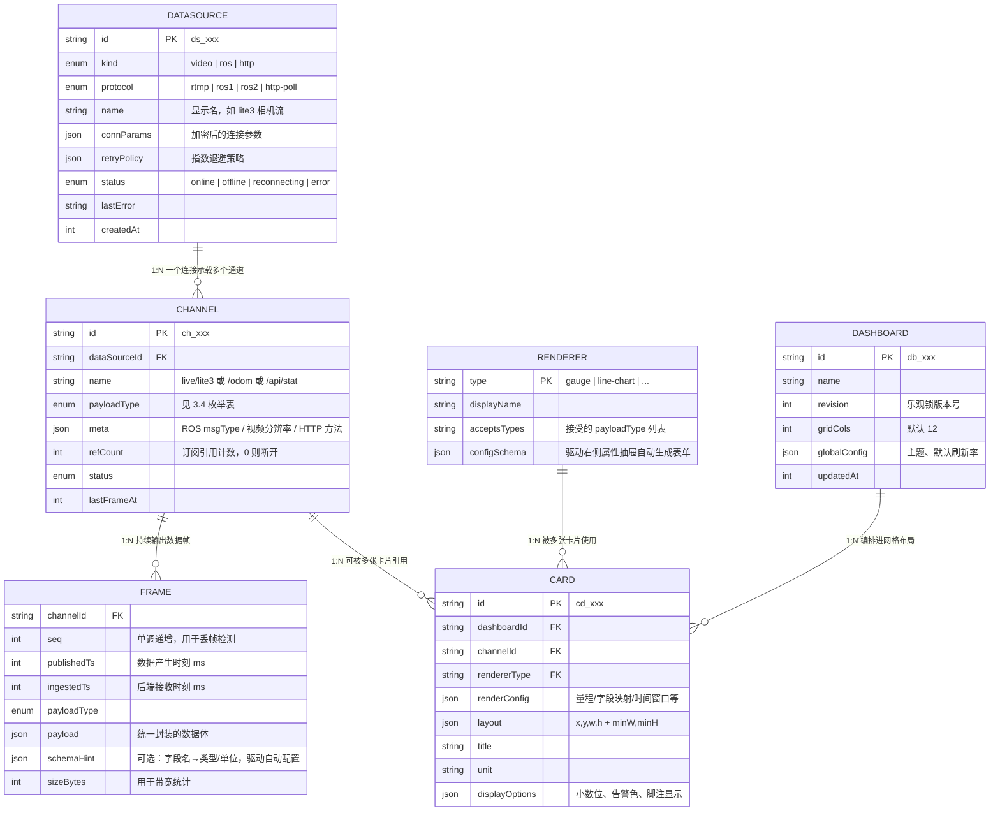
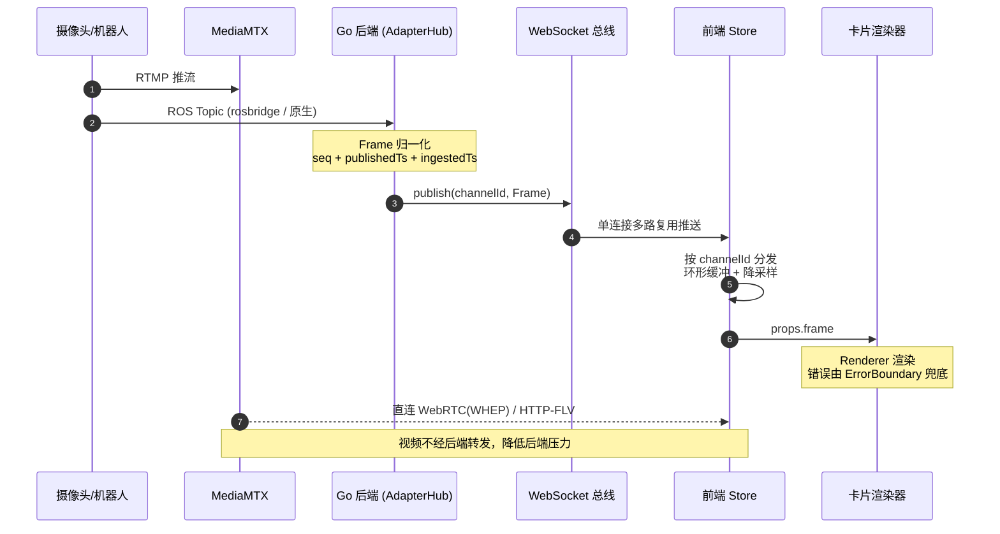
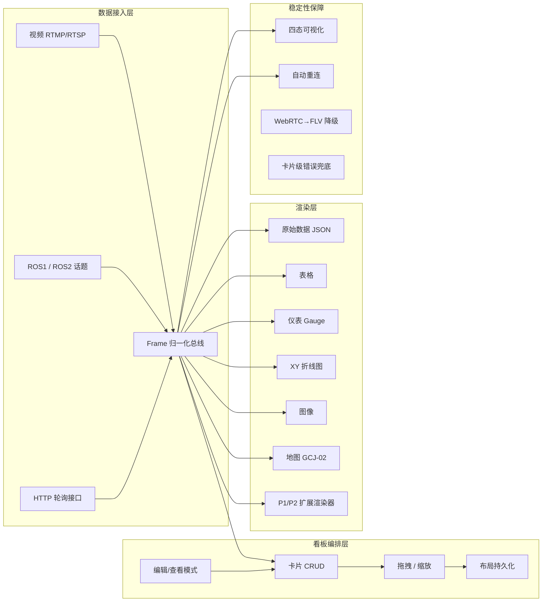
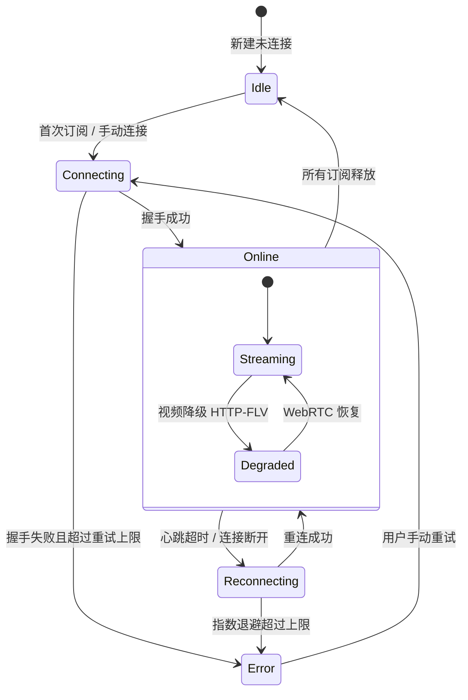
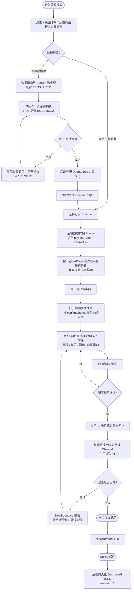

# MonitorAll 监控看板平台 — 产品需求文档（PRD）

| 项 | 内容 |
| --- | --- |
| 版本 | **v1.0** |
| 日期 | **2026-09-21** |
| 作者 | **许清楚（产品经理）** |
| 项目名 | `monitor_all` |
| 文档状态 | 待评审（架构师 / 用户） |
| 关联文档 | 系统架构设计文档（待产出） |

---

## 0. 阅读指南

- 本文档只定义**做什么、为什么做、验收标准**，不涉及代码实现。
- 文中 `[P0]` = 必须有，`[P1]` = 应该有，`[P2]` = 可以有（详见第 4.4 节需求池）。
- **标记为 🔒 的条目为硬约束**（技术选型已由用户确认，不做推翻讨论）。
- 标记为 ❓ 的条目需在架构评审前拍板，汇总见第 8 节。

---

## 1. 项目概述

### 1.1 原始需求（用户原话）

> "我需要开发出一个监控平台，可以接收自定义视频流（例如：`rtmp://172.31.68.227:1936/live/lite3`），局域网内的 ros 话题，http 接口获取的数据（可以选择数据的渲染方式，原始数据、表格、仪表、地图、图像、xy 随时间变化的图表等等），都使用卡片式布局，来方便后续拖拽编辑布局。"

### 1.2 场景画像

| 维度 | 描述 |
| --- | --- |
| 使用场景 | **局域网内**的工业 / 机器人实时监控看板 |
| 典型用户 | 机器人方向研究者（技术用户）+ 其非技术同事（操作者） |
| 典型监控对象 | 四足机器人（机械狗）：视频流、里程计 /odom、IMU、相机图像、电池电压、自建 HTTP 遥测服务 |
| 典型部署 | 一台局域网主机（或工控机），同事通过浏览器访问同一地址 |
| 视频源示例 | `rtmp://172.31.68.227:1936/live/lite3`（RTMP，端口 1936） |

### 1.3 价值主张（一句话）

> **让 ROS 机器人 / 工业设备的多源异构数据（视频、话题、HTTP 接口），在局域网内以"拖拽即得的卡片看板"形式零配置门槛地可视化出来。**

### 1.4 产品目标（3 条，正交）

| # | 目标 | 衡量指标（上线后 30 天内） |
| --- | --- | --- |
| G1 | **接得进**：异构数据源统一接入 | 视频 / ROS1 / ROS2 / HTTP 四类源全部可用；新增一个数据源的平均配置时间 ≤ 60 秒；非技术同事可在无文档情况下完成配置 |
| G2 | **看得清**：数据可选渲染方式与拖拽布局自由编排 | **7 种** P0 渲染器全部可用；单条数据可切换 ≥ 3 种渲染方式；布局拖拽/缩放/保存闭环可用，布局还原准确率 100% |
| G3 | **扛得住**：7×24 长时间稳定运行，故障局部化 | 连续运行 72h 无重启；内存 48h 增长 < 10%；任意单卡片崩溃不影响其余卡片；数据源断线后 ≤ 5s 自动恢复 |

### 1.5 非目标（本版本明确不做）

- 不做公网 SaaS、不做云端账号体系。
- 不做海量历史数据归档与大数据分析。
- 不做移动端原生 App（P2 才考虑响应式平板适配）。
- 不做 RISC-V / Windows 以外的桌面客户端打包。

---

## 2. 用户故事

> 全部采用「作为……我希望……以便……」格式。

| # | 用户故事 | 优先级 |
| --- | --- | --- |
| US-1 | 作为**机器人研究者**，我希望在页面上粘贴一条 RTMP 地址（如 `rtmp://172.31.68.227:1936/live/lite3`）就能看到画面，以便我不必手动敲 ffmpeg 命令验证推流是否正常 | P0 |
| US-2 | 作为**操作同事**，我希望从下拉列表里直接选 ROS 话题（而不是手打 `/odom`），以便我不会因为拼错话题名而看到空白卡片 | P1 |
| US-3 | 作为**研究者**，我希望同时接入 ROS1（Noetic）和 ROS2（Humble）两套机器人，并且只需在表单里切换版本，以便在混合设备环境中不用开两个软件 | P0 |
| US-4 | 作为**研究者**，我希望配置一个 HTTP 接口地址和轮询间隔，就能把自建遥测服务的 JSON 数据接到看板上，以便不改动现有后端代码即可纳管 | P0 |
| US-5 | 作为**研究者**，我希望对同一份数据（例如 `/battery`）在原始数据 JSON、数显表格、仪表盘三种渲染方式之间随意切换，以便我能挑出最适合该数据的呈现形式 | P0 |
| US-6 | 作为**操作同事**，我希望用鼠标拖动和拉伸卡片来排布看板并点击保存，以便我无需写代码或改 JSON 就能定制自己的监控视图 | P0 |
| US-7 | 作为**研究者**，我希望把配置好的整套看板导出成一个 JSON 文件（或复制分享链接）给同事导入，以便团队快速复用同一套监控视图 | P1 |
| US-8 | 作为**操作同事**，我希望每张卡片上有明确的连接状态角标（在线 / 离线 / 重连中 / 错误），以便我能立刻判断是"设备真离线"还是"看板出问题了" | P0 |
| US-9 | 作为**研究者**，我希望网络抖动后视频和话题能自动重连恢复而不用刷新页面，以便长时间监控（数小时野外测试）不断裂 | P0 |
| US-10 | 作为**研究者**，我希望某张卡片（例如一张渲染失败的地图卡）出错时只显示该卡片的错误提示，以便**整个看板不会白屏**、其它数据继续可见 | P0 |
| US-11 | 作为**研究者**，我希望地图卡片能正确显示机器人 GPS 轨迹，并且坐标系偏差不明显，以便我能直接依据轨迹判断机器人位置 | P0 |
| US-12 | 作为**团队负责人**，我希望在查看模式下锁定布局（禁止拖拽），以免值班同事误拖动破坏排好的看板 | P0 |
| US-13 | 作为**研究者**，我希望能给电池电压卡片设置红/黄/绿阈值区间，以便低于警戒值时一眼看出 | P1 |
| US-14 | 作为**研究者**，我希望后期能扩展自定义渲染器插件，以便接入点云、雷达等专用可视化而不用改平台代码 | P2 |
| US-15 | 作为**研究者**，我希望在视频卡片上能一键截图/录制短片，以便事后复盘现场画面 | P2 |

---

## 3. 核心概念模型

### 3.1 对建议模型的评审结论

用户建议的模型：**DataSource / Frame / Renderer / Card / Dashboard**。
评审结论：**整体方向正确、层次清晰，保留并细化；但有 3 处必须改进。**

| # | 问题 | 改进方案 | 理由 |
| --- | --- | --- | --- |
| ❶ | 「DataSource 既表示连接，又表示一个话题订阅」职责混淆 | **拆为两层：`DataSource`（连接）→ `Channel`（通道/订阅）** | 一台 ROS Master 上订阅 20 个话题，若不拆分就会产生 20 条独立连接与 20 次独立握手/重连 → **重连风暴**与资源浪费。拆开后可实现「连接复用 + 引用计数」（最后一订阅退出才断开），且数据源面板可按树形组织，视觉上更符合直觉 |
| ❷ | Card 直接绑 DataSource，粒度太粗 | **Card 绑定 `Channel`** | 一个 HTTP 服务根地址下可能有 `/api/stat`、`/api/health` 多个接口；一个 ROS Master 下有 N 个话题。绑在 Channel 上才能真正表达"这张卡显示的是哪一路数据" |
| ❸ | Renderer 无能力声明，无法支撑"自动推荐可用渲染方式" | **引入 `RendererManifest`（渲染器能力清单）：声明其接受的 `payloadType` 列表、配置项 Schema** | 用户核心诉求之一是「可以选择数据的渲染方式」。只有渲染器声明自己能吃什么数据，才能在 UI 上**只列出兼容的渲染器**（而非给用户 20 个选项让他试错），同时为 P2 的渲染器插件化预留接口 |
| ➍ | Frame 只有单一 timestamp，无法测量链路延迟 | Frame 增加 **`publishedTs` / `ingestedTs` 双时间戳 + `seq` 序号** | 视频/ROS 数据延迟是产品核心指标（见第 6 节），无双时间戳则无法端到端量化，也无法检测丢帧 |

**其余保留并细化**：Frame 的 `sourceId/channelId` 命名对齐、`payloadType` 枚举化、Dashboard 增加 `revision` 支持版本与导入导出。

### 3.2 最终概念模型（六层）

| 层级 | 实体 | 定义 | 举例 | 生命周期 |
| --- | --- | --- | --- | --- |
| L1 | **DataSource**（数据源连接） | 一次连接配置：类型 + 连接参数 + 重试策略 + 状态。**它本身不直接出数据** | 一个 MediaMTX 服务、一个 ROS1 Master、一个 ROS2 Domain、一个 HTTP 服务根地址 | 长生命周期，持久化到后端 |
| L2 | **Channel**（数据通道） | DataSource 之下的**最小订阅单位**，是实际的数据出口。有独立的 `payloadType`、`status`、订阅引用计数 | RTMP path `live/lite3`、话题 `/odom`、HTTP 端点 `/api/stat` | 依附于 DataSource；可被手动发现或自动生成 |
| L3 | **Frame**（数据帧） | 通道输出的**标准化数据单元**，跨源统一格式 | 一帧 `/battery` 电压读数、一张 ROS Image、一条 HTTP JSON | 内存中流过，不落盘（P2 才考虑） |
| L4 | **Renderer**（渲染器） | 把某类 Frame 画成某种视觉形式的插件，由 `RendererManifest` 声明能力 | 仪表、折线图、地图、图像 | 前端注册表中的静态能力 |
| L5 | **Card**（卡片） | **Channel(1) + Renderer(1) + RenderConfig(1) + Layout(1) + 展示元信息** | 「lite3 前置相机」视频卡、「电池电压」仪表卡 | 持久化到后端，隶属于某个 Dashboard |
| L6 | **Dashboard**（看板） | 一组 Card + 一份网格布局 + 全局配置（主题、刷新策略、栅格列数） | 「机械狗外场测试看板」 | 持久化到后端，支持导入/导出/分享 |

> **一句话记忆**：`Dashboard ⊃ Card = Channel(⊂ DataSource) × Renderer；Channel 吐 Frame，Renderer 吃 Frame。`

### 3.3 实体关系图



### 3.4 `payloadType` 标准化枚举（关键契约）

所有数据源进入总线前**必须**归一化到下列类型之一，这是「渲染方式可选」的技术前提。

| payloadType | 含义 | 典型来源 | 可渲染（P0 内） |
| --- | --- | --- | --- |
| `video_stream` | 流媒体播放地址（非像素数据） | RTMP 经 MediaMTX 转封装 | 视频播放器 |
| `image` | 单张图片（JPEG/PNG base64 或 URL） | ROS `sensor_msgs/Image`、HTTP 图片接口 | 图像渲染器 |
| `scalar` | 单个数值（含单位/范围） | `/battery`、HTTP 某字段 | 仪表、数显、进度条、状态灯 |
| `time_series_sample` | 同一时刻的多个命名字段值 | `/odom`、`/imu`、HTTP JSON 对象 | 折线图、表格、原始数据 |
| `geo_pose` | 经纬度 + 朝向 + 时间戳 | `/gps/fix`、`/odom` 里程推算 | 地图轨迹/点位 |
| `table` | 行列结构数据 | HTTP 返回数组 | 表格 |
| `json` | 任意嵌套 JSON | HTTP 原始响应、任意 ROS msg | 原始数据 JSON 树、表格（自动拍平） |
| `log_line` | 一行带级别和时间的文本 | `/rosout`、日志 HTTP 接口 | 日志流（P1） |
| `state_enum` | 枚举状态值 | 自定义状态话题 | 状态灯/徽标（P1） |
| `histogram_bins` | 预聚合的分桶数据 | HTTP 统计接口 | 直方图（P1） |
| `point_cloud` | 点云数据 | ROS `PointCloud2` | 3D 渲染器（P2） |

> **兼容矩阵原则**：渲染器可声明接受多种 payloadType；`json` 为兜底类型（几乎所有渲染器可接受 `json` 并让用户挑字段）。

### 3.5 ROS 统一适配器契约（产品侧定义，实现由架构师决定）

🔒 ROS1（Noetic/Melodic）与 ROS2（Humble/Foxy）**必须同时支持**，运行时按版本切换。
对用户而言，两种版本的配置体验**必须完全一致**，因此定义如下统一契约：

| 契约能力 | 说明 | 用户可见价值 |
| --- | --- | --- |
| `Connect(connParams) → status` | 建立到 Master / Domain 的连接 | 表单只需填地址 + 选版本 |
| `ListTopics() → TopicInfo[]` | 返回话题名 + 消息类型 + 发布者数量 | 驱动下拉选择器（US-2） |
| `Subscribe(topic, opts) → Frame流` | 订阅并输出 Frame | macOS/Windows 体验无差异 |
| `Unsubscribe(handle)` | 取消订阅 | 删除卡片即释放资源 |
| `Health() → latency, status` | 心跳与健康度 | 状态角标与延迟显示 |
| `MsgType → payloadType 映射表` | 见下表 | 自动推荐渲染器 |

**ROS 消息类型 → payloadType 映射（MVP 必须覆盖）**

| ROS 消息类型 | payloadType | 默认推荐渲染器 |
| --- | --- | --- |
| `std_msgs/Float32`、`Float64`、`Int32`、`Bool` | `scalar` | 数显 / 仪表 |
| `sensor_msgs/BatteryState` | `scalar`（取 voltage）+ `state_enum` | 仪表 / 状态灯 |
| `sensor_msgs/Imu` | `time_series_sample` | 折线图（多字段） |
| `nav_msgs/Odometry` | `time_series_sample` + `geo_pose` | 折线图 / 地图轨迹 |
| `sensor_msgs/NavSatFix` | `geo_pose` | 地图点位 |
| `sensor_msgs/Image` / `CompressedImage` | `image` | 图像渲染器 |
| `sensor_msgs/LaserScan` | `histogram_bins`（P2 转雷达） | 直方图 |
| `rosgraph_msgs/Log` | `log_line` | 日志流（P1） |
| 其他未知类型 | `json`（反射转 JSON） | 原始数据 JSON 树 |

> ❓ **实现路线待确认**：走「rosbridge WebSocket 统一代理」还是「Go 原生 TCPROS / DDS」。见 Q6，PM 建议 MVP 走 rosbridge（版本无关、开发快），P2 对性能敏感话题改原生。

### 3.6 端到端数据流



> **设计要点**：视频像素流**不经过 Go 后端**（后端只做地址编排与状态管理），避免后端成为带宽瓶颈；控制面（增删改订阅）走 REST，数据面走 WebSocket。

---

## 4. 功能需求

### 4.1 功能全景



### 4.2 数据源子系统

#### 4.2.1 三种数据源类型参数（MVP）

| 类型 | 必填参数 | 可选参数 | Channel 生成方式 |
| --- | --- | --- | --- |
| **视频（RTMP）** 🔒 | 名称、RTMP 完整 URL（如 `rtmp://172.31.68.227:1936/live/lite3`） | 是否音频、画质档位、首选协议 | 自动 1 个 Channel，产出 `video_stream` |
| **ROS** 🔒 | 名称、ROS 版本（ROS1/ROS2 下拉切换）、Master URI / ROS_DOMAIN_ID | 节点名、QoS、压缩话题开关 | 「新建时手工填 topic」或 P1「从 ListTopics 下拉选」 |
| **HTTP 轮询** | 名称、URL、轮询间隔（默认 1000ms，下限 100ms） | Method(GET/POST)、Header、Body、JSONPath 提取路径、超时 | 每个数据源 1 个 Channel，产出 `json`/`time_series_sample` |

#### 4.2.2 数据源状态机（四态）🔒 P0



- **在线（绿）** / **离线（灰）** / **重连中（黄，闪烁）** / **错误（红，hover 显示 `lastError`）**
- 重连策略：`min(基础间隔 × 2^n, 上限)` 指数退避，默认基础 1s、上限 30s、抖动 ±20%（防重连风暴）。

### 4.3 渲染器矩阵

| 编号 | 渲染器 | 接受 payloadType | 关键配置项 | 优先级 | 来源 |
| --- | --- | --- | --- | --- | --- |
| RD-01 | **原始数据（JSON 树）** | `json` / 任意 | 展开层级默认深度、是否显示类型 | P0 | ✅ 用户点名 |
| RD-02 | **表格** | `table` / `json`(拍平) / `time_series_sample` | 列选择、列宽、排序、冻结首列、行数上限 | P0 | ✅ 用户点名 |
| RD-03 | **仪表 Gauge** | `scalar` / `json`(挑字段) | 量程 min/max、单位、小数位、指针样式 | P0 | ✅ 用户点名 |
| RD-04 | **XY 随时间折线图** | `time_series_sample` / `scalar` / `json` | 字段→轴映射（多选）、时间窗口（默认 60s）、Y 轴自动/固定量程、暂停、CSV 导出 | P0 | ✅ 用户点名 |
| RD-05 | **图像** | `image` | 保持宽高比/拉伸、缩放、是否显示时间戳水印、帧率上限 | P0 | ✅ 用户点名 |
| RD-06 | **地图（GCJ-02）** | `geo_pose` | 底图样式（标准/卫星/暗色）、轨迹尾迹长度、是否跟随当前点、标记图标 | P0 | ✅ 用户点名 |
| RD-07 | **视频播放器** | `video_stream` | 首选协议、自动播放、静音、音量、画质档位、全屏 | P0 | ✅ 用户点名（自定义视频流） |
| RD-08 | 数显卡片（大字号） | `scalar` / `json` | 字号、单位、前缀/后缀、变化箭头 | P1 | 补充 |
| RD-09 | 状态灯 / 徽标 | `state_enum` / `scalar` | 状态值→颜色/文字映射表 | P1 | 补充 |
| RD-10 | 进度条 | `scalar` | min/max、渐变色、反向（充放电）、是否显示百分比 | P1 | 补充 |
| RD-11 | 日志流 | `log_line` | 级别过滤（DEBUG/INFO/WARN/ERROR）、关键字高亮、滚动锁定、行数上限 | P1 | 补充 |
| RD-12 | 直方图 | `histogram_bins` / `scalar` | 分桶数、颜色、是否显示数值标签 | P1 | 补充 |
| RD-13 | 折线图增强（多 Y 轴/缩放拖拽/导出） | `time_series_sample` | 双 Y 轴、dataZoom、图例联动 | P1 | 补充 |
| RD-14 | 仪表阈值区段着色（红/黄/绿弧线） | `scalar` | 阈值分段数量与配色、hover tooltip | P1 | 补充（US-13） |
| RD-15 | 地图多图层 / 多点位 | `geo_pose` | 多通道叠加、跟随模式、地理围栏绘制 | P1 | 补充 |
| RD-16 | 雷达图 | `time_series_sample` | 维度选择、量程 | P2 | 补充 |
| RD-17 | 散点图 / 相关性图 | `time_series_sample` | X/Y 字段、点大小 | P2 | 补充 |
| RD-18 | 点云 / 3D（TF + PointCloud） | `point_cloud` | 视角、点云抽稀率、色带 | P2 | 补充 |
| RD-19 | 告警列表 | 任意 + 规则 | 规则表达式、级别、确认操作 | P2 | 补充 |
| RD-20 | 视频快照 / 短时录制 | `video_stream` | 截图格式、录制时长 | P2 | 补充 |
| RD-21 | 自定义渲染器插件 | 任意 | 由插件 SDK 声明 Manifest | P2 | 补充（US-14） |

> **编号规则**：`编号` 列与 4.4 节需求池中的 `RD-xx` 条目**一一对应**，评审时请交叉引用。

> **渲染器选择交互**：用户在配置卡片时只看到**与自己数据 payloadType 兼容的渲染器**（兼容项置顶且打「推荐」标签，不兼容项置灰并 tooltip 说明原因）。

### 4.4 需求池

> 优先级：P0 = MVP 必须（产品可跑起来的最小集）；P1 = 应该有；P2 = 可以有。
> 编号规则：`DS` 数据源 / `BE` 后端总线 / `RD` 渲染器 / `CD` 卡片与布局 / `DB` 看板 / `ST` 稳定性 / `OP` 平台运维。

#### A. 数据源接入（DS）

| 编号 | 需求描述 | 优先级 | 验收标准 |
| --- | --- | --- | --- |
| DS-01 | 🔒 RTMP 视频源接入：表单输入完整 RTMP URL，实时校验 URL 合法性并自动填充显示名 | P0 | 粘贴 `rtmp://172.31.68.227:1936/live/lite3` 后 ≤ 10s 卡片出画面；填入 `abc` 时输入框即时红字报错且保存按钮禁用 |
| DS-02 | 🔒 MediaMTX 双路播放地址生成：同一 path 同时产出 WebRTC(WHEP) 与 HTTP-FLV 两个可播放地址供前端选择 | P0 | 对同一 RTMP path，浏览器可直接打开两路地址均能播放；后端 API 返回两路 URL 字段 |
| DS-03 | 🔒 ROS1（Noetic/Melodic）话题订阅，支持手动填写 topic 名 + 消息类型自动推断 | P0 | 订阅 `/odom` 后 ≤ 2s 收到数据；发布端退出后状态转为重连中 |
| DS-04 | 🔒 ROS2（Humble/Foxy）话题订阅，与 ROS1 共用同一套对外契约 | P0 | 切换版本后配置表单字段不变；订阅 `/imu/data` 成功并渲染 |
| DS-05 | 🔒 ROS 版本运行时切换：同一数据源表单提供 ros1/ros2 下拉，切换后按对应适配器连接 | P0 | 不重启后端即可在两种版本间切换并各自连成功 |
| DS-06 | ROS 话题浏览器：调用 ListTopics 自动列举话题名与消息类型，支持搜索过滤的下拉选择 | P1 | 下拉列表在点击后 ≤ 3s 展示全部话题；选中后自动带出消息类型与推荐渲染器 |
| DS-07 | HTTP 轮询数据源：配置 URL + 间隔（默认 1000ms）+ JSONPath 提取路径 | P0 | 配置一个返回 JSON 的自建接口，卡片按间隔刷新数据；间隔设为 100ms 时不报错 |
| DS-08 | HTTP 高级配置：POST Method、自定义 Header/Body、Basic/Bearer 认证、跳过 TLS 自签校验 | P1 | 携带 Header 成功请求需鉴权的接口；勾选后自签 HTTPS 接口可正常拉取 |
| DS-09 | 「测试连接」按钮：保存前验证连通性并展示一帧样例数据预览 | P1 | 点击后 ≤ 5s 返回成功/失败原因；成功时展示样例 Frame 及识别出的 payloadType |
| DS-10 | 数据源全局启用/禁用开关（禁用后其下所有卡片显示「已停用」占位） | P2 | 关闭后卡片停止订阅且不报错，重新开启后自动恢复 |
| DS-11 | 数据源分组/标签管理（按机器人、按项目打标签过滤） | P2 | 左侧面板可按标签筛选数据源 |
| DS-12 | 扩展数据源类型：Prometheus / MQTT / WebSocket 订阅 | P2 | 至少支持 MQTT 订阅并在页面上可配置 topic |

#### B. 后端与数据总线（BE）

| 编号 | 需求描述 | 优先级 | 验收标准 |
| --- | --- | --- | --- |
| BE-01 | 统一 Frame 归一化：各数据源输出统一封装（seq / publishedTs / ingestedTs / payloadType / payload / schemaHint） | P0 | 三类数据源产出的 Frame 结构完全一致；前端无需针对不同源写分支逻辑 |
| BE-02 | WebSocket 单连接多路复用：前端仅建立一条 WS 连接承载所有 Frame 与状态事件 | P0 | 打开含 30 张卡片的看板，浏览器 Network 中仅 1 条 WS 连接 |
| BE-03 | 订阅生命周期管理：引用计数，首个订阅建立连接、最后一个订阅释放则断开 | P0 | 3 张卡片订阅同一话题时后端只建立 1 条底层连接；删除全部卡片后连接释放且无 goroutine 泄漏 |
| BE-04 | 通道级限流与丢帧策略：高频话题（如 30fps 图像）可按配置降频或丢弃积压帧 | P1 | 配置 5fps 上限后，前端实测渲染帧率 ≤ 6fps；高频数据不导致内存持续增长 |
| BE-05 | 后端运行指标暴露：在线数据源数、WS 连接数、每秒帧数、内存占用 | P1 | 内置状态页面展示上述 4 项且每 5s 自刷新 |
| BE-06 | REST API：数据源 / 通道 / 看板 / 卡片的增删改查 | P0 | 全部接口有统一响应格式与错误码；重启后数据不丢失 |
| BE-07 | 配置持久化：默认 SQLite（或 JSON 文件）落盘，启动时自动加载并恢复已配置的数据源 | P0 | 后端重启后看板与数据源配置完整恢复；异常断电（kill -9）后已保存配置不损坏 |
| BE-08 | 单二进制交付：前端构建产物嵌入 Go 二进制，一条命令启动 | P1 | 复制单个可执行文件到目标机器即可运行，无需装 Node/静态服务器 |
| BE-09 | 健康检查接口 `/healthz`、`/readyz` | P1 | 返回 JSON 状态；异常时 HTTP 500 |
| BE-10 | 结构化日志：按等级输出到标准输出与滚动日志文件 | P1 | 日志含时间戳/等级/模块/channelId；单文件上限 50MB 自动滚动，保留 7 天 |

#### C. 渲染器（RD）

| 编号 | 需求描述 | 优先级 | 验收标准 |
| --- | --- | --- | --- |
| RD-01 | 原始数据渲染器：JSON 树形展示，支持折叠、类型标注、层级深度控制 | P0 | 任意嵌套 JSON 均可展开查看；5000 字段的响应渲染不卡顿（>1s 则视为不通过） |
| RD-02 | 表格渲染器：自动从 JSON 数组/对象生成列，支持列选择、排序、行数上限 | P0 | 1000 行 × 20 列数据滚动流畅；超过 5000 行自动截断并提示 |
| RD-03 | 仪表 Gauge 渲染器：支持量程、单位、小数位配置 | P0 | 量程改为 0–100 后指针与刻度实时正确；数据超量程时显示为满量程并标红 |
| RD-04 | XY 随时间折线图：支持多字段映射、时间窗口（默认 60s）、暂停、CSV 导出 | P0 | 20Hz 数据连续跑 30min 内存稳定；导出 CSV 内容与图表数据一致 |
| RD-05 | 图像渲染器：显示 ROS Image / HTTP 图片，支持保持宽高比、时间戳水印 | P0 | 1080p@15fps 图像卡片 CPU 占用无明显飙升；切换 url 后 1s 内更新 |
| RD-06 | 🔒 地图渲染器：基于高德 JS API 显示点位与轨迹，坐标系为 **GCJ-02** | P0 | 注入 WGS-84 坐标后地图点位与参照物（如道路）偏差 < 10m；连续轨迹帧率达 10Hz 不卡顿 |
| RD-07 | 视频播放器渲染器：播放 `video_stream` 通道的流媒体，含播放/暂停、音量、静音、全屏、画质档位、协议指示 | P0 | 新建视频卡片后自动开始播放；全屏后 Esc 退出不影响布局；WebRTC 不可用自动降级 FLV（配合 ST-03）；8 张视频卡同时播放 CPU 占用可控 |
| RD-08 | 数显卡片渲染器（大字号单值 + 单位 + 变化箭头） | P1 | 数值变化时字色可闪烁一次提示；支持设置小数位与千分位 |
| RD-09 | 状态灯 / 徽标渲染器：枚举值到颜色文字的可视化映射 | P1 | 可自定义 ≥ 5 组「值→颜色+文案」映射，未知值显示为灰色兜底 |
| RD-10 | 进度条渲染器 | P1 | 支持反向（充放电方向）与渐变色 |
| RD-11 | 日志流渲染器：级别过滤、关键字高亮、滚动锁定 | P1 | 5000 行日志滚动流畅；开启过滤后实时生效 |
| RD-12 | 直方图渲染器 | P1 | 分桶数可调，切换后立即重绘 |
| RD-13 | 折线图增强：双 Y 轴、区域拖拽缩放（dataZoom）、图例开关联动 | P1 | 拖拽缩放后时间窗正确收缩；隐藏图例后对应曲线消失且 Y 轴量程自适应 |
| RD-14 | 仪表阈值区段着色（红/黄/绿弧线） | P1 | 支持 ≥ 3 段区间配置，各段颜色与 tooltip 正确 |
| RD-15 | 地图多图层与跟随模式（尾迹长度可调、镜头跟随当前点） | P1 | 开启跟随后地图自动平移保持点位居中；尾迹长度调整立即生效 |
| RD-16 | 雷达图渲染器 | P2 | 多维度数据正确闭合显示 |
| RD-17 | 散点图 / 相关性图渲染器 | P2 | 支持 X/Y 字段选择与点大小设置 |
| RD-18 | 点云 / 3D 渲染器（含 TF 坐标变换） | P2 | 10 万点级别点云可交互旋转且帧率 ≥ 15fps |
| RD-19 | 告警列表渲染器（配合规则引擎） | P2 | 按时间倒序列出触发记录，支持确认/静默 |
| RD-20 | 视频快照与短时录制 | P2 | 一键保存当前帧为 PNG；录制 ≤ 60s 视频并下载 |
| RD-21 | 自定义渲染器插件 SDK + 注册表机制 | P2 | 按 SDK 文档开发的第三方渲染器可在不修改平台代码的前提下注册并出现在渲染器列表 |

#### D. 卡片与布局（CD）

| 编号 | 需求描述 | 优先级 | 验收标准 |
| --- | --- | --- | --- |
| CD-01 | 新增卡片向导：选数据源通道 → 选渲染器 → 配置 → 上画布（三步闭环） | P0 | 全程鼠标点击完成，无需编辑任何 JSON；≤ 5 次点击生成一张可用卡片 |
| CD-02 | 编辑已有卡片：可修改绑定的通道、渲染器与全部渲染配置 | P0 | 修改后立即在画布生效；切换渲染器时自动保留可复用的配置项（如标题、单位） |
| CD-03 | 删除卡片：支持卡片头关闭按钮与确认弹窗 | P0 | 删除后立即释放该通道订阅（引用计数归零时断开底层连接） |
| CD-04 | 卡片拖拽移动：网格拖拽，编辑模式下生效 | P0 | 拖拽跟手（≥ 50fps），落点吸附到最近网格；松手后位置正确保存 |
| CD-05 | 卡片缩放 resize：右下角手柄拖拽，八向缩放 | P0 | 缩放时不重排其它卡片导致布局错乱；最小尺寸不越界 |
| CD-06 | 网格吸附与最小尺寸约束（默认 12 列，卡片最小 2×2 格） | P0 | 卡片不得小于最小尺寸；不得拖出画布边界 |
| CD-07 | 渲染器兼容过滤：仅列出与当前 payloadType 兼容的渲染器，兼容项标记「推荐」 | P0 | 选中 `scalar` 类型数据时不出现「视频播放器」选项；不兼容项置灰并 tooltip 说明原因 |
| CD-08 | 卡片展示元信息配置：标题、单位、小数位、脚注（更新频率/延迟）显示开关 | P0 | 修改标题后画布立即更新；关闭脚注后卡片底部信息区消失 |
| CD-09 | 字段映射配置：通过可视化下拉/点选选择 JSONPath 字段，而非手填路径 | P0 | 嵌套对象可用点选方式挑到深层字段；选中后立即在预览区看到效果 |
| CD-10 | 卡片级错误兜底：单卡片渲染异常由 ErrorBoundary 捕获，显示错误卡占位 | P0 | 人为让某卡片渲染器抛异常，其余卡片数据持续刷新且页面不白屏；错误卡提供「重试」按钮 |
| CD-11 | 卡片三态 UI：加载骨架屏 / 空数据提示 / 连接中断遮罩（含重连倒计时） | P0 | 四种数据源状态对应四种明确视觉表现，不存在「白屏但无提示」的情况 |
| CD-12 | 卡片最大化（临时放大到画布全屏，Esc 还原） | P1 | 最大化时不影响持久化的原始布局；Esc 或点击还原按钮精确回到原位置尺寸 |
| CD-13 | 卡片复制：一键复制并自动偏移位置 | P1 | 复制出的卡片配置完全一致且不与现有卡片重叠 |
| CD-14 | 卡片右键菜单（编辑/复制/删除/最大化） | P1 | 菜单在编辑模式可用，查看模式禁用相关项 |
| CD-15 | 响应式断点布局：大屏/笔记本/平板三套布局分别保存 | P2 | 改变窗口宽度跨断点后自动切换到对应布局且不丢失 |
| CD-16 | 卡片联动（点击某卡片作为过滤变量影响其它卡片） | P2 | 配置源卡片与目标卡片的变量绑定后联动生效 |

#### E. 看板管理（DB）

| 编号 | 需求描述 | 优先级 | 验收标准 |
| --- | --- | --- | --- |
| DB-01 | 看板列表与 CRUD：新建 / 切换 / 重命名 / 删除（删除需二次确认） | P0 | 支持 ≥ 10 个看板；切换后 URL 变化，浏览器刷新仍停留在当前看板 |
| DB-02 | 布局持久化到后端：卡片位置尺寸与配置保存为看板 JSON | P0 | 保存后刷新页面，布局还原准确率 100%（含位置、尺寸、配置） |
| DB-03 | 编辑模式 / 查看模式切换 | P0 | 查看模式下拖拽与缩放失效、右键菜单编辑项隐藏；布局变更入口仅出现在编辑模式 |
| DB-04 | 未保存变更提示与 Ctrl+S 保存 | P0 | 有未保存改动时标签页显示圆点；关闭页面前弹浏览器原生确认框 |
| DB-05 | 本地草稿自动保存（localStorage）：后端不可用时也不丢失编辑内容 | P1 | 断开后端网络编辑后恢复网络，提示「有本地未同步草稿」并可一键同步 |
| DB-06 | 看板 JSON 导入 / 导出 | P1 | 导出后清空浏览器数据在另一台机器导入，布局与卡片完整还原 |
| DB-07 | 只读分享链接（带 token）：无需登录即可查看指定看板，禁止编辑 | P1 | 用分享链接打开看不到编辑入口；token 失效后链接返回 403 |
| DB-08 | 暗色 / 亮色主题切换 + 全局字号 | P1 | 切换后立即生效并随看板配置持久化；暗色主题下所有 P0 渲染器可读（对比度达标） |
| DB-09 | 多页签看板自动轮播（每 N 秒切换） | P2 | 大屏场景下无需人工干预循环展示 |
| DB-10 | 内置看板模板库（机器人标准监控模板一键套用） | P2 | 提供 ≥ 3 套模板，一键生成含视频/IMU/电池/地图的看板 |

#### F. 稳定性与降级（ST）

| 编号 | 需求描述 | 优先级 | 验收标准 |
| --- | --- | --- | --- |
| ST-01 | 数据源四态可视化：在线/离线/重连中/错误，卡片角标 + 左侧面板 + 全局状态条三处同步显示 | P0 | 手动 kill 数据源进程，3s 内三处 UI 同步进入重连中态 |
| ST-02 | 指数退避自动重连：默认基础 1s、上限 30s、±20% 抖动 | P0 | 数据源恢复后 ≤ 5s 自动恢复数据流，无需刷新页面 |
| ST-03 | 🔒 视频协议降级：优先 WebRTC，不可用时自动降级 HTTP-FLV，并支持手动强制切换 | P0 | 禁用 WebRTC 后自动在 ≤ 3s 内切到 FLV 继续播放；降级时卡片角标显示「FLV 1-3s 延迟」提示 |
| ST-04 | 前端 WS 断线重连与订阅恢复 | P0 | 重启后端后前端自动重连并恢复全部订阅，无需用户操作 |
| ST-05 | 全局连接状态条：显示后端在线状态、WS 延迟、活跃卡片数 | P1 | 断连时顶部横幅红条提示，恢复后绿条提示 3s 自动消失 |
| ST-06 | 一键部署与进程守护（systemd / Docker Compose 配置） | P1 | 主机重启后服务自启；`docker compose up -d` 一条命令拉起全部组件 |
| ST-07 | 前端内存保护：图表环形缓冲上限（默认 1200 点/通道）、卡片数量软上限 | P0 | 40 张卡片运行 2h，浏览器内存无持续增长趋势（< 10% 波动） |
| ST-08 | 渲染降级：帧率超过阈值时自动降采样渲染并提示 | P1 | 高频图像话题满载时不阻塞 UI 主线程，页面仍可拖拽 |
| ST-09 | 统一错误码体系与前端错误上报（本地错误列表页） | P2 | 所有后端错误返回可查表错误码；前端可见最近 100 条错误记录 |

#### G. 平台与运维（OP）

| 编号 | 需求描述 | 优先级 | 验收标准 |
| --- | --- | --- | --- |
| OP-01 | 局域网一键访问：启动后控制台打印可访问的 LAN 地址，浏览器打开即用 | P0 | 同事在同一局域网用另一台机器访问该地址可正常打开并使用全部功能 |
| OP-02 | Docker Compose 编排（平台 + MediaMTX 一体化启动） | P1 | 全新机器执行 `docker compose up -d` 后 60s 内看板可用 |
| OP-03 | 多用户、登录鉴权与角色权限（管理员/编辑者/查看者） | P2 | 未登录访问受限；查看者无法进入编辑模式 |
| OP-04 | 历史数据存储与时间轴回放 | P2 | 可选择任意历史时间段回放 ≥ 24h 前的数据 |
| OP-05 | 告警规则引擎（阈值/变化率/离线告警，含 Webhook 通知） | P2 | 规则触发后 ≤ 5s 产生告警并在看板与 Webhook 双通道呈现 |
| OP-06 | 操作审计日志（谁在何时改了哪张卡片） | P2 | 可按用户与时间检索审计记录 |

### 4.5 需求池统计

| 优先级 | 条目数 | 占比 | 说明 |
| --- | --- | --- | --- |
| **P0** | **39** | 46.4% | MVP 最小可跑集：四类数据源（RTMP / ROS1 / ROS2 / HTTP）+ 7 种渲染器 + 卡片与布局闭环 + 稳定性四件套 |
| **P1** | **27** | 32.1% | 体验增强：话题浏览器、更多渲染器、分享与主题、运维保障 |
| **P2** | **18** | 21.4% | 远期扩展：多用户、历史回放、告警、点云/插件生态 |
| **合计** | **84** | 100% | 分 7 个子域：DS(12) / BE(10) / RD(21) / CD(16) / DB(10) / ST(9) / OP(6) |

> 分域统计（`P0 / P1 / P2`）：DS 数据源接入 6/3/3 · BE 后端总线 5/5/0 · RD 渲染器 7/8/6 · CD 卡片布局 11/3/2 · DB 看板管理 4/4/2 · ST 稳定性 5/3/1 · OP 平台运维 1/1/4。
> 交叉引用：渲染器条目的详细说明见 4.3 节渲染器矩阵（`编号` 列与本表 `RD-xx` 一一对应）。

---

## 5. UI 设计稿

### 5.1 主界面布局（查看模式）

```
┌─────────────────────────────────────────────────────────────────────────────────┐
│ ① 顶部工具栏  TopBar                                                    h=48px  │
│                                                                                 │
│  MonitorAll │ 看板: 机械狗外场测试 ▾ │ [编辑模式] │ [+ 新建卡片] │ [保存] │     │
│                                                        ● 后端在线 28ms │ ◐ 主题 │
└─────────────────────────────────────────────────────────────────────────────────┘
┌────────────────┬────────────────────────────────────────────────────────────────┐
│ ② 数据源面板    │ ③ 网格画布 GridCanvas（12 列栅格，gap=12px）                    │
│  w = 260px     │                                                                │
│ ┌────────────┐ │ ┌──────────────┬──────────────┬──────────────┬───────────────┐ │
│ │🔍 搜索源   │ │ │ 视频 lite3   │ 电池电压     │ 里程计 XY    │ IMU 角速度    │ │
│ └────────────┘ │ │  4列×3行     │  2列×2行     │  4列×2行     │  4列×2行      │ │
│                │ │              │              │              │               │ │
│ ▾ 视频源       │ │  ┌────────┐  │   ╭──────╮   │    ╭─╮       │  ╭──╮    ╭──╮ │ │
│  ● lite3 相机  │ │  │ ▶画面  │  │  │ 24.6V │   │ ╭──╯ ╰──╮   │ ╭╯  ╰╮  ╭╯  ╰╮│ │
│  ○ 后置流(停用)│ │  │        │  │  │ ⚡在线 │   │ ╯        ╰   │ ╯     ╰──╯    │ │
│                │ │  └────────┘  │   ╰──────╯   │               │               │ │
│ ▾ ROS1 Master  │ └──────────────┴──────────────┴──────────────┴───────────────┘ │
│  ● /odom       │ ┌──────────────┬─────────────────────────────────────────────┐ │
│  ● /imu/data   │ │ 地图 轨迹    │ 相机图像 /camera/front                      │ │
│  ○ /tf (离线)  │ │  6列×3行     │  6列×3行                                    │ │
│                │ │  ╭─●─╮轨迹   │  ┌────────────────────────────────────────┐ │ │
│ ▾ ROS2 Domain  │ │  ╰───╯       │  │         JPEG 实时画面                 │ │ │
│  ● /battery    │ │              │  └────────────────────────────────────────┘ │ │
│                │ ├──────────────┴─────────────────────────────────────────────┤ │
│ ▾ HTTP 接口    │ │ 状态总览        │ 日志流 /rosout                           │ │
│  ● /api/stat   │ │  2列×2行        │  10列×2行                                │ │
│                │ │ ● 视频 ○ IMU   │ INFO  导航已就绪...                       │ │
│ [+ 新建数据源] │ │ ● ROS2 ● HTTP  │ WARN  里程计协方差偏高...                 │ │
└────────────────┴───────────────────────────────────────────────────────────────┘

④ 属性配置抽屉 Drawer（w=360px，仅在选中/新建卡片时从右侧滑出，见 5.3 流程图）
```

### 5.2 编辑模式差异（同一界面的变化点）

```
┌─────────────────────────────────────────────────────────────────────────────────┐
│  MonitorAll │ 看板 ▾ │ [◉ 编辑中] │ [+ 卡片] │ [保存 Ctrl+S ● 有未保存改动]     │
└─────────────────────────────────────────────────────────────────────────────────┘
┌────────────────┬────────────────────────────────────────────────────────────────┐
│ 数据源面板      │ 画布：卡片出现虚线外框 + 右上角操作图标 + 右下角缩放手柄         │
│ 每条源可【拖拽】 │                                                                │
│  到画布直接建档 │  ┌ ─ ─ ─ ─ ─ ─ ─ ─ ─ ─ ─ ─ ─ ┐                                │
│                │  │ Card              ⋮ ▢ ⤢ ✕ │ ← 编辑态装饰层                  │
│  提示：拖拽 ↓   │  │                            │                                │
│  ══▶ ══▶ ══▶   │  │      渲染区                │                                │
│                │  │                            ◢ ← resize handle               │
│                │  └ ─ ─ ─ ─ ─ ─ ─ ─ ─ ─ ─ ─ ─ ┘                                │
│                │  拖拽时显示 8px 蓝色对齐参考线 + 半透明占位阴影                   │
└────────────────┴────────────────────────────────────────────────────────────────┘
```

### 5.3 卡片通用内部结构

```
┌─ Card ────────────────────────────────────────────────────┐
│ ● 状态角标      标题  [单位]              ⋮   ▢   ⤢   ✕   │ ← 卡片头 h=32px
├───────────────────────────────────────────────────────────┤
│                                                           │
│                 渲染区  Renderer Body                     │ ← 唯一必需区，
│            （由 RendererManifest 决定画什么）              │   撑满剩余空间
│                                                           │
├───────────────────────────────────────────────────────────┤
│ 最后更新 12:03:45.120 │ 20 Hz │ 端到端 42ms │ /battery    │ ← 卡片脚 h=24px（可开关）
└───────────────────────────────────────────────────────────┘
   状态角标图例： ●绿=在线  ●灰=离线  ●黄闪=重连中  ●红=错误（hover 显示 lastError）
```

### 5.4 关键卡片 ① 视频卡片

```
┌─ 视频 · lite3 前置相机 ─────────────────────────────────────────────┐
│ ● WebRTC 在线                                    ⋮   ▢   ⤢   ✕     │
├─────────────────────────────────────────────────────────────────────┤
│                                                                     │
│                    <video> 画面区                                    │
│              保持源流宽高比，letterbox 填充黑色                        │
│                                                                     │
│   ┌─────────────────────────────────────────────────────────────┐   │
│   │ [▶/⏸]  [🔊━━━━●───]  画质[自动 ▾]  延迟 240ms   [⛶ 全屏]    │   │ ← 悬浮控制条
│   └─────────────────────────────────────────────────────────────┘   │   （hover 显示）
├─────────────────────────────────────────────────────────────────────┤
│ 协议 WebRTC │ RTT 32ms │ 码率 1.8Mbps │ 丢帧 0 │ 源 rtmp://…/lite3  │
└─────────────────────────────────────────────────────────────────────┘

WebRTC 不可用时（自动降级）：
┌─ 视频 · lite3 前置相机 ─────────────────────────────────────────────┐
│ ● HTTP-FLV (降级 1-3s)            ⚠ WebRTC 不可用，已自动降级  ⤢ ✕  │
├─────────────────────────────────────────────────────────────────────┤
│                       画面区（mpegts.js 播放 FLV）                    │
├─────────────────────────────────────────────────────────────────────┤
│ 协议 HTTP-FLV │ 缓冲 1.2s │ 重试 WebRTC ⟳ 30s │ [强制切换协议 ▾]     │
└─────────────────────────────────────────────────────────────────────┘
```

### 5.5 关键卡片 ② 仪表卡片

```
┌─ 仪表 · 电池电压 ───────────────────────────────────────────────────┐
│ ● 在线                                            ⋮   ▢   ⤢   ✕    │
├─────────────────────────────────────────────────────────────────────┤
│                                                                     │
│              ▂▂▂▂ 阈值区段弧线 ▂▂▂▂                                  │
│          ╭───╯ 🟢安全   🟡警戒   🔴危险 ╰───╮                        │
│         ╱                                    ╲                      │
│        │            ╭───────────╮            │                      │
│        │           │   24.6     │            │  ← 主数值 32px       │
│        │           │    V       │            │  ← 单位 14px         │
│        │            ╰───────────╯            │                      │
│         ╲            ● 指针                  ╱                      │
│          ╰────●────────────────────────────●╯                       │
│             0.0                          30.0                       │
│                       量程 0 – 30 V                                 │
├─────────────────────────────────────────────────────────────────────┤
│ MIN 22.1 │ MAX 26.3 │ 更新 10Hz │ 源 ROS2 /battery                  │
└─────────────────────────────────────────────────────────────────────┘
```

### 5.6 关键卡片 ③ XY 折线图卡片

```
┌─ 折线图 · 里程计线速度与角速度 ──────────────────────────────────────┐
│ ● 在线              [⏸ 暂停] [⟲ 清空] [⟱ CSV]      ⋮   ▢   ⤢   ✕   │
├──────────────────────────────────────────────────────────────────────┤
│ m/s                                                                  │
│ 1.5┤                                    ╭─╮        ╭─                │
│    │                        ╭───────────╯ ╰────────╯                 │
│ 0.8┤            ╭───────────╯                                        │
│    │   ╭────────╯                                                    │
│ 0.0┼───╯─────────────────────────────────────────────────────────    │
│    └──────────────────────────────────────────────────────────────   │
│     -0.5                                                    t →      │
│                                                                      │
│  ☑ x.linear(红)   ☑ z.angular(蓝)   ☐ pose.y(绿)   ← 图例 = 字段开关  │
├──────────────────────────────────────────────────────────────────────┤
│ 窗口 60s │ 采样 20Hz │ 缓冲 1200 点 │ 源 ROS1 /odom │ 端到端 42ms     │
└──────────────────────────────────────────────────────────────────────┘
```

### 5.7 关键卡片 ④ 地图卡片（合规重点）

```
┌─ 地图 · 机械狗实时轨迹 ──────────────────────────────────────────────┐
│ ● 在线                     [⊙ 跟随开] [尾迹 200]     ⋮   ▢   ⤢   ✕  │
├──────────────────────────────────────────────────────────────────────┤
│  ┌──────┐                                                            │
│  │  ＋  │  图层：☐卫星  ☑标准路网  ☐地形                              │
│  │  －  │                                                            │
│  └──────┘              ╭──────╮                                      │
│                        │ 轨迹 │  ← Polyline 轨迹（坐标已转 GCJ-02）  │
│                        ╰──▲──╯                                      │
│                           ▲ ← 当前位姿 Marker（朝向角随 yaw 旋转）    │
│   ┌──────────────────────────────────────────────┐                  │
│   │ lat 31.230412   lon 121.473701   yaw 87.3°   │ ← 悬浮信息面板     │
│   │ 坐标系 GCJ-02（源 WGS-84，已离线换算）         │                  │
│   └──────────────────────────────────────────────┘                  │
├──────────────────────────────────────────────────────────────────────┤
│ 高德 JS API 2.0 │ 已转换 1284 点 │ 源 /gps/fix │ ⓘ 境内合规底图       │
└──────────────────────────────────────────────────────────────────────┘
```

> 🔒 **合规红线（必须写入实现规范）**
> 1. 底图**仅使用高德地图 JS API**，禁止接入 Google Maps、未审校的 OSM 等非合规境外底图。
> 2. 高德底图为 **GCJ-02（火星坐标系）**；机器人 GPS/ROS 话题常输出 **WGS-84**。二者混用会产生约 **300–600 米偏移**，因此**必须转换**。
> 3. **转换策略（PM 建议，供架构师确认）**：默认在**后端/前端本地算法**（如 `gcoord`）离线完成 WGS-84 → GCJ-02 转换。理由：`AMap.convertFrom` 官方接口对**个人开发者有每日调用配额限制**且依赖外网，而本产品运行在可能离线的局域网环境中，本地换算无配额、无延迟、无网络依赖。`AMap.convertFrom` 仅作为抽样交叉校验手段。
> 4. 界面上必须让用户**显式声明输入坐标系**（WGS-84 / GCJ-02 / 已转换），并在卡片脚注显示当前生效坐标系。
> 5. 涉及行政边界/国界渲染必须使用国内合规数据源，不得引入境外边界数据。

### 5.8 卡片配置交互流程



### 5.9 空状态与错误态设计原则

| 场景 | 卡片表现 | 文案示例 |
| --- | --- | --- |
| 首次创建未配置 | 虚线占位 + 居中图标按钮 | 「选择数据开始」 |
| 等待首帧数据 | 骨架屏 + 脉冲动画 | 「等待数据…」 |
| 数据源离线 | 灰化渲染区 + 重连倒计时遮罩 | 「连接已断开，正在重连（3s）」 |
| 数据源错误 | 红色错误图标 + 折叠的错误详情 | 「订阅失败：话题不存在」+ [查看原因] |
| 数据为空/字段缺失 | 空状态插画 | 「未匹配到字段 `a.b.c`，请重新配置字段映射」 |
| 渲染异常 | 错误边界卡 | 「此卡片渲染出错，其余卡片不受影响」+ [重试] |

---

## 6. 非功能需求

### 6.1 性能指标

| 类别 | 指标项 | 目标值 | 测量方式 |
| --- | --- | --- | --- |
| **视频延迟** | WebRTC 端到端（P50 / P95） | ≤ 500ms / ≤ 800ms | 画面旁放置毫秒计时器，拍摄对比 |
| | HTTP-FLV 端到端 | 1 – 3s | 同上 |
| | 首次出图时间 | ≤ 3s | 新建卡片到画面渲染完成 |
| | 降级切换耗时 | ≤ 3s | 手动阻断 WebRTC 后计时 |
| **数据延迟** | ROS 数值类话题端到端 | ≤ 200ms | publishedTs 与前端渲染时刻差值 |
| | ROS 图像话题端到端（720p） | ≤ 500ms | 同上 |
| | HTTP 轮询数据端到端 | ≤ 轮询间隔 + 300ms | 同上 |
| **交互性能** | 卡片拖拽帧率 | ≥ 50fps | Chrome Performance 面板 |
| | UI 操作响应（点击→可见反馈） | ≤ 100ms | 手动计时 |
| | 看板首屏加载（含 40 卡片） | ≤ 2s | Lighthouse / Network 面板 |
| **容量** | 单看板卡片数 | ≥ 40 张（保持流畅） | 压力测试看板 |
| | 并发视频路数 | ≥ 8 路 720p 同时播放 | 8 张视频卡片看板测试 |
| | 后端并发数据通道 | ≥ 100 通道 | 模拟 100 路 ROS 话题 |
| | WebSocket 聚合吞吐 | ≥ 200 帧/秒 | 后端指标页观测 |
| | 并发浏览器会话 | ≥ 10 个只读会话 | 多机同时打开 |

### 6.2 稳定性

| 项 | 要求 |
| --- | --- |
| 连续运行时长 | 7×24 连续运行 **≥ 30 天**无需重启 |
| 内存增长 | 48h 连续运行内存增长 **< 10%**（无 goroutine / 无前端 DOM 泄漏） |
| 故障隔离 | 单卡片渲染异常、单数据源断连**不得**影响其它卡片与整个页面 |
| 自动恢复 | 数据源恢复后 **≤ 5s** 自动重连并恢复数据流；后端重启后前端自动恢复全部订阅 |
| 数据完整性 | 配置写入需事务保护，`kill -9` 后已保存数据不损坏、可正常启动 |
| 降级可用性 | WebRTC 不可用时必须自动降级 HTTP-FLV，**不允许出现无法播放** |

### 6.3 浏览器与环境兼容

| 浏览器 | 版本要求 | 支持级别 |
| --- | --- | --- |
| Chrome / Edge（Windows、macOS、Linux） | ≥ 100 | **必须完整支持**（主目标） |
| Firefox | ≥ 100 | 应该支持（HTTP-FLV 路径可用，WebRTC 需验证） |
| Safari（macOS / iPad） | ≥ 16 | 应该支持；HTTP-FLV 在 iOS Safari 受限，需注明以 FLV 兜底受限风险 |
| IE / 国产双核浏览器兼容模式 | — | **明确不支持** |
| 最小分辨率 | 1366×768 | 必须；1920×1080 与大屏 2560×1440 为推荐优化目标 |

> ⚠️ **安全上下文风险（需架构评审确认，见 Q5）**：现代浏览器要求 WebRTC 运行在**安全上下文**（HTTPS 或 localhost）。本产品通过局域网 `http://172.31.x.x:port` 访问时属于**非安全上下文**，WebRTC 可能被浏览器阻止。必须在架构设计中给出方案（推荐：内置自签 HTTPS + 一键信任指引；并保证 HTTP-FLV 路径始终可用作为兜底）。

### 6.4 配置持久化策略

| 数据 | 存储位置 | 说明 |
| --- | --- | --- |
| 看板定义（卡片 + 布局 + 渲染配置） | 后端 SQLite（默认）/ JSON 文件 | 主存储，`revision` 乐观锁防并发覆盖 |
| 数据源定义与连接参数 | 后端 SQLite（敏感字段加密存储） | 重启自动加载并尝试恢复重要数据源 |
| 编辑中的未保存草稿 | 浏览器 localStorage | 后端不可用时防丢失，恢复后提示「一键同步」 |
| 分享/导出 | JSON 文件导出 + token 只读链接 | 便于团队之间快速复制同一套视图 |
| Schema 演进 | 配置内含 `schemaVersion` 字段 + 迁移脚本 | 保证旧配置升级后可读 |

### 6.5 安全与部署

| 项 | 要求 |
| --- | --- |
| 网络边界 | MVP 默认仅监听局域网，不暴露公网；端口可在配置中修改 |
| 凭据保护 | 数据源 Token / 密码类参数加密落盘，API 返回时脱敏（返回 `***`） |
| 部署形态 | 单二进制 / Docker Compose（平台 + MediaMTX）两种形态都要提供 |
| 升级策略 | 滚动升级不丢失配置（配置卷挂载持久化） |

---

## 7. 技术选型结论（含 UI 库推荐）

🔒 已确认硬约束：**Vue 3 + Vite + TypeScript**（前端）、**Go**（后端）、**ROS1 + ROS2 双支持**、**MediaMTX（WebRTC + HTTP-FLV）**、**高德地图 GCJ-02**。

### 7.1 前端 UI 库选型：**推荐 Naive UI**

| 评判维度 | Naive UI（推荐） | Element Plus（备选） |
| --- | --- | --- |
| TypeScript 友好度 | ⭐⭐⭐⭐⭐ 原生 TS 编写，类型完备 | ⭐⭐⭐⭐ TS 类型较全，少数组件有 `any` |
| 暗色主题 | ⭐⭐⭐⭐⭐ 一等公民，`darkTheme` 开箱即用 | ⭐⭐⭐ 2.x 支持暗色，但需较多手工覆盖 |
| 主题定制深度 | ⭐⭐⭐⭐⭐ 基于 CSS 变量 + ThemeOverrides | ⭐⭐⭐⭐ 支持 SCSS 变量覆盖 |
| 配置项复杂度 | ⭐⭐ 组件数少于 Element Plus，偶需自研 | ⭐⭐⭐⭐⭐ 组件极全（表格/上传/表单） |
| 虚拟滚动表格 | ⭐⭐⭐⭐ `n-data-table` 原生支持 | ⭐⭐⭐⭐ 支持但配置略繁 |
| 表单驱动配置面板 | ⭐⭐⭐⭐ API 简洁，适合 schema 驱动 | ⭐⭐⭐⭐ `el-form` 校验体系成熟 |
| 生态/资料丰富度 | ⭐⭐⭐ 中文资料中等，社区较活跃 | ⭐⭐⭐⭐⭐ 中文资料最丰富，团队最熟悉 |
| 维护模式 | 核心作者驱动 + 社区，迭代快 | 社区 + 企业支持，非常稳定 |

**推荐理由（结合本项目特征）：**

1. **暗色大屏是主场景**：7×24 工业监控看板以暗色为主，Naive UI 的暗色主题是一等公民，改造成本远低于 Element Plus。
2. **TS 优先技术栈**：本项目已确定 TypeScript，Naive UI 原生 TS 类型能显著降低「把 configSchema 动态渲染成表单」这一核心功能的开发成本（CD-01 / CD-09）。
3. **配置项界面的核心是 Form + DataTable + Drawer + Tree + Select**，Naive UI 这些组件质量与 API 一致性最佳；日志流（RD-11）需要虚拟滚动表格，Naive UI 原生支持。
4. **视觉风格更现代**：偏科技感的监控平台，Naive UI 的默认视觉风格更贴合。

**风险控制**：若开发过程中遇到 Naive UI 缺失的关键组件，通过自研薄封装补齐（禁止同时引入两套 UI 库造成风格割裂）。并要求**所有业务组件不直接依赖 UI 库的类型**，通过 `src/components/base/` 适配层隔离，保留未来替换的可能。

### 7.2 其他关键技术组件建议（供架构师确认/取舍）

| 领域 | 建议方案 | 说明 |
| --- | --- | --- |
| 状态管理 | Pinia | Vue 3 官方推荐 |
| 网格拖拽布局 | `grid-layout-plus` **锁定 `^1.x` 稳定版** | Vue 3 + TS 的 Grid Layout 移植版，支持拖拽/resize/序列化还原；其 v2 目前仍为 beta，MVP **不要**用 v2 |
| 图表渲染 | ECharts（Gauge / Line / Histogram / Radar 全覆盖） | 一种库覆盖 P0 的仪表与折线图，降低体积与心智负担 |
| HTTP-FLV 播放 | `mpegts.js` | 广泛用于 FLV 低延迟播放 |
| 地图 | 高德地图 JS API 2.0 + `@amap/amap-jsapi-loader` | 合规底图 |
| 坐标转换 | **`gcoord`（本地离线算法）为主** | 规避 `AMap.convertFrom` 配额限制与外网依赖；官方接口仅作抽样校验 |
| ROS 接入（待定） | rosbridge WebSocket（MVP 建议） / Go 原生 TCPROS·DDS（P2） | 见 Q6 |
| 后端框架 | Go 标准库 + gorilla/websocket（或 gin） | 由架构师定 |
| 持久化 | SQLite（`modernc.org/sqlite` 纯 Go 免 CGO 更佳） | 免外部依赖，便于单二进制分发 |
| 部署 | Docker Compose（含 MediaMTX 官方镜像） | 一条命令起全栈 |

---

## 8. 待确认问题（需架构师 / 用户拍板）

| # | 问题 | 备选方案 | PM 建议 | 影响面 | 决策期限 |
| --- | --- | --- | --- | --- | --- |
| **Q1** | **是否需要多用户与权限体系？** | ① MVP 无鉴权（局域网可信网络，所有人可编辑）<br/>② MVP 即做登录 + 管理员/编辑/查看三种角色 | **建议 ①**：MVP 做无鉴权 + 只读分享链接（DB-07，P1）已足够；多用户列入 P2（OP-03）。局域网机器人场景更看重"立刻能用"，鉴权会显著拉长 MVP 周期 | 后端是否需要用户表、会话管理；所有 REST 接口是否加中间件 | 架构评审前 |
| **Q2** | **是否需要历史数据存储与回放？** | ① 只做内存环形缓冲（重启即丢，窗口 ≤ 60s）<br/>② 接入时序库（SQLite/InfluxDB）落盘 ≥ 7 天 + 时间轴回放 | **建议 ①**：MVP 只做内存环形缓冲即可满足"实时监控"核心诉求；历史回放（OP-04）明确列为 P2。若用户明确需要，需新增时序库组件与存储容量评估 | 后端存储选型、是否需要新组件、磁盘容量规划 | 架构评审前 |
| **Q3** | **MediaMTX 由平台托管还是外部独立部署？** | ① 平台内置托管（Docker Compose 同栈编排，平台负责拉起与健康检查）<br/>② 外部独立部署，平台只配置其 API 地址<br/>③ 两者都支持（默认托管，可切换为外部地址） | **建议 ③**：MVP 内置托管让用户体验"零配置"，同时保留"外部已有 MediaMTX"的接入能力（用户现网可能已有推流服务）。配置项：`mediamtx.mode = embedded \| external` | 部署形态、网络拓扑、是否需要管理 MediaMTX 进程 | 架构评审前 |
| **Q4** | **告警规则引擎是否纳入 MVP？** | ① 不纳入，仅做阈值着色（视觉提示）<br/>② MVP 纳入基础阈值告警 + 卡片飘红<br/>③ 完整规则引擎（阈值/变化率/离线 + Webhook） | **建议 ① + 部分②**：MVP 只做**视觉层面**阈值区段着色（RD-14，P1，成本极低）；完整告警引擎（OP-05）列为 P2。告警涉及通知渠道、去抖、静默、持久化，复杂度远高于视觉提示 | 是否需要规则存储、调度器、通知通道 | 架构评审前 |
| **Q5** | **局域网 HTTP 访问下 WebRTC 受浏览器安全上下文限制，如何处置？** | ① 提供自签 HTTPS（内置证书 + 一键信任指引），默认走 HTTPS<br/>② 仅 HTTP，WebRTC 依赖浏览器启动参数放行<br/>③ 直接以 HTTP-FLV 为主、WebRTC 为可选项 | **建议 ① + 强制保留降级**：内置自签 HTTPS 并给出 Chrome 信任指引；**同时必须保留 HTTP 访问能力**，且 ST-03 的 WebRTC→FLV 自动降级为 P0，确保任何环境都能出画面。此问题不解决将导致核心功能在同事电脑上不可用 | 部署方式、访问地址形态、用户使用门槛、是否需要证书管理 | **架构评审前（高风险，优先）** |
| **Q6** | **ROS 接入实现路线：rosbridge 还是 Go 原生协议？** | ① rosbridge WebSocket 统一代理（ROS1/ROS2 均支持，版本无关）<br/>② Go 原生 TCPROS（ROS1）+ DDS 绑定（ROS2）<br/>③ 混合：MVP 走 rosbridge，P1/P2 对性能敏感话题改原生 | **建议 ③**：MVP 走 rosbridge——开发量小、ROS1/ROS2 天然统一、契合 3.5 节的统一适配器契约；原生方案工作量极大（尤其 ROS2 DDS Go 绑定不成熟）。**需确认的限制**：rosbridge 为单连接 JSON 序列化，多路 1080p 图像 topic 带宽与 CPU 压力较大，因此图像的降频/压缩（BE-04）应提前到 P0 考虑 | 是否需要部署 rosbridge 依赖、docker 镜像体积、性能上限、DS-03/DS-04 的实现难度 | **架构评审前（影响工期，优先）** |

---

## 9. 术语表

| 术语 | 说明 |
| --- | --- |
| 数据源 DataSource | 一次连接配置，本身不直接出数据 |
| 通道 Channel | 数据源之下的最小订阅单位，真正的数据出口（如某个 RTMP path、某个 ROS 话题） |
| 数据帧 Frame | 跨源标准化的数据单元 |
| payloadType | Frame 的数据类型枚举，决定可选渲染器 |
| 渲染器 Renderer | 把 Frame 画成某种视觉形式的组件 |
| RendererManifest | 渲染器能力清单，声明其接受的 payloadType 与配置 Schema |
| 卡片 Card | Channel + Renderer + RenderConfig + Layout 的组合体 |
| 看板 Dashboard | 一组卡片 + 网格布局 + 全局配置 |
| adapter ROS 适配器 | 屏蔽 ROS1/ROS2 差异、对外暴露统一契约的接入层 |
| GCJ-02 | 火星坐标系，高德等国内地图使用 |
| WGS-84 | GPS 原始坐标系，ROS NavSatFix 常用 |
| MediaMTX | 开源流媒体服务器，负责 RTMP → WebRTC / HTTP-FLV 转封装 |
| WHEP | WebRTC 播放侧协商协议 |
| HTTP-FLV | 基于 HTTP 长连接的 FLV 推流，延迟 1–3 秒 |

---

## 10. 版本规划建议（供排期参考）

| 阶段 | 范围 | 目标产出 |
| --- | --- | --- |
| **M1 · 骨架打通** | DS-01/02/07、BE-01/02/06/07、RD-01/07、CD-01/03/10/11、DB-01/02/03/04、OP-01 | 能接入 RTMP 视频 + HTTP 数据，卡片可增删、布局可存可读的最小闭环 |
| **M2 · 核心能力** | DS-03/04/05、RD-02/03/04/05/06、CD-02/04/05/06/07/08/09、ST-01/02/03/04/07 | ROS1/ROS2 全部打通，**7 种 P0 渲染器齐备**，拖拽布局与稳定性四件套完成 —— **MVP 达成** |
| **M3 · 体验增强** | 主要 P1 条目（DS-06/08/09、RD-08~15、CD-12/13/14、DB-05/06/07/08、ST-05/06/08、BE-04/05/08） | 非技术同事可独立配置，可分享、可导出、可长时间值守 |
| **M4 · 平台化** | P2 条目（多用户、历史回放、告警、点云/插件生态） | 团队级平台能力 |

---

**文档结束。** 待评审通过后由架构师据此产出系统架构设计与任务分解。
