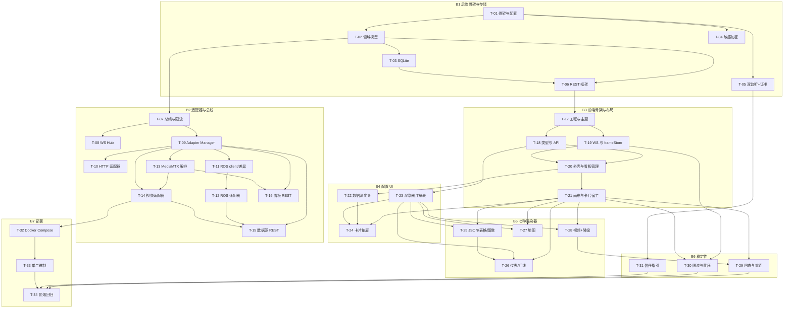

# MonitorAll MVP — 任务分解与实现顺序

| 项 | 内容 |
| --- | --- |
| 版本 | v1.0 |
| 日期 | 2026-09-21 |
| 作者 | 高见远（架构师） |
| 上游 | `docs/PRD.md`（PRD v1.0）、`docs/ARCHITECTURE.md`（架构 v1.0） |
| 执行者 | 寇豆码（工程师） |
| 范围 | PRD 全部 **P0（39 条）** + **BE-04（提前至 P0）**；P1/P2 只留扩展点不实现 |
| 任务总数 | **34**（T-01 ~ T-34），分 **7 批（B1–B7）** |

> **阅读顺序**：先读「§1 共享知识」（跨文件约定，必须全文遵守），再按批次实现。每个任务的「涉及文件」是**精确到文件名**的清单，不要自行增删目录。

---

## 1. 共享知识（跨文件约定 · 硬性）

### 1.1 路径与包结构

| 侧 | 根 | 模块根 | 说明 |
| --- | --- | --- | --- |
| 后端 | `server/` | `module github.com/monitorall/monitorall` | 业务代码全在 `internal/`，`cmd/monitorall/main.go` 只做装配 |
| 前端 | `web/` | `@` → `web/src` | 业务代码按 `views / components / stores / composables / utils / types / api / renderers` 组织 |

### 1.2 ID 生成规则

```go
// server/internal/model/ids.go —— 唯一生成处，禁止其它文件自己拼 ID
const (
	PrefixDataSource = "ds_"
	PrefixChannel    = "ch_"
	PrefixCard       = "cd_"
	PrefixDashboard  = "db_"
)
// 格式：<前缀><16 位 base36 随机串>，例：ds_7f3kq9x2ap1m0z4t
func NewDataSourceID() string
func NewChannelID() string
func NewCardID() string
func NewDashboardID() string
```

- 前端**不得**生成业务 ID（临时 UI id 可用 `tmp_` 前缀，且不得落库）。
- grid-layout-plus 的 `item.i` **直接等于** `card.id`。

### 1.3 JSON 序列化约定

| 规则 | 说明 |
| --- | --- |
| 字段命名 | 全项目 **camelCase**；Go struct 必写 json tag，TS interface 同名。 |
| 时间 | **毫秒 int64**（`publishedTs`/`ingestedTs`/`createdAt`/`updatedAt`/`lastFrameAt`/`lastOkAt`/`t`）。禁止秒、禁止 RFC3339 字符串。 |
| 枚举 | 字符串常量（`scalar`、`ros2`、`reconnecting`、`WGS-84`），Go 用 `type X string`。 |
| 可选 | Go `omitempty`；TS `?:`。**不用 `null`** 表达"未设置"。 |
| Frame | 结构见架构 §5，任何适配器不得增删外壳字段。 |
| 统一响应 | `{ code, message, data, traceId? }`，失败时 `data: null`。 |

### 1.4 错误处理约定

**后端**
```go
// 禁止 fmt.Errorf 直接抛给 API；一律用 apperr
apperr.New(apperr.InvalidParam, "rtmpUrl is required")
apperr.Wrap(err, apperr.StoreError, "save dashboard")
// HTTP 映射见架构 §7.2 错误码表；Gin handler 统一 return，由 mw 渲染
```
- 任何 goroutine 内 `defer recover()`，捕获后置对应数据源 `error`，**不得让进程退出**。
- 日志必须带 `module` 字段：`logx.With("module","ros")`。

**前端**
```ts
// api/client.ts 统一解包：code!==0 → throw AppError{code,message,traceId}
// 组件内不 try/catch 业务错误，统一由 uiStore.pushError 记录 + message 提示
// 卡片内渲染异常 → CardErrorBoundary 捕获，不冒泡
```

### 1.5 前端组件与文件命名

| 类型 | 规则 | 例 |
| --- | --- | --- |
| Vue 组件 | PascalCase，`*.vue` | `CardFrame.vue` |
| 渲染器组件 | `<Name>Renderer.vue` | `GaugeRenderer.vue` |
| composable | `use<Xxx>.ts`，导出 `useXxx()` | `useFrameFeed.ts` |
| store | `stores/<name>.ts`，导出 `use<Name>Store` | `useFrameStore` |
| 工具 | 小驼峰语义名 | `utils/geo.ts` |
| 类型 | `types/index.ts` 集中；WS 消息另放 `types/ws.ts` | |
| CSS 类 | 全部 `ma-` 前缀避免冲突 | `.ma-card__footer` |

### 1.6 CSS 变量与暗色主题

```css
/* web/src/styles/variables.css —— 唯一颜色/间距来源，组件内禁止硬编码色值 */
:root {
  --ma-bg-base: #101014;
  --ma-bg-card: #18181c;
  --ma-bg-elevated: #1f1f24;
  --ma-border: #2c2c34;
  --ma-text-1: #e5e5ea;
  --ma-text-2: #9a9aa6;
  --ma-accent: #63e2b7;
  --ma-status-online: #63e2b7;
  --ma-status-offline: #6b6b76;
  --ma-status-reconnecting: #f2c037;
  --ma-status-error: #e5534b;
  --ma-status-degraded: #f2a037;
  --ma-gap: 12px;
  --ma-radius: 6px;
  --ma-card-header-h: 32px;
  --ma-card-footer-h: 24px;
}
```
- 主题由 `styles/theme.ts` 生成 Naive UI `darkTheme + themeOverrides`，**只从 CSS 变量取值**。
- MVP 默认暗色；亮色主题为 P1，**不实现**，但不得写死暗色十六进制。

### 1.7 常量存放（🚨 禁止魔法值）

| 侧 | 位置 | 内容 |
| --- | --- | --- |
| 后端默认值 | `internal/config/config.go` 的 `DefaultConfig()` | 端口、退避参数、限流 Hz、批量窗口、队列深度 |
| 后端枚举/错误码 | `internal/apperr/apperr.go`、`internal/model/common.go` | 错误码、PayloadType、Status、CRS |
| 前端常量 | `web/src/utils/constants.ts` | `GRID_COLS=12`、`ROW_HEIGHT=30`、`MARGIN=[12,12]`、`MIN_CARD_W=2`、`MIN_CARD_H=2`、`DEFAULT_RING_CAPACITY=1200`、`WS_RECONNECT_BASE_MS=1000`、`WS_RECONNECT_MAX_MS=30000`、`SAMPLE_TIMEOUT_MS=3000`、`STATUS_COLORS` |
| 渲染器默认值 | `web/src/renderers/manifests.ts` | 各 manifest 的 `defaultConfig` / `defaultLayout` |

任何文件出现裸数字（如 `1200`、`9090`、`12`）都应先检查是否已有常量。

### 1.8 网格布局约定（grid-layout-plus）

```ts
// 锁 ^1.1.1，禁止升 v2
<grid-layout
  v-model:layout="cards"          // 元素需含 i,x,y,w,h,minW,minH
  :col-num="GRID_COLS"            // 12
  :row-height="ROW_HEIGHT"        // 30
  :margin="MARGIN"                // [12,12]
  :is-draggable="editMode"
  :is-resizable="editMode"
  :vertical-compact="true"
  :use-css-transforms="true"
  @layout-updated="onLayoutUpdated"
/>
```

### 1.9 日志约定

- 后端：`slog`，字段 `module` / `dataSourceId` / `channelId` / `traceId`。级别：`debug` 帧级、`info` 生命周期、`warn` 可恢复失败、`error` 不可恢复。
- 前端：仅 `console.warn/error`（生产禁用 `console.log`）；错误进 `uiStore.errors`（上限 100 条）。

### 1.10 敏感字段约定

- 落盘加密（AES-GCM），API 出参一律 `"***"`。
- **PUT 时收到 `"***"` 表示"保持原值"**（`crypto.Unmask` 处理）。漏实现会导致每次编辑清空凭据。

---

## 2. 批次总览

| 批次 | 主题 | 任务 | 可并行 | 产出里程碑 |
| --- | --- | --- | --- | --- |
| **B1** | 后端骨架与存储 | T-01 ~ T-06 | T-02 ∥ T-04 ∥ T-05（依赖 T-01） | `make run` 能启动、打印 LAN、REST 通 |
| **B2** | 后端适配器与总线 | T-07 ~ T-16 | T-10 ∥ T-11 ∥ T-13（依赖 T-09） | 三类数据源可接入、WS 能推帧 |
| **B3** | 前端骨架与布局 | T-17 ~ T-21 | T-18 ∥ T-19（依赖 T-17） | 看板可渲染、卡片可拖可缩放 |
| **B4** | 数据源与看板配置 UI | T-22 ~ T-24 | T-22 ∥ T-23 | 新建卡片向导三步闭环 |
| **B5** | 七种渲染器 | T-25 ~ T-28 | T-25 ∥ T-26 ∥ T-27 ∥ T-28 | 7 种渲染器齐备 |
| **B6** | 稳定性与降级 | T-29 ~ T-31 | T-29 ∥ T-31 | 四态、重连、降级、限流可用 |
| **B7** | 构建部署与文档 | T-32 ~ T-34 | T-32 ∥ T-33 | Docker/单二进制可用 |

---

## 3. B1 · 后端骨架与存储

> **串行起点**：T-01 必须最先完成（其余全部依赖它）。

| ID | 任务 | 涉及文件 | 依赖 | 验收标准 |
| --- | --- | --- | --- | --- |
| **T-01** | **项目骨架与配置** | 新建：`server/go.mod`、`server/Makefile`、`server/config.example.yaml`、`server/cmd/monitorall/main.go`、`server/internal/config/config.go`、`server/internal/logx/log.go`、`server/internal/apperr/apperr.go` | — | ① `go build ./...` 通过；② `make run` 启动后按 `config.yaml` 打印生效配置（含端口、数据目录）；③ 支持 `MONITORALL_SERVER_HTTPADDR` 环境变量覆盖；④ `apperr` 错误码常量齐全且能映射 HTTP status |
| **T-02** | **领域模型与 ID** | 新建：`server/internal/model/ids.go`、`common.go`、`source.go`、`frame.go`、`payload.go`、`board.go` | T-01 | ① 全部 struct 带 camelCase json tag，时间字段为 int64 ms；② `NewXxxID()` 生成 `ds_/ch_/cd_/db_` 前缀 + 16 位 base36；③ 单测：Frame 序列化后再反序列化，字段与文档 §5 示例逐字一致 |
| **T-03** | **SQLite 持久化与迁移** | 新建：`server/internal/store/store.go`、`sqlite.go`、`schema.go` | T-02 | ① 启动时自动建 6 张表（架构 §4.4）；② `meta.schema_version` 机制可用，迁移按序执行且幂等；③ 数据源/看板/卡片 CRUD 单测通过；④ **kill -9 后重启数据不丢**（WAL） |
| **T-04** | **敏感字段加密** | 新建：`server/internal/crypto/secret.go` | T-01 | ① `data/secret.key` 首次生成（0600）；② 加解密往返一致；③ `MaskSecrets` 出参为 `***`；④ `Unmask` 遇到 `***` 保持原值；⑤ 密钥文件损坏时返回 50011 而非 panic |
| **T-05** | **HTTP/HTTPS 双监听 + 自签证书 + LAN 打印** | 新建：`server/internal/server/server.go`、`server/internal/media/cert.go`、`server/internal/web/embed.go`、`server/internal/web/dist/.gitkeep` | T-01 | ① 同时监听 `:8080` 与 `:8443`，任一失败不影响另一；② 首次启动自动生成含 LAN IP SAN 的自签证书；③ 控制台打印 `http://<lan>:8080` / `https://<lan>:8443` / `/trust`；④ `CGO_ENABLED=0` 可编译 |
| **T-06** | **REST 框架与系统接口** | 新建：`server/internal/api/router.go`、`resp.go`、`mw.go`、`system.go` | T-02, T-03 | ① 统一响应 `{code,message,data}`；② 中间件：请求日志、panic recover、`X-Request-Id`；③ `/healthz`（含 goroutines/uptime）、`/readyz`、`/api/v1/system/runtime`、`/lan`、`/cert` 全部可用；④ 静态 embed 与 SPA fallback 生效（无 dist 时降级为仅 API 并记日志） |

---

## 4. B2 · 后端适配器与总线

> T-07 → T-08/T-09 串行；T-10/T-11/T-13 可并行；T-12 依赖 T-11，T-14 依赖 T-13；T-15/T-16 最后。

| ID | 任务 | 涉及文件 | 依赖 | 验收标准 |
| --- | --- | --- | --- | --- |
| **T-07** | **Frame 总线与限流器** | 新建：`server/internal/bus/bus.go`、`limiter.go` | T-02 | ① `Publish` 永不阻塞；② 通道级 `maxHz` 令牌桶生效，超限进合并窗口且**最新值覆盖**；③ `dropped` 计数正确；④ 后端环形缓冲定容 1200；⑤ 单测：以 1000Hz 灌入 5s，实际投递 ≈ maxHz×5 |
| **T-08** | **WebSocket Hub 与协议** | 新建：`server/internal/ws/protocol.go`、`conn.go`、`hub.go`；修改：`api/router.go` | T-07 | ① `/api/v1/ws?protocol=1` 可用；② hello→welcome、subscribe→subscribed、unsubscribe、ping/pong、frames 批量、channelStatus、sourceStatus、backpressure、error 全部 op 实现；③ 20ms/64 条批量；④ 单连接输出队列满时丢最旧批并计数；⑤ 断连后该连接订阅全部释放 |
| **T-09** | **Adapter 接口与 Manager** | 新建：`server/internal/adapter/adapter.go`、`manager.go` | T-07 | ① `Adapter` 六方法与 `Factory` 注册表；② 引用计数：3 张卡订阅同一通道只有 1 条底层连接；③ 指数退避 1s→30s ±20%；④ **创建+删除 100 个数据源后 `/healthz.goroutines` 回归基线 ±10**；⑤ 重连成功后自动 `StartChannel` 恢复全部活动通道 |
| **T-10** | **HTTP 轮询适配器** | 新建：`server/internal/adapter/http/adapter.go` | T-09 | ① 按 `intervalMs`（下限 100ms）轮询，单次超时不叠加；② `jsonPath` 用 gjson 提取；③ payloadType 按架构 §5.4-R4 推断；④ 连续 3 次失败才置 reconnecting；⑤ 生成 schemaHint |
| **T-11** | **ROS 统一客户端与版本差异** | 新建：`server/internal/adapter/ros/client.go`、`diff.go`、`mapping.go` | T-09 | ① 一条 WS 连 rosbridge，多话题复用；② `NormalizeMsgType` 处理 `nav_msgs/msg/X` ↔ `nav_msgs/X`；③ **所有版本分支只出现在 `diff.go`**（`grep -rn "ros1\|ros2" internal/ --include=*.go` 只应命中 diff.go/配置）；④ 映射表覆盖 PRD §3.5 全部 9 行；⑤ rosapi 发现失败软降级不报错 |
| **T-12** | **ROS 适配器** | 新建：`server/internal/adapter/ros/adapter.go` | T-11 | ① ROS1 订阅 `/odom` ≤2s 收到 `time_series_sample` 帧；② ROS2 切换版本后配置表单字段不变且能连 `/imu/data`；③ 发布端退出 → 3s 内转 reconnecting；④ `NavSatFix` 出 `geo_pose` 且带 `crs`；⑤ 图像话题 base64 正确、受 imageMaxHz 限流 |
| **T-13** | **MediaMTX 客户端与播放地址编排** | 新建：`server/internal/media/mediamtx.go`、`url.go` | T-02 | ① `paths/list`、`paths/add` 封装；② RTMP URL 解析出 path，非法 URL 返回 40002；③ 按 `publicScheme/publicHost/port` 生成 webrtc/hls/flv **绝对** URL；④ `flvBase` 为空则不产 flv 键 |
| **T-14** | **视频适配器** | 新建：`server/internal/adapter/video/video.go` | T-09, T-13 | ① 创建视频源时自动注册 path 到 MediaMTX；② 每 2s 轮询 path 状态 → 产出 `video_stream` 帧（只含地址与状态，**无像素**）；③ 自动创建 1 个 channel；④ MediaMTX 不可达 → 源 status=error 且 lastError=50003；⑤ 帧率受 `videoStatusHz` 限制 |
| **T-15** | **数据源与通道 REST** | 新建：`server/internal/api/source.go` | T-09, T-12, T-14 | ① 数据源 CRUD + `/datasources/test` + 通道 CRUD + `/channels/{id}/sample`（3s 超时→50004）；② 敏感字段出参 `***`、入参 `***` 保持原值；③ 删除数据源级联清理通道与卡片；④ 通道返回 `refCount/frameRateHz/dropped` |
| **T-16** | **看板/卡片 REST 与 MediaMTX 查询** | 新建：`server/internal/api/board.go`、`mediamtx.go` | T-09, T-13 | ① 看板 CRUD + `revision` 乐观锁（不匹配→40009）；② `/dashboards/{id}/layout` 轻量保存；③ 卡片 CRUD 触发订阅引用计数增减；④ 全量保存为事务；⑤ `/mediamtx/paths` 返回路径与健康 |

---

## 5. B3 · 前端骨架与布局

| ID | 任务 | 涉及文件 | 依赖 | 验收标准 |
| --- | --- | --- | --- | --- |
| **T-17** | **前端工程、主题与路由** | 新建：`web/package.json`、`vite.config.ts`、`tsconfig.json`、`tsconfig.node.json`、`env.d.ts`、`index.html`、`src/main.ts`、`src/App.vue`、`src/router/index.ts`、`src/styles/theme.ts`、`variables.css`、`global.css`、`src/components/base/NaiveProvider.vue` | B2 完成（联调需后端；可先独立开发） | ① `npm run dev` 起来且 `/api`、`/ws` 代理到 Go；② 暗色主题生效，颜色全部来自 CSS 变量；③ `vue-tsc` 零错误；④ 依赖锁版本：grid-layout-plus `^1.1.1`、echarts `^5.6`、naive-ui `^2.45` |
| **T-18** | **类型与 API 层** | 新建：`web/src/types/index.ts`、`types/ws.ts`、`api/client.ts`、`api/endpoints.ts`、`utils/constants.ts` | T-17 | ① TS interface 与 Go struct 字段逐一对齐（含 PayloadType/Status/CRS 联合类型）；② `client.ts` 统一解包并把 code≠0 抛 `AppError`；③ 常量文件包含 §1.7 全部条目，代码内无裸魔法值 |
| **T-19** | **WS 客户端与帧状态主干** | 新建：`web/src/ws/client.ts`、`stores/frame.ts`、`utils/ringbuffer.ts`、`composables/useRafBatch.ts`、`composables/useFrameFeed.ts` | T-17, T-18 | ① 单条 WS 连接，断线指数退避重连并**重放订阅表**；② `frameStore.buffers` 用 `markRaw`（非响应式），`version[ch]++` 为唯一响应式触发；③ rAF 批处理：每通道每帧最多 1 次更新；④ 环形缓冲定容 1200，切换看板清理未引用 buffer；⑤ 心跳/pong 正常 |
| **T-20** | **全局外壳、Store 与看板管理** | 新建：`web/src/stores/dashboard.ts`、`stores/datasource.ts`、`stores/ui.ts`、`components/layout/TopBar.vue`、`SourcePanel.vue`、`ConnectionBanner.vue`、`views/DashboardView.vue`、`composables/useDashboardSave.ts`、`useHotkeys.ts` | T-18, T-19 | ① 看板列表/切换/重命名/删除（二次确认），切换后 URL 变化且刷新停留；② 编辑/查看模式切换，查看模式禁用拖拽；③ 未保存改动：标题圆点 + `beforeunload` + **Ctrl+S 保存**；④ revision 冲突提示"已被修改，请刷新"；⑤ 顶部横幅显示后端在线/WS 延迟/活跃卡片；⑥ 数据源面板树形展示 + 四态点 |
| **T-21** | **网格画布与卡片宿主** | 新建：`web/src/components/layout/DashboardCanvas.vue`、`CardFrame.vue`、`StatusBadge.vue`、`components/cards/CardHost.vue`、`CardErrorBoundary.vue`、`CardSkeleton.vue`、`components/base/EmptyState.vue`、`composables/useCardStatus.ts` | T-20 | ① grid-layout-plus 12 列、拖拽与八向 resize、最小 2×2、不出界；② 编辑模式显示虚线框+操作图标+resize 手柄，查看模式隐藏；③ 卡片头 32px / 脚 24px（可开关）/ 状态角标四态；④ **人为让某渲染器抛异常 → 只有该卡变错误卡，其余卡片持续刷新，页面不白屏**，错误卡有"重试"；⑤ 三态：骨架屏 / 空数据 / 重连遮罩（含倒计时） |

---

## 6. B4 · 数据源与看板配置 UI

| ID | 任务 | 涉及文件 | 依赖 | 验收标准 |
| --- | --- | --- | --- | --- |
| **T-22** | **数据源向导与通道选择** | 新建：`web/src/components/config/DataSourceWizard.vue`、`ChannelSelect.vue` | T-20 | ① Step1 选类型（视频/ROS/HTTP），Step2 填参数（ROS 需选 ROS1·ROS2 且切换后字段不变）；② RTMP URL 实时校验，填 `abc` 立即红字且保存禁用；③ 测试连接 ≤5s 返回结果，失败给修复建议并停留 Step2；④ 通道选择支持"复用已有"与"手工新增 ROS topic" |
| **T-23** | **渲染器注册表与动态表单** | 新建：`web/src/renderers/manifests.ts`、`renderers/index.ts`、`components/config/SchemaForm.vue`、`FieldPicker.vue`、`utils/jsonpath.ts` | T-18 | ① 7 个 manifest 全部注册（gauge/line-chart/map 完整实现，其余按架构 §9.4）；② `filterByPayloadType` 返回推荐/兼容/不兼容三段；③ SchemaForm 支持 number/slider/text/select/switch/color/field-picker/multi-field/threshold-list 全部控件；④ FieldPicker 用最近一帧的 schemaHint 生成树，可点选深层字段并实时预览；⑤ `mergeConfig` 兼容旧配置缺字段 |
| **T-24** | **卡片配置抽屉与向导闭环** | 新建：`web/src/components/config/CardConfigDrawer.vue`、`RendererSelectList.vue` | T-21, T-22, T-23 | ① 新建卡片 ≤5 次点击闭环：选通道 → 选渲染器 → 配置 → 上画布；② 选中 `scalar` 时不出现"视频播放器"，不兼容项置灰 + tooltip 说明原因，兼容项标"推荐"；③ 切换渲染器保留可复用配置（标题/单位）；④ 抽屉内实时预览；⑤ 编辑已有卡片后立即生效；⑥ 删除卡片 → 引用计数归零时后端断开底层连接（可用 `/healthz` 或日志验证） |

---

## 7. B5 · 七种渲染器

> 四个任务**可并行**（互不依赖），但都依赖 T-21/T-23。

| ID | 任务 | 涉及文件 | 依赖 | 验收标准 |
| --- | --- | --- | --- | --- |
| **T-25** | **RD-01/02/05 基础渲染器** | 新建：`web/src/components/renderers/JsonTreeRenderer.vue`、`TableRenderer.vue`、`ImageRenderer.vue`、`components/base/EChart.vue`、`utils/csv.ts`、`utils/format.ts` | T-21, T-23 | ① JSON 树：任意嵌套可折叠、类型标注、深度控制，5000 字段渲染 <1s；② 表格：自动从数组/对象生成列，列选择/排序/行数上限，1000×20 滚动流畅，>5000 行截断提示；③ 图像：base64/URL 均可，保持宽高比、时间戳水印、`maxFps` 限流，切换 url 1s 内更新；④ `format.ts` 提供统一小数位/单位/千分位 |
| **T-26** | **RD-03/04 仪表与折线图** | 新建：`web/src/components/renderers/GaugeRenderer.vue`、`LineChartRenderer.vue` | T-25（复用 EChart.vue） | ① 仪表：量程 0–100 改后指针刻度正确，超量程显示满量程并标红；红/黄/绿区段弧线按 `bands` 渲染；② 折线图：多字段映射（图例即开关）、时间窗默认 60s、Y 轴自动/固定、暂停、CSV 导出内容与图一致；③ **20Hz 连续跑 30min 内存稳定**（缓冲 1200 点上限）；④ ECharts 按需引入、10Hz 节流、`sampling:'lttb'`、`animation:false`、卸载 dispose |
| **T-27** | **RD-06 地图渲染器（合规重点）** | 新建：`web/src/components/renderers/MapRenderer.vue`、`utils/geo.ts`、`utils/amapLoader.ts` | T-21, T-23 | ① 高德 JS API 2.0 单例加载（`amapKey` 为空时显示配置提示，**不降级到任何境外底图**）；② **注入 WGS-84 坐标后与道路偏差 <10m**；③ 转换**只**在 `utils/geo.ts` 用 gcoord 完成（全仓 grep 无第二处转换）；④ 界面显式声明输入坐标系，脚注与悬浮面板显示"GCJ-02（源 WGS-84，已离线换算）"；⑤ 轨迹尾迹可调、跟随开关、朝向箭头随 yaw；⑥ 10Hz 轨迹不卡顿；⑦ 断外网时转换仍生效 |
| **T-28** | **RD-07 视频渲染器与协议降级** | 新建：`web/src/components/renderers/VideoRenderer.vue`、`utils/video.ts` | T-21, T-23 | ① `VideoBackend` 抽象三实现：webrtc（原生 WHEP）、hls（hls.js）、flv（mpegts.js，仅 `flvBase` 配置时启用）；② 新建视频卡自动播放，控制条含播放/音量/静音/全屏/画质/协议指示；③ **禁用 WebRTC 后 ≤3s 自动降级且继续出画面**，角标显示"HLS（降级 2-3s）"；④ `retryPreferredSec` 后台探测恢复后切回；⑤ 手动"强制切换协议"下拉；⑥ 8 张视频卡同时播放 CPU 可控；⑦ 全屏后 Esc 退出不影响布局 |

---

## 8. B6 · 稳定性与降级

| ID | 任务 | 涉及文件 | 依赖 | 验收标准 |
| --- | --- | --- | --- | --- |
| **T-29** | **四态可视化与自动重连贯通** | 修改：`server/internal/adapter/manager.go`、`server/internal/ws/hub.go`、`web/src/components/layout/StatusBadge.vue`、`components/cards/CardHost.vue`、`stores/datasource.ts`、`composables/useCardStatus.ts` | T-21, T-28 | ① kill 数据源进程 → **3s 内卡片角标 / 左侧面板 / 全局条三处同步进入重连中**；② 数据源恢复后 ≤5s 自动恢复数据流且无需刷新；③ 重连倒计时来自 `sourceStatus.reconnectInMs`；④ 视频降级态 `degraded` 角标；⑤ 后端重启后前端自动重连并恢复全部订阅 |
| **T-30** | **限流丢帧与背压贯通（BE-04）** | 修改：`server/internal/bus/limiter.go`、`server/internal/ws/conn.go`、`web/src/stores/frame.ts`、`components/cards/CardHost.vue` | T-19, T-21 | ① 配置 5fps 上限后前端实测渲染帧率 ≤6fps；② 高频数据不导致前后端内存持续增长；③ 前端接收 `backpressure` 并在卡片脚注显示"丢帧 N"；④ 慢客户端被丢弃不影响其它连接与其它通道 |
| **T-31** | **证书信任指引与 HTTPS 引导** | 新建：`web/src/views/TrustGuideView.vue`；修改：`server/internal/api/system.go`、`server/internal/server/server.go` | T-05 | ① `/trust` 页提供证书下载、Chrome 信任步骤、MediaMTX 二次信任说明；② `GET /api/v1/system/cert` 返回可安装证书；③ 启动横幅含 `/trust` 链接；④ HTTP 永远可访问（不强制跳转 HTTPS） |

---

## 9. B7 · 构建部署与文档

| ID | 任务 | 涉及文件 | 依赖 | 验收标准 |
| --- | --- | --- | --- | --- |
| **T-32** | **Docker Compose 与 MediaMTX 编排** | 新建：`deploy/docker-compose.yml`、`deploy/Dockerfile`、`deploy/mediamtx/mediamtx.yml`；修改：`server/internal/media/url.go`（embedded/external 分支） | T-14 | ① `docker compose up -d` 一条命令拉起平台 + MediaMTX；② embedded 模式通过 `http://mediamtx:9997/v3/paths/list` 健康检查与路径发现；③ external 模式只填 API 地址即可；④ 证书卷共享，MediaMTX 首启动失败可自愈；⑤ 全新机器 60s 内看板可用 |
| **T-33** | **单二进制构建与说明文档** | 修改：`server/Makefile`、`server/internal/web/embed.go`；新建：`README.md` | T-32 | ① `make build` 产出单个可执行文件，`CGO_ENABLED=0`；② 复制到目标机器无需 Node/静态服务器即可运行；③ README 含：快速开始、配置说明、ROS1/ROS2 启动命令（roslaunch/ros2 launch rosbridge）、信任指引、常见问题 |
| **T-34** | **冒烟自测与稳定性回归** | 新建：`scripts/smoke.sh`；修改：`server/internal/api/system.go`（goroutines 指标） | 全部 | ① 脚本覆盖：建源→发现通道→取样例→建卡→订阅→收帧→保存→重启→还原；② 创建+删除 100 个数据源后 `/healthz.goroutines` 回归基线 ±10；③ 40 张卡片运行 2h 浏览器内存增长 <10%（人工核对 + 记录）；④ 7×24 稳定性做 ≥72h 观察记录 |

---

## 10. 任务依赖图



**并行建议**

| 阶段 | 可同时开工 | 必须串行 |
| --- | --- | --- |
| B1 | T-02 ∥ T-04 ∥ T-05（T-01 完成后） | T-01 → T-03 → T-06 |
| B2 | T-10 ∥ T-11 ∥ T-13 | T-07 → T-09 → {T-12 / T-14} → {T-15 / T-16} |
| B3 | T-18 ∥ T-19 | T-17 → T-20 → T-21 |
| B4 | T-22 ∥ T-23 | → T-24 |
| B5 | T-25 ∥ T-27 ∥ T-28（T-26 需等 T-25 的 EChart.vue） | — |
| B6 | T-29 ∥ T-31；T-30 可并行 | — |
| B7 | T-32 ∥ T-33（T-33 依赖 embed 产物） | → T-34 |

---

## 11. P0 需求 → 任务映射（验收自查表）

| PRD 编号 | 覆盖任务 | PRD 编号 | 覆盖任务 |
| --- | --- | --- | --- |
| DS-01 | T-22, T-14 | CD-06 | T-21 |
| DS-02 | T-13, T-28 | CD-07 | T-23, T-24 |
| DS-03 | T-11, T-12 | CD-08 | T-21, T-24 |
| DS-04 | T-11, T-12 | CD-09 | T-23 |
| DS-05 | T-11, T-22 | CD-10 | T-21 |
| DS-07 | T-10, T-22 | CD-11 | T-21, T-29 |
| BE-01 | T-02, T-07, T-12, T-14 | DB-01 | T-20 |
| BE-02 | T-08, T-19 | DB-02 | T-16, T-20 |
| BE-03 | T-09 | DB-03 | T-20, T-21 |
| **BE-04** | **T-07, T-30** | DB-04 | T-20 |
| BE-06 | T-06, T-15, T-16 | ST-01 | T-29 |
| BE-07 | T-03, T-06 | ST-02 | T-09, T-29 |
| RD-01 | T-25 | ST-03 | T-28 |
| RD-02 | T-25 | ST-04 | T-19 |
| RD-03 | T-26 | ST-07 | T-19, T-21, T-26 |
| RD-04 | T-26 | OP-01 | T-05, T-31 |
| RD-05 | T-25 | CD-01 | T-24 |
| RD-06 | T-27 | CD-02 | T-24 |
| RD-07 | T-28 | CD-03 | T-21, T-24 |
|  |  | CD-04 / CD-05 | T-21 |

---

## 12. 待明确事项（需交付总监拍板后工程师再动手）

| # | 事项 | 影响任务 | 架构师建议 | 状态 |
| --- | --- | --- | --- | --- |
| **D1** | **MediaMTX 无原生 HTTP-FLV**：PRD DS-02 / ST-03 的"HTTP-FLV 降级"无法直接实现（官方 issue #1460 明确不实现，建议用 LL-HLS） | T-13, T-28, T-32 | 默认降级改为 **HLS(mpegts variant) + hls.js**；`mpegts.js` 保留为可选后端，当用户配置 `mediamtx.flvBase` 指向外部 FLV 网关（SRS/ZLMediaKit/nginx-http-flv）时启用。延迟同量级（1–3s），**不影响 ST-03 验收** | ⬜ 待拍板 |
| **D2** | **HTTPS 模式下 MediaMTX 自签证书需二次信任**，否则 WHEP/HLS 均被拦 | T-05, T-31, T-32 | 共用同一张证书 + `/trust` 指引引导用户先访问一次 `https://host:8889/`；**不把视频代理进 Go 后端** | ⬜ 待拍板 |
| **D3** | 看板 `revision` 冲突处理策略 | T-16, T-20 | 返回 40009，前端提示"看板已被修改，请刷新后重试"，不做自动合并 | ⬜ 待确认 |
| **D4** | `POST /datasources/test` 与 `GET /channels/{id}/sample` 在 PRD 中属 P1（DS-09），但 CD-07 渲染器过滤与 CD-09 字段点选**强依赖样例帧** | T-15, T-23, T-24 | **纳入 MVP**（仅这两个接口，不含 UI 增强交互） | ⬜ 待确认 |
| **D5** | ROS2 rosbridge 的 rosapi 服务名在不同发行版不一致 | T-11 | MVP 以"手工填 topic"为主路径，rosapi 仅做软失败尽力发现 | ⬜ 待确认 |
| **D6** | 图像话题带宽（rosbridge 单连接 JSON + base64） | T-12, T-30 | `imageMaxHz=10` + `compression:"jpeg"` + `throttle_rate`；MVP 仅支持 `CompressedImage` 或由 rosbridge 压缩后的 raw Image | ⬜ 待确认 |
| **D7** | 高德 Key 需用户自备 | T-27 | `config.yaml` 的 `web.amapKey`；为空时地图卡显示配置指引 + 纯坐标列表，**不降级到境外底图** | ⬜ 待确认（需用户提供 Key 才能验收 RD-06） |
| **D8** | 首次启动是否自动创建默认看板 | T-16, T-20 | 自动创建 1 个名为「默认看板」的空看板 | ⬜ 待确认 |

---

## 13. 交付前的自检清单（工程师完成后逐条打勾）

- [ ] `grep -rn "ros1\|ros2" server/internal --include=*.go` 只命中 `adapter/ros/diff.go` 与配置/mapping
- [ ] `grep -rin "google\|mapbox\|openstreetmap\|leaflet" web/src web/package.json` 无结果（合规红线）
- [ ] `grep -rn "gcoord" web/src` 只命中 `utils/geo.ts`
- [ ] 全仓无裸魔法值（端口 / 1200 / 30 / 9090 均来自常量或 config）
- [ ] 所有 `go` 语句都绑定 ctx + WaitGroup（人工 review + goroutine 计数回归）
- [ ] 所有 ECharts / AMap / 视频播放器实例在 `onBeforeUnmount` 中 dispose/destroy
- [ ] PUT 接口收到 `"***"` 时保持原敏感值不变
- [ ] Frame 结构与 `docs/ARCHITECTURE.md` §5 的 JSON 示例逐字段一致
- [ ] WS 消息 op 名称与 §6 完全一致（前端 `types/ws.ts` 与后端 `ws/protocol.go` 对照）
- [ ] 40 卡片看板在浏览器中仅 **1 条** WS 连接（Network 面板验证）

---

**任务分解文档结束。实现过程中如遇契约歧义，以 `docs/ARCHITECTURE.md` 为准；架构文档未覆盖的，先问架构师再动手。**
